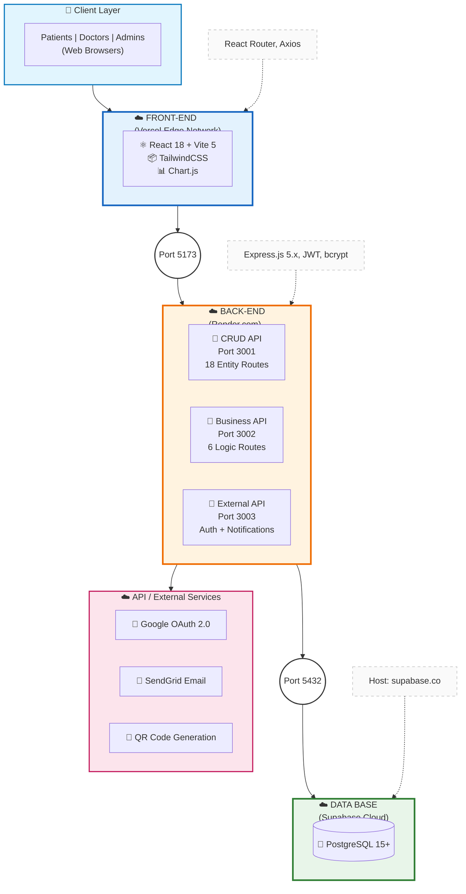

# Cloud Production Architecture

## Medical Appointment Management System - Clínica San Miguel

**Document Version:** 1.0  
**Last Updated:** 2025-01-21  
**Architecture Type:** Cloud-Native Microservices

---

## Table of Contents

1. [Evidence & Files Used](#1-evidence--files-used)
2. [Architecture Overview](#2-architecture-overview)
3. [Infrastructure Components](#3-infrastructure-components)
4. [Network & Security Layers](#4-network--security-layers)
5. [Data Flow & Communication](#5-data-flow--communication)
6. [Production Architecture Diagram](#6-production-architecture-diagram)
7. [Port Mappings & Endpoints](#7-port-mappings--endpoints)
8. [Environment Configuration](#8-environment-configuration)
9. [Observability & Monitoring](#9-observability--monitoring)
10. [Assumptions & Open Questions](#10-assumptions--open-questions)

---

## 1. Evidence & Files Used

The following project files were analyzed to construct this architecture documentation:

### Configuration Files

| File | Purpose | Key Information Extracted |
|------|---------|---------------------------|
| [frontend/vercel.json](../frontend/vercel.json) | Vercel deployment config | SPA routing, Vite framework, build commands |
| [frontend/.env.example](../frontend/.env.example) | Frontend env template | 3 API URLs (CRUD, Business, External) |
| [backend/.env.example](../backend/.env.example) | Backend env template | Supabase, JWT, SendGrid, QR settings |
| [frontend/package.json](../frontend/package.json) | Frontend dependencies | React 18, Vite 5, TailwindCSS, Chart.js |
| [backend/package.json](../backend/package.json) | Backend dependencies | Express 5, Supabase JS, Helmet, Winston |

### Server Files

| File | Purpose | Key Information Extracted |
|------|---------|---------------------------|
| [backend/crud-api/server.js](../backend/crud-api/server.js) | CRUD API entry point | Port 3001, Helmet security, entity routes |
| [backend/business-api/server.js](../backend/business-api/server.js) | Business API entry point | Port 3002, scheduling/validation logic |
| [backend/external-api/server.js](../backend/external-api/server.js) | External API entry point | Port 3003, auth/notifications/QR |

### Shared Configuration

| File | Purpose | Key Information Extracted |
|------|---------|---------------------------|
| [backend/shared/config/cors.config.js](../backend/shared/config/cors.config.js) | CORS settings | Allowed Vercel origins, credentials |
| [backend/shared/middleware/auth.middleware.js](../backend/shared/middleware/auth.middleware.js) | JWT authentication | Token verification, role extraction |

### Frontend API Configuration

| File | Purpose | Key Information Extracted |
|------|---------|---------------------------|
| [frontend/src/config/api.config.js](../frontend/src/config/api.config.js) | API URL routing | Production URLs for all 3 microservices |

---

## 2. Architecture Overview

### Architecture Style

**Cloud-Native Microservices** with the following characteristics:

- **Decomposition Strategy:** Separation by responsibility (CRUD, Business Logic, External Services)
- **Communication:** Synchronous REST over HTTPS
- **Data Management:** Shared PostgreSQL database (managed by Supabase)
- **Deployment Model:** Platform-as-a-Service (PaaS) on Render.com + Vercel

### High-Level Architecture Pattern

```
┌─────────────────────────────────────────────────────────────────────────┐
│                           PRESENTATION LAYER                            │
│                    React SPA (Vercel Edge Network)                      │
└───────────────────────────────┬─────────────────────────────────────────┘
                                │ HTTPS
                                ▼
┌─────────────────────────────────────────────────────────────────────────┐
│                            API GATEWAY LAYER                            │
│           (Implicit - Each API handles own routing & auth)              │
└───┬───────────────────────────┼───────────────────────────┬─────────────┘
    │                           │                           │
    ▼                           ▼                           ▼
┌─────────┐             ┌─────────────┐             ┌─────────────┐
│CRUD API │             │BUSINESS API │             │EXTERNAL API │
│ (Render)│             │  (Render)   │             │  (Render)   │
└────┬────┘             └──────┬──────┘             └──────┬──────┘
     │                         │                          │
     └─────────────────────────┼──────────────────────────┘
                               ▼
                    ┌─────────────────────┐
                    │  Supabase PostgreSQL │
                    │    (Data Layer)      │
                    └─────────────────────┘
```

---

## 3. Infrastructure Components

### 3.1 Frontend Hosting (Vercel)

| Component | Technology | Purpose |
|-----------|------------|---------|
| **Platform** | Vercel | Static site hosting with global CDN |
| **Framework** | Vite 5.x | Build toolchain for React SPA |
| **Runtime** | React 18.3 | UI component framework |
| **Styling** | TailwindCSS 3.4 | Utility-first CSS framework |
| **Build Output** | `/dist` | Static files (HTML, JS, CSS, assets) |
| **Routing** | SPA Rewrite | All paths → `/index.html` |

**Vercel Features Used:**
- Edge Network (Global CDN)
- Automatic HTTPS/TLS certificates (Let's Encrypt)
- Environment Variables injection
- Preview deployments (branch-based)
- Automatic builds on Git push

### 3.2 Backend Hosting (Render.com)

Each microservice is deployed as an independent **Web Service** on Render:

| Service | Instance Type | Port | Auto-Deploy |
|---------|---------------|------|-------------|
| CRUD API | Web Service | Dynamic (Render `$PORT`) | Yes (Git) |
| Business API | Web Service | Dynamic (Render `$PORT`) | Yes (Git) |
| External API | Web Service | Dynamic (Render `$PORT`) | Yes (Git) |

**Render Features Used:**
- Managed SSL/TLS certificates
- Zero-downtime deploys
- Health check monitoring (`/health` endpoint)
- Environment variable management
- Auto-sleep for free tier (if applicable)

### 3.3 Database Layer (Supabase)

| Component | Technology | Purpose |
|-----------|------------|---------|
| **Database** | PostgreSQL 15+ | Primary data store |
| **Platform** | Supabase | Managed PostgreSQL hosting |
| **Access** | Service Key | Backend-only access (RLS bypassed) |
| **Connection** | Direct (not pooled) | Via `@supabase/supabase-js` client |
| **Region** | (Configured in Supabase) | Should match Render region |

**Supabase Features Used:**
- Managed PostgreSQL with automatic backups
- Real-time subscriptions (available, not currently used)
- Row Level Security (RLS) - defined but bypassed via service key
- Dashboard for database management

### 3.4 External Services

| Service | Provider | Purpose |
|---------|----------|---------|
| **Email Delivery** | SendGrid | Transactional emails (confirmations, reminders) |
| **OAuth Provider** | Google | Social login authentication |
| **QR Generation** | Node `qrcode` library | Appointment verification codes |
| **Logging** | Winston | Structured application logging |

---

## 4. Network & Security Layers

### 4.1 TLS/HTTPS Termination

```
Client Browser
     │
     │ TLS 1.3
     ▼
┌────────────────┐
│  Vercel CDN    │ ◄── Frontend: *.vercel.app (auto-certificate)
└────────────────┘
     │
     │ TLS 1.2/1.3
     ▼
┌────────────────┐
│  Render LB     │ ◄── Backend: *.onrender.com (auto-certificate)
└────────────────┘
     │
     │ Internal HTTPS
     ▼
┌────────────────┐
│  API Instances │
└────────────────┘
```

### 4.2 CORS Policy

**Allowed Origins** (from `cors.config.js`):

```javascript
// Development
'http://127.0.0.1:5500'
'http://localhost:5500'
'http://localhost:5173'

// Production (Vercel)
'https://medical-appointment-frontend-ten.vercel.app'
'https://t6-awd-medical-appointment-web-syst.vercel.app'
'https://fronttemporalappointments.vercel.app'
'https://medical-appointment-web-system.vercel.app'
'https://medical-appointment-web-system-stevven23s-projects.vercel.app'
```

**CORS Headers:**
- `Access-Control-Allow-Methods`: GET, POST, PUT, PATCH, DELETE, OPTIONS
- `Access-Control-Allow-Headers`: Content-Type, Authorization, Accept, Origin, X-Requested-With
- `Access-Control-Allow-Credentials`: true

### 4.3 Authentication Flow

```
┌─────────────────────────────────────────────────────────────────────────┐
│                         JWT AUTHENTICATION FLOW                         │
└─────────────────────────────────────────────────────────────────────────┘

1. Login Request
   ┌─────────┐                              ┌──────────────┐
   │ Browser │ ─── POST /auth/login ──────► │ External API │
   └─────────┘     {email, password}        └──────┬───────┘
                                                   │
                                                   ▼
                                            ┌──────────────┐
                                            │   Supabase   │
                                            │   (verify)   │
                                            └──────┬───────┘
                                                   │
                                                   ▼
   ┌─────────┐                              ┌──────────────┐
   │ Browser │ ◄── {token, user, role} ──── │ External API │
   └────┬────┘                              └──────────────┘
        │
        │ Store in localStorage
        ▼

2. Authenticated Request
   ┌─────────┐                              ┌──────────────┐
   │ Browser │ ─── Authorization: Bearer ─► │   Any API    │
   └─────────┘     <JWT>                    └──────┬───────┘
                                                   │
                                            authMiddleware
                                                   │
                                                   ▼
                                            ┌──────────────┐
                                            │ jwt.verify() │
                                            │ + DB lookup  │
                                            └──────┬───────┘
                                                   │
                                                   ▼
                                            req.user = {
                                              id, email, role,
                                              roleCode, roleId
                                            }
```

### 4.4 Security Middleware Stack

Each API applies the following security layers:

1. **Helmet.js** - HTTP security headers
   - X-Content-Type-Options: nosniff
   - X-Frame-Options: DENY
   - X-XSS-Protection: 1; mode=block
   - Content-Security-Policy (configured per API)

2. **CORS** - Cross-Origin Resource Sharing
   - Whitelist-based origin validation
   - Credentials support enabled

3. **JWT Verification** - Token authentication
   - Secret-based HMAC verification
   - Expiration checking (24h access, 7d refresh)

4. **Role Authorization** - Access control
   - Role-based route protection
   - Resource ownership validation

5. **Input Sanitization** - XSS prevention
   - Body sanitization middleware
   - Joi schema validation

---

## 5. Data Flow & Communication

### 5.1 Request Flow (Example: Book Appointment)

```
┌─────────────────────────────────────────────────────────────────────────┐
│                    APPOINTMENT BOOKING FLOW                              │
└─────────────────────────────────────────────────────────────────────────┘

Browser                    Business API              CRUD API           Supabase
   │                            │                       │                   │
   │ 1. Check Availability      │                       │                   │
   │────────────────────────────►                       │                   │
   │ GET /availability/doctors/{id}/slots               │                   │
   │                            │                       │                   │
   │                            │ 2. Query Schedules    │                   │
   │                            │───────────────────────────────────────────►
   │                            │                       │                   │
   │◄───────────────────────────│ 3. Available Slots    │                   │
   │ {slots: [...]}             │◄──────────────────────────────────────────│
   │                            │                       │                   │
   │ 4. Create Appointment      │                       │                   │
   │─────────────────────────────────────────────────────►                  │
   │ POST /appointments         │                       │                   │
   │ {doctor_id, date, time}    │                       │                   │
   │                            │                       │ 5. INSERT         │
   │                            │                       │───────────────────►
   │                            │                       │                   │
   │◄─────────────────────────────────────────────────────────────────────│
   │ 6. {appointment}           │                       │                   │
   │                            │                       │                   │
   │                            │                External API              │
   │                            │                       │                   │
   │                            │                       │ 7. Send Email     │
   │                            │                       │───────────────────►
   │                            │                       │ (async webhook    │
   │                            │                       │  or direct call)  │
   │                            │                       │                   │
```

### 5.2 Microservice Communication Matrix

| Source | Target | Protocol | Purpose |
|--------|--------|----------|---------|
| Frontend | CRUD API | HTTPS REST | Entity CRUD operations |
| Frontend | Business API | HTTPS REST | Business logic (availability, validation) |
| Frontend | External API | HTTPS REST | Auth, notifications |
| Business API | Supabase | PostgreSQL | Direct DB queries |
| CRUD API | Supabase | PostgreSQL | Direct DB queries |
| External API | Supabase | PostgreSQL | Direct DB queries |
| External API | SendGrid | HTTPS REST | Email delivery |
| External API | Google OAuth | HTTPS OAuth2 | Social authentication |

---

## 6. Production Architecture Diagram

```mermaid
flowchart LR
    %% ===== SIDE ANNOTATIONS =====
    FRONTEND_TECH["React Router, Axios<br/>TailwindCSS, Chart.js"]
    
    %% ===== FRONT-END CLOUD =====
    subgraph FRONTEND["☁️ FRONT-END"]
        direction TB
        REACT["⚛️ React 18"]
        VITE["⚡ Vite 5"]
        VERCEL_ICON["▲ Vercel"]
    end
    
    FRONTEND_PORT["Port<br/>5173"]
    
    %% ===== BACK-END CLOUD =====
    subgraph BACKEND["☁️ BACK-END"]
        direction TB
        NODE["🟢 Node.js"]
        RENDER_ICON["🔷 Render"]
        
        subgraph SERVICES["Microservices"]
            CRUD["CRUD API"]
            BUSINESS["Business API"]
            EXTERNAL["External API"]
        end
    end
    
    BACKEND_TECH["Express.js 5.x, JWT, bcrypt<br/>Helmet, Winston, Joi"]
    BACKEND_PORTS["Ports<br/>3001 | 3002 | 3003"]
    
    %% ===== API / EXTERNAL SERVICES =====
    subgraph API["☁️ API / External Services"]
        direction TB
        GOOGLE_AUTH["Google OAuth 2.0"]
        SENDGRID_SVC["SendGrid Email"]
        QR_SVC["QR Code Generator"]
    end
    
    %% ===== DATABASE CLOUD =====
    subgraph DATABASE["☁️ DATA BASE"]
        direction TB
        POSTGRES["🐘 PostgreSQL 15+"]
        SUPABASE["⚡ Supabase"]
    end
    
    DATABASE_HOST["Host: supabase.co"]
    DATABASE_PORT["Port<br/>5432"]
    
    %% ===== CONNECTIONS =====
    FRONTEND_TECH -.-> FRONTEND
    FRONTEND --> FRONTEND_PORT
    FRONTEND_PORT --> BACKEND
    
    BACKEND --> BACKEND_PORTS
    BACKEND_TECH -.-> BACKEND
    
    BACKEND --> API
    
    BACKEND_PORTS --> DATABASE
    DATABASE --> DATABASE_PORT
    DATABASE_HOST -.-> DATABASE
    
    %% ===== STYLING =====
    classDef cloudStyle fill:#e3f2fd,stroke:#1565c0,stroke-width:2px,rx:20,ry:20
    classDef portStyle fill:#fff,stroke:#333,stroke-width:1px
    classDef techStyle fill:#f5f5f5,stroke:#9e9e9e,stroke-dasharray:5
    classDef apiStyle fill:#fff3e0,stroke:#ef6c00,stroke-width:2px,rx:15,ry:15
    classDef dbStyle fill:#e8f5e9,stroke:#2e7d32,stroke-width:2px,rx:20,ry:20
    
    class FRONTEND,BACKEND cloudStyle
    class DATABASE dbStyle
    class API apiStyle
    class FRONTEND_PORT,BACKEND_PORTS,DATABASE_PORT portStyle
    class FRONTEND_TECH,BACKEND_TECH,DATABASE_HOST techStyle
```



### Alternative View: Simplified Three-Tier Architecture



---

## 7. Port Mappings & Endpoints

### 7.1 Production URLs

| Service | Production URL | Local Dev Port |
|---------|----------------|----------------|
| **Frontend** | `https://medical-appointment-web-system.vercel.app` | `5173` (Vite) |
| **CRUD API** | `https://medical-crud-api.onrender.com` | `3001` |
| **Business API** | `https://medical-business-api.onrender.com` | `3002` |
| **External API** | `https://medical-external-api.onrender.com` | `3003` |

### 7.2 API Base Paths

| API | Base Path | Example Endpoint |
|-----|-----------|------------------|
| CRUD | `/api/v1` | `GET /api/v1/patients` |
| Business | `/api/v1` | `GET /api/v1/availability/doctors/{id}/slots` |
| External | `/api/v1` | `POST /api/v1/auth/login` |

### 7.3 Health Check Endpoints

| Service | Endpoint | Response |
|---------|----------|----------|
| CRUD API | `GET /health` | `{ service: 'CRUD API', status: 'healthy', ... }` |
| Business API | `GET /health` | `{ service: 'Business Rules API', status: 'healthy', ... }` |
| External API | `GET /health` | `{ service: 'External Services API', status: 'healthy', ... }` |

### 7.4 Complete Endpoint Inventory

#### CRUD API Endpoints (18 Entity Groups)

| Entity | Endpoints | Auth Required |
|--------|-----------|---------------|
| Users | CRUD + Soft Delete | Admin |
| Patients | CRUD + Profile | Patient/Admin |
| Doctors | CRUD + Profile | Doctor/Admin |
| Appointments | CRUD + Status Updates | All Roles |
| Specialties | CRUD | Admin |
| Schedules | CRUD + Exceptions | Doctor/Admin |
| Medical Records | CRUD | Doctor |
| Prescriptions | CRUD | Doctor |
| Prescription Renewals | CRUD | Patient/Doctor |
| Billings | CRUD | Admin |
| Billing Items | CRUD | Admin |
| Consultation Rooms | CRUD | Admin |
| Consultation Notes | CRUD | Doctor |
| Doctor Ratings | CRUD | Patient |
| Waiting List | CRUD | All Roles |
| Medical Services | CRUD | Admin |
| Insurance Providers | CRUD | Admin |
| Security (Audit Logs) | Read Only | Admin |

#### Business API Endpoints (6 Logic Groups)

| Domain | Endpoints | Purpose |
|--------|-----------|---------|
| Availability | 4 | Slot calculation, conflict detection |
| Scheduling | 5 | Schedule management, blocking |
| Validation | 3 | Business rule validation |
| Consultation | 4 | Workflow management |
| Reports | 4 | Analytics generation |
| Billing Calculation | 2 | Invoice generation |

#### External API Endpoints (4 Integration Groups)

| Domain | Endpoints | Purpose |
|--------|-----------|---------|
| Authentication | 6 | Login, register, OAuth, password reset |
| Notifications | 5 | Email templates, reminders |
| QR Codes | 3 | Generation, verification |
| Google OAuth | 2 | Social login flow |

---

## 8. Environment Configuration

### 8.1 Frontend Environment Variables

| Variable | Purpose | Example |
|----------|---------|---------|
| `VITE_CRUD_API_URL` | CRUD API base URL | `https://medical-crud-api.onrender.com/api/v1` |
| `VITE_BUSINESS_API_URL` | Business API base URL | `https://medical-business-api.onrender.com/api/v1` |
| `VITE_EXTERNAL_API_URL` | External API base URL | `https://medical-external-api.onrender.com/api/v1` |

### 8.2 Backend Environment Variables

| Category | Variables | Purpose |
|----------|-----------|---------|
| **Database** | `SUPABASE_URL`, `SUPABASE_SERVICE_KEY`, `SUPABASE_ANON_KEY` | PostgreSQL connection |
| **Authentication** | `JWT_SECRET`, `JWT_EXPIRES_IN`, `JWT_REFRESH_EXPIRES_IN` | Token generation |
| **Email** | `SENDGRID_API_KEY`, `EMAIL_FROM`, `EMAIL_FROM_NAME` | Transactional emails |
| **CORS** | `FRONTEND_URL`, `FRONTEND_URL_PROD` | Origin whitelist |
| **QR** | `QR_VERIFICATION_URL` | Verification link base |
| **Runtime** | `NODE_ENV`, `PORT` | Environment detection |

### 8.3 Platform-Injected Variables

| Platform | Variable | Purpose |
|----------|----------|---------|
| Render | `PORT` | Dynamic port assignment |
| Vercel | `VERCEL_ENV` | Environment detection (production/preview/development) |

---

## 9. Observability & Monitoring

### 9.1 Logging Architecture

```
┌─────────────────────────────────────────────────────────────────────────┐
│                         LOGGING ARCHITECTURE                             │
└─────────────────────────────────────────────────────────────────────────┘

Application Code
       │
       ▼
┌──────────────┐
│   Winston    │  ◄── Structured JSON logging
│   Logger     │      Levels: error, warn, info, debug
└──────┬───────┘
       │
       ▼
┌──────────────┐
│   stdout     │  ◄── Console transport (Render captures)
└──────┬───────┘
       │
       ▼
┌──────────────┐
│ Render Logs  │  ◄── Web dashboard, CLI access, log retention
│  Dashboard   │
└──────────────┘
```

### 9.2 Health Monitoring

| Check Type | Implementation | Alert Mechanism |
|------------|----------------|-----------------|
| **Endpoint Health** | `GET /health` on each API | Render auto-monitoring |
| **Database Health** | Supabase dashboard metrics | Supabase alerts |
| **SSL Certificate** | Automatic renewal (Render/Vercel) | N/A (managed) |
| **Uptime Monitoring** | Render status page | Platform notifications |

### 9.3 Metrics Available

| Platform | Metrics |
|----------|---------|
| **Render** | Response time, request count, CPU/memory usage, error rate |
| **Vercel** | Edge latency, bandwidth, cache hit ratio |
| **Supabase** | Query performance, connection pool, storage usage |

### 9.4 Log Levels & Usage

```javascript
// Winston Logger Configuration
const levels = {
  error: 0,   // Application errors, exceptions
  warn: 1,    // Deprecation notices, recoverable issues
  info: 2,    // Request logs, audit trail
  http: 3,    // HTTP request/response details
  verbose: 4, // Detailed operation logs
  debug: 5,   // Development debugging
  silly: 6    // Trace-level logging
};
```

---

## 10. Assumptions & Open Questions

### 10.1 Documented Assumptions

| # | Assumption | Based On |
|---|------------|----------|
| A1 | **No CI/CD pipelines exist** | No `.github/workflows/` or `render.yaml` found |
| A2 | **Manual deployment via Git push** | Render/Vercel auto-deploy on main branch |
| A3 | **Single database instance shared** | All APIs use same Supabase project |
| A4 | **No containerization** | No Dockerfile found in repository |
| A5 | **Free/Starter tier hosting** | No paid features configured |
| A6 | **Render auto-sleep enabled** | No explicit configuration to disable |
| A7 | **No rate limiting configured** | No rate limit middleware found |
| A8 | **No API versioning strategy** | All endpoints use `/api/v1` |
| A9 | **Winston logs to stdout only** | No file or remote transport configured |
| A10 | **No APM tool integrated** | No DataDog, New Relic, etc. found |

### 10.2 Open Questions

| # | Question | Impact | Recommended Action |
|---|----------|--------|-------------------|
| Q1 | Is Render free tier or paid? | Cold start latency (~30s on free tier) | Document or upgrade |
| Q2 | What is the Supabase region? | Latency to Render servers | Verify same region |
| Q3 | Are Vercel preview deployments enabled? | PR review workflow | Document policy |
| Q4 | What is the backup/restore procedure? | Data recovery SLA | Document Supabase backups |
| Q5 | Is there a staging environment? | Testing before production | Create staging instances |
| Q6 | What is the SSL certificate renewal process? | Security compliance | Verify auto-renewal works |
| Q7 | Are environment variables rotated? | Security hygiene | Create rotation schedule |
| Q8 | What is the incident response process? | Mean time to recovery | Document runbooks |

### 10.3 Recommended Improvements

| Priority | Improvement | Benefit |
|----------|-------------|---------|
| 🔴 High | Add rate limiting middleware | Prevent DoS attacks |
| 🔴 High | Create CI/CD pipeline | Automated testing/deployment |
| 🟡 Medium | Add APM monitoring (e.g., Sentry) | Error tracking, performance |
| 🟡 Medium | Create staging environment | Safe testing |
| 🟡 Medium | Add API documentation (Swagger/OpenAPI) | Developer experience |
| 🟢 Low | Containerize with Docker | Portable deployments |
| 🟢 Low | Add request ID tracing | Distributed tracing |

---

## Appendix A: Technology Stack Summary

### Frontend Stack

| Layer | Technology | Version |
|-------|------------|---------|
| Runtime | React | 18.3.1 |
| Build | Vite | 5.0.8 |
| Styling | TailwindCSS | 3.4.0 |
| Routing | React Router DOM | 6.20.0 |
| HTTP Client | Axios | 1.6.2 |
| Charts | Chart.js + react-chartjs-2 | 4.4.0 |
| Date Handling | date-fns | 3.0.0 |
| PDF Generation | jsPDF + html2canvas | 4.0.0 |
| Icons | Heroicons React | 2.1.0 |

### Backend Stack

| Layer | Technology | Version |
|-------|------------|---------|
| Runtime | Node.js | (Latest LTS) |
| Framework | Express | 5.1.0 |
| Database Client | @supabase/supabase-js | 2.78.0 |
| Authentication | jsonwebtoken | 9.0.2 |
| Password Hashing | bcrypt | 6.0.0 |
| Security Headers | Helmet | 8.1.0 |
| CORS | cors | 2.8.5 |
| Validation | Joi | 17.13.3 |
| Email | @sendgrid/mail | 8.1.6 |
| OAuth | passport + passport-google-oauth20 | 0.7.0 |
| QR Code | qrcode | 1.5.4 |
| Logging | Winston | 3.14.2 |
| Compression | compression | 1.7.4 |
| Scheduling | node-cron | 4.2.1 |
| UUID | uuid | 10.0.0 |

---

## Appendix B: Deployment Checklist

### Pre-Deployment

- [ ] All environment variables configured in Render dashboard
- [ ] Supabase project created with schema migrated
- [ ] SendGrid account verified with sender domain
- [ ] Google OAuth credentials configured
- [ ] CORS origins updated for production URLs

### Deployment Steps

1. **Frontend (Vercel)**
   ```bash
   # Automatic via Git integration
   git push origin main
   # Or manual
   vercel --prod
   ```

2. **Backend (Render)**
   ```bash
   # Automatic via Git integration
   git push origin main
   # Each API auto-deploys from its branch/path
   ```

### Post-Deployment Verification

- [ ] `GET /health` returns 200 on all APIs
- [ ] Frontend loads without console errors
- [ ] Login flow works end-to-end
- [ ] Email notifications are delivered
- [ ] Database queries execute successfully

---

**Document Maintained By:** Development Team  
**Review Cycle:** Quarterly or on major infrastructure changes
