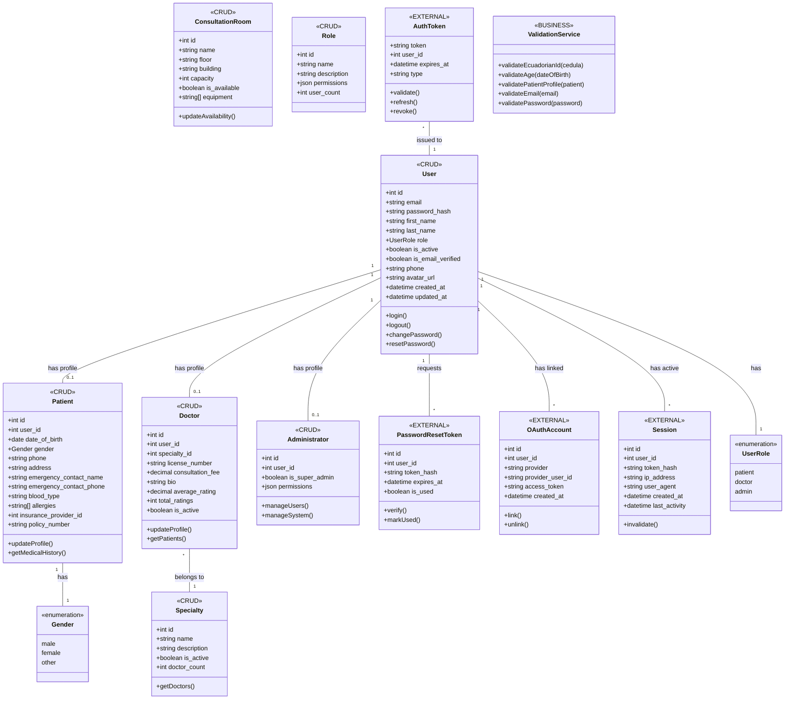
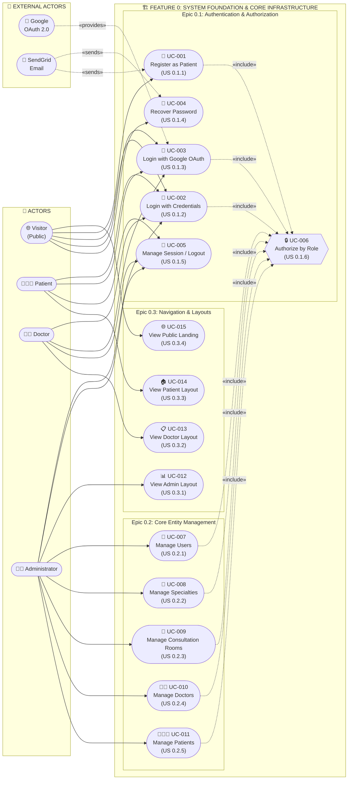

# Feature 0: System Foundation & Core Infrastructure

## Architecture Design Document

**Feature ID:** 0  
**Feature Name:** System Foundation & Core Infrastructure  
**Version:** 1.0  
**Date:** February 2026  
**Scope Keywords:** Authentication, Authorization, Patient Registration, User CRUD, Doctor CRUD, Specialties, Consultation Rooms, OAuth, Login, RBAC

---

## Table of Contents

1. [Feature Scoping](#1-feature-scoping)
2. [URI Design (Feature-Only)](#2-uri-design-feature-only)
3. [Feature Architecture (Data Flow)](#3-feature-architecture-data-flow)
4. [Feature Class Diagram](#4-feature-class-diagram)
5. [Feature Use Case Diagram](#5-feature-use-case-diagram)
6. [Assumptions & TODOs](#6-assumptions--todos)

---

## 1. Feature Scoping

### 1.1 Goal

Establish the foundational infrastructure that serves as the backbone for all other features, including secure authentication mechanisms, role-based authorization, core entity management (CRUD operations), and role-specific navigation structures.

### 1.2 Epics & User Stories Summary

| Epic | Epic Name | User Stories | Description |
|------|-----------|--------------|-------------|
| **0.1** | Authentication & Authorization | 6 | User registration, login, OAuth, password recovery, session management, RBAC middleware |
| **0.2** | Core Entity Management (CRUDs) | 5 | User, Specialty, Consultation Room, Doctor, Patient management |
| **0.3** | Navigation Structure & Layouts | 4 | Admin, Doctor, Patient layouts, Public landing page |

### 1.3 In-Scope

| Category | Items |
|----------|-------|
| **Authentication** | Patient self-registration with Ecuadorian ID validation (10-digit cédula), email/password login with bcrypt, Google OAuth 2.0 integration, JWT token generation (24h/7d expiration), password recovery via email |
| **Authorization** | JWT verification middleware, role-based access control (patient/doctor/admin), route protection per endpoint, 401/403 response handling |
| **User Management** | CRUD operations for users, activate/deactivate accounts, password reset, role assignment, last access tracking |
| **Specialty Management** | CRUD for medical specialties, standard consultation duration, doctor count per specialty |
| **Room Management** | CRUD for consultation rooms, availability status, equipment list |
| **Doctor Management** | CRUD for doctors with user account creation, specialty assignment, license validation, profile photo |
| **Patient Management** | CRUD for patients, search/filter, appointment history view, CSV export |
| **Navigation** | Admin sidebar (organized sections), Doctor panel (clinical focus), Patient portal (simple navigation), Public landing page |

### 1.4 Out-of-Scope

| Category | Items | Assigned Feature |
|----------|-------|------------------|
| Schedule Configuration | Weekly schedule setup, exceptions | Feature 1 |
| Availability Calculation | Real-time slot calculation | Feature 1 |
| Appointment Booking | Booking wizard, confirmation flow | Feature 1 |
| Medical Records | Patient history, SOAP notes | Feature 2 |
| Prescriptions | Creation, QR codes, renewals | Feature 2 |
| Billing | Invoices, payments, insurance | Feature 3 |
| Dashboards | Role-specific analytics | Feature 4 |
| Audit Logging | Action tracking, security alerts | Feature 4 |

### 1.5 Dependencies on Previous Features

**None** - Feature 0 is the foundational feature with no dependencies. All other features depend on Feature 0 for:
- User authentication and authorization infrastructure
- Base user, doctor, patient, specialty entities
- Role-based access control middleware
- Navigation structure and layouts

---

## 2. URI Design (Feature-Only)

### 2.1 External API - Authentication Endpoints

| Service | Method | Path | Auth (Role) | Purpose | Key Request Fields | Key Response Fields | Notes/Edge Cases |
|---------|--------|------|-------------|---------|-------------------|---------------------|------------------|
| External | GET | `/auth/google` | Public | Redirect to Google OAuth consent | - | Redirect URL | Initiates OAuth flow |
| External | GET | `/auth/google/callback` | Public | Google OAuth callback handler | `code` (query) | `token`, `user` | Creates user if not exists |
| External | POST | `/auth/register` | Public | Patient self-registration | `email`, `password`, `password_confirmation`, `first_name`, `last_name` | `success`, `user.id`, `user.email`, `user.role` | Validates Ecuadorian ID (10 digits), age 18+ |
| External | POST | `/auth/login` | Public | User authentication | `email`, `password` | `success`, `token`, `user` | Account lockout after 5 failed attempts |
| External | POST | `/auth/password-reset/request` | Public | Request password reset | `email` | `success`, `message` | Rate limit: 3/hour per email |
| External | POST | `/auth/password-reset/confirm` | Public | Reset password with token | `token`, `new_password` | `success`, `message` | Token valid for 1 hour |
| External | POST | `/auth/change-password` | Authenticated | Change current password | `current_password`, `new_password` | `success`, `message` | Requires valid current password |
| External | POST | `/auth/refresh-token` | Public | Refresh JWT token | `refresh_token` | `token` | For extended sessions |
| External | POST | `/auth/logout` | Authenticated | User logout | - | `success`, `message` | Invalidates token |
| External | GET | `/auth/me` | Authenticated | Get current user info | - | `user` object | Used for session validation |

### 2.2 CRUD API - User Management Endpoints

| Service | Method | Path | Auth (Role) | Purpose | Key Request Fields | Key Response Fields | Notes/Edge Cases |
|---------|--------|------|-------------|---------|-------------------|---------------------|------------------|
| CRUD | GET | `/api/v1/users` | Admin | List all users | `page`, `limit`, `search` (query) | `data[]`, `pagination` | Paginated (20/page) |
| CRUD | GET | `/api/v1/users/me` | Authenticated | Get current user | - | `id`, `email`, `first_name`, `last_name`, `role` | All roles |
| CRUD | GET | `/api/v1/users/:id` | Admin | Get user by ID | `id` (param) | Full user object | Includes `is_active`, `is_email_verified` |
| CRUD | POST | `/api/v1/users` | Admin | Create new user | `email`, `password`, `first_name`, `last_name`, `role` | Created user | Role assignment at creation |
| CRUD | PUT | `/api/v1/users/me` | Authenticated | Update current user | `first_name`, `last_name`, `phone`, `avatar_url` | Updated user | Cannot change own role |
| CRUD | PUT | `/api/v1/users/:id` | Admin | Update user by ID | `first_name`, `last_name`, `phone`, `role`, `is_active` | Updated user | Admin cannot deactivate self |
| CRUD | DELETE | `/api/v1/users/:id` | Admin | Soft delete user | `id` (param) | `success`, `message` | Sets `is_active=false` |

### 2.3 CRUD API - Patient Management Endpoints

| Service | Method | Path | Auth (Role) | Purpose | Key Request Fields | Key Response Fields | Notes/Edge Cases |
|---------|--------|------|-------------|---------|-------------------|---------------------|------------------|
| CRUD | GET | `/api/v1/patients` | Admin, Doctor | List all patients | `page`, `limit`, `search` (query) | `data[]`, `pagination` | Search by name/email |
| CRUD | GET | `/api/v1/patients/stats` | Admin | Get patient statistics | - | `total`, `active`, `new_this_month`, `by_gender` | Dashboard widget data |
| CRUD | GET | `/api/v1/patients/me` | Patient | Get own profile | - | Full patient object with `user` | Includes insurance info |
| CRUD | PUT | `/api/v1/patients/me` | Patient | Update own profile | `phone`, `address`, `emergency_contact_*`, `blood_type`, `allergies` | Updated patient | Cannot change medical ID |
| CRUD | POST | `/api/v1/patients/with-user` | Admin | Create patient + user | User fields + `date_of_birth`, `gender`, `phone` | `user`, `patient` objects | Creates both records |
| CRUD | GET | `/api/v1/patients/user/:userId` | Admin, Doctor | Get patient by user ID | `userId` (param) | Patient object | Cross-reference lookup |
| CRUD | GET | `/api/v1/patients/:id` | Admin, Doctor | Get patient by ID | `id` (param) | Patient object | - |
| CRUD | PUT | `/api/v1/patients/:id` | Admin | Update patient | All patient fields | Updated patient | - |
| CRUD | DELETE | `/api/v1/patients/:id` | Admin | Soft delete patient | `id` (param) | `success`, `message` | Audit logged |

### 2.4 CRUD API - Doctor Management Endpoints

| Service | Method | Path | Auth (Role) | Purpose | Key Request Fields | Key Response Fields | Notes/Edge Cases |
|---------|--------|------|-------------|---------|-------------------|---------------------|------------------|
| CRUD | GET | `/api/v1/doctors` | Public | List active doctors | `specialty_id`, `is_active` (query) | `data[]` with specialty, ratings | Public for booking UI |
| CRUD | GET | `/api/v1/doctors/specialty/:specialtyId` | Public | Doctors by specialty | `specialtyId` (param) | `data[]` | For booking wizard |
| CRUD | GET | `/api/v1/doctors/me` | Doctor | Get own profile | - | Full doctor object | Includes ratings |
| CRUD | PUT | `/api/v1/doctors/me` | Doctor | Update own profile | `consultation_fee`, `bio`, `phone` | Updated doctor | Limited fields |
| CRUD | GET | `/api/v1/doctors/my-patients` | Doctor | List own patients | - | `data[]` with appointment count | Based on appointment history |
| CRUD | POST | `/api/v1/doctors` | Admin | Create doctor | `user_id`, `specialty_id`, `license_number`, `consultation_fee` | Created doctor | Requires existing user |
| CRUD | POST | `/api/v1/doctors/with-user` | Admin | Create doctor + user | User fields + doctor fields | `user`, `doctor` objects | Creates both records |
| CRUD | GET | `/api/v1/doctors/:id` | Public | Get doctor by ID | `id` (param) | Doctor object | Public for profiles |
| CRUD | PUT | `/api/v1/doctors/:id` | Admin | Update doctor | All doctor fields | Updated doctor | Can change specialty |
| CRUD | POST | `/api/v1/doctors/:id/reset-password` | Admin | Reset doctor password | `id` (param) | `success`, `message` | Sends email notification |
| CRUD | DELETE | `/api/v1/doctors/:id` | Admin | Soft delete doctor | `id` (param) | `success`, `message` | Fails if future appointments |

### 2.5 CRUD API - Specialty Management Endpoints

| Service | Method | Path | Auth (Role) | Purpose | Key Request Fields | Key Response Fields | Notes/Edge Cases |
|---------|--------|------|-------------|---------|-------------------|---------------------|------------------|
| CRUD | GET | `/api/v1/specialties` | Public | List all specialties | - | `data[]` with `id`, `name`, `description`, `is_active` | For booking wizard |
| CRUD | GET | `/api/v1/specialties/stats` | Public | Specialty statistics | - | Stats per specialty | Doctor count, etc. |
| CRUD | GET | `/api/v1/specialties/:id` | Public | Get specialty by ID | `id` (param) | Specialty object | - |
| CRUD | POST | `/api/v1/specialties` | Admin | Create specialty | `name`, `description` | Created specialty | Name must be unique |
| CRUD | PUT | `/api/v1/specialties/:id` | Admin | Update specialty | `name`, `description` | Updated specialty | - |
| CRUD | DELETE | `/api/v1/specialties/:id` | Admin | Soft delete specialty | `id` (param) | `success`, `message` | Fails if active doctors assigned |

### 2.6 CRUD API - Consultation Room Management Endpoints

| Service | Method | Path | Auth (Role) | Purpose | Key Request Fields | Key Response Fields | Notes/Edge Cases |
|---------|--------|------|-------------|---------|-------------------|---------------------|------------------|
| CRUD | GET | `/api/v1/consultation-rooms` | Admin | List all rooms | - | `data[]` | Includes availability |
| CRUD | GET | `/api/v1/consultation-rooms/:id` | Admin | Get room by ID | `id` (param) | Room object | - |
| CRUD | POST | `/api/v1/consultation-rooms` | Admin | Create room | `name`, `floor`, `building`, `capacity`, `equipment[]` | Created room | - |
| CRUD | PUT | `/api/v1/consultation-rooms/:id` | Admin | Update room | All room fields | Updated room | - |
| CRUD | PATCH | `/api/v1/consultation-rooms/:id/availability` | Admin | Toggle availability | `is_available` | Updated room | For maintenance mode |
| CRUD | DELETE | `/api/v1/consultation-rooms/:id` | Admin | Delete room | `id` (param) | `success`, `message` | - |

### 2.7 Endpoint Overlap Analysis

| Endpoint | Also Used By | Overlap Resolution |
|----------|--------------|-------------------|
| `GET /api/v1/doctors` | Feature 1 (Booking Wizard) | **Keep in F0** - Core entity listing; F1 consumes it |
| `GET /api/v1/specialties` | Feature 1 (Booking Wizard) | **Keep in F0** - Core entity listing; F1 consumes it |
| `GET /api/v1/patients/:id` | Feature 2 (Medical Records) | **Keep in F0** - Core entity; F2 reads medical data separately |

---

## 3. Feature Architecture (Data Flow)

### 3.1 End-to-End Data Flow

```
┌─────────────────────────────────────────────────────────────────────────────────────┐
│                              PRESENTATION LAYER (Vercel)                            │
│  ┌─────────────┐  ┌─────────────┐  ┌─────────────┐  ┌─────────────────────────────┐│
│  │   Public    │  │   Patient   │  │   Doctor    │  │        Admin Layout         ││
│  │  Landing    │  │   Layout    │  │   Layout    │  │  (Sidebar: Main, Clinical,  ││
│  │   Page      │  │   (Simple)  │  │  (Clinical) │  │   Patients, Admin, System)  ││
│  └──────┬──────┘  └──────┬──────┘  └──────┬──────┘  └─────────────┬───────────────┘│
│         │                │                │                       │                 │
│         └────────────────┴────────────────┴───────────────────────┘                 │
│                                    │                                                │
│                            React Router DOM                                         │
│                    (Role-based route protection)                                    │
└────────────────────────────────────┬────────────────────────────────────────────────┘
                                     │ HTTPS
                                     ▼
┌────────────────────────────────────────────────────────────────────────────────────┐
│                        API LAYER (Render.com - 3 Services)                         │
│                                                                                    │
│  ┌─────────────────────────────────────────────────────────────────────────────┐  │
│  │                    SHARED MIDDLEWARE (All APIs)                              │  │
│  │  ┌────────────┐  ┌────────────────┐  ┌───────────────────┐  ┌────────────┐  │  │
│  │  │   Helmet   │  │  CORS Config   │  │  Auth Middleware  │  │   Morgan   │  │  │
│  │  │  (Security)│  │  (Whitelist)   │  │  (JWT Verify)     │  │  (Logging) │  │  │
│  │  └────────────┘  └────────────────┘  └─────────┬─────────┘  └────────────┘  │  │
│  │                                                │                             │  │
│  │                                    ┌───────────▼───────────┐                 │  │
│  │                                    │   Role Authorization  │                 │  │
│  │                                    │   requireRole(roles)  │                 │  │
│  │                                    └───────────────────────┘                 │  │
│  └─────────────────────────────────────────────────────────────────────────────┘  │
│                                                                                    │
│  ┌───────────────────┐     ┌───────────────────┐     ┌───────────────────────┐    │
│  │   EXTERNAL API    │     │     CRUD API      │     │    BUSINESS API       │    │
│  │    (Port 3003)    │     │    (Port 3001)    │     │     (Port 3002)       │    │
│  │                   │     │                   │     │                       │    │
│  │  ┌─────────────┐  │     │  ┌─────────────┐  │     │  ┌─────────────────┐  │    │
│  │  │    Auth     │  │     │  │    Users    │  │     │  │   Validations   │  │    │
│  │  │  Controller │  │     │  │  Controller │  │     │  │   Controller    │  │    │
│  │  │             │  │     │  │             │  │     │  │                 │  │    │
│  │  │ - register  │  │     │  │ - getAll    │  │     │  │ - patient       │  │    │
│  │  │ - login     │  │     │  │ - getById   │  │     │  │   profile       │  │    │
│  │  │ - logout    │  │     │  │ - create    │  │     │  │   validation    │  │    │
│  │  │ - password  │  │     │  │ - update    │  │     │  │                 │  │    │
│  │  │   reset     │  │     │  │ - delete    │  │     │  └─────────────────┘  │    │
│  │  │ - OAuth     │  │     │  └─────────────┘  │     │                       │    │
│  │  └─────────────┘  │     │                   │     │                       │    │
│  │                   │     │  ┌─────────────┐  │     │                       │    │
│  │                   │     │  │  Patients   │  │     │                       │    │
│  │                   │     │  │  Controller │  │     │                       │    │
│  │                   │     │  └─────────────┘  │     │                       │    │
│  │                   │     │                   │     │                       │    │
│  │                   │     │  ┌─────────────┐  │     │                       │    │
│  │                   │     │  │   Doctors   │  │     │                       │    │
│  │                   │     │  │  Controller │  │     │                       │    │
│  │                   │     │  └─────────────┘  │     │                       │    │
│  │                   │     │                   │     │                       │    │
│  │                   │     │  ┌─────────────┐  │     │                       │    │
│  │                   │     │  │ Specialties │  │     │                       │    │
│  │                   │     │  │  Controller │  │     │                       │    │
│  │                   │     │  └─────────────┘  │     │                       │    │
│  │                   │     │                   │     │                       │    │
│  │                   │     │  ┌─────────────┐  │     │                       │    │
│  │                   │     │  │ Consult.    │  │     │                       │    │
│  │                   │     │  │   Rooms     │  │     │                       │    │
│  │                   │     │  │  Controller │  │     │                       │    │
│  │                   │     │  └─────────────┘  │     │                       │    │
│  └───────────────────┘     └───────────────────┘     └───────────────────────┘    │
└────────────────────────────────────────┬───────────────────────────────────────────┘
                                         │
                     ┌───────────────────┴───────────────────┐
                     │                                       │
                     ▼                                       ▼
┌─────────────────────────────────┐     ┌─────────────────────────────────────────┐
│      EXTERNAL SERVICES          │     │           DATA LAYER (Supabase)         │
│                                 │     │                                         │
│  ┌─────────────────────────┐   │     │  ┌─────────────────────────────────────┐│
│  │     Google OAuth 2.0    │   │     │  │        PostgreSQL 15+ Tables        ││
│  │   (Social Login)        │   │     │  │                                     ││
│  └─────────────────────────┘   │     │  │  users, patients, doctors,          ││
│                                 │     │  │  specialties, consultation_rooms,   ││
│  ┌─────────────────────────┐   │     │  │  roles, sessions                    ││
│  │       SendGrid          │   │     │  │                                     ││
│  │   (Password Reset)      │   │     │  └─────────────────────────────────────┘│
│  └─────────────────────────┘   │     │                                         │
└─────────────────────────────────┘     └─────────────────────────────────────────┘
```

### 3.2 Authentication Flow Detail

```
┌──────────┐      ┌───────────────┐      ┌────────────────┐      ┌──────────┐
│  Client  │      │ External API  │      │   Supabase     │      │  Google  │
│ (React)  │      │  (Port 3003)  │      │  (PostgreSQL)  │      │  OAuth   │
└────┬─────┘      └───────┬───────┘      └───────┬────────┘      └────┬─────┘
     │                    │                      │                    │
     │ ══════════════════════════════════════════════════════════════════════
     │ FLOW 1: Email/Password Registration
     │ ══════════════════════════════════════════════════════════════════════
     │                    │                      │                    │
     │ POST /auth/register│                      │                    │
     │ {email, password,  │                      │                    │
     │  first_name, ...}  │                      │                    │
     ├───────────────────►│                      │                    │
     │                    │                      │                    │
     │                    │ Validate:            │                    │
     │                    │ - Email format       │                    │
     │                    │ - Password strength  │                    │
     │                    │ - Ecuadorian ID (10d)│                    │
     │                    │ - Age >= 18          │                    │
     │                    │                      │                    │
     │                    │ INSERT INTO users    │                    │
     │                    │ (bcrypt password)    │                    │
     │                    ├─────────────────────►│                    │
     │                    │                      │                    │
     │                    │      User created    │                    │
     │                    │◄─────────────────────┤                    │
     │                    │                      │                    │
     │ {success, user}    │                      │                    │
     │◄───────────────────┤                      │                    │
     │                    │                      │                    │
     │ ══════════════════════════════════════════════════════════════════════
     │ FLOW 2: Email/Password Login
     │ ══════════════════════════════════════════════════════════════════════
     │                    │                      │                    │
     │ POST /auth/login   │                      │                    │
     │ {email, password}  │                      │                    │
     ├───────────────────►│                      │                    │
     │                    │                      │                    │
     │                    │ SELECT user WHERE    │                    │
     │                    │ email = ?            │                    │
     │                    ├─────────────────────►│                    │
     │                    │                      │                    │
     │                    │   User record        │                    │
     │                    │◄─────────────────────┤                    │
     │                    │                      │                    │
     │                    │ bcrypt.compare()     │                    │
     │                    │ Generate JWT:        │                    │
     │                    │ - sub: user_id       │                    │
     │                    │ - role: user_role    │                    │
     │                    │ - exp: 24h/7d        │                    │
     │                    │                      │                    │
     │ {success, token,   │                      │                    │
     │  user}             │                      │                    │
     │◄───────────────────┤                      │                    │
     │                    │                      │                    │
     │ Store in           │                      │                    │
     │ localStorage       │                      │                    │
     │                    │                      │                    │
     │ ══════════════════════════════════════════════════════════════════════
     │ FLOW 3: Google OAuth
     │ ══════════════════════════════════════════════════════════════════════
     │                    │                      │                    │
     │ GET /auth/google   │                      │                    │
     ├───────────────────►│                      │                    │
     │                    │                      │                    │
     │ 302 Redirect       │                      │                    │
     │◄───────────────────┤                      │                    │
     │                    │                      │                    │
     │──────────────────────────────────────────────────────────────►│
     │                    │                      │    Google Consent  │
     │                    │                      │                    │
     │◄──────────────────────────────────────────────────────────────│
     │ Redirect with code │                      │                    │
     │                    │                      │                    │
     │ GET /auth/google/  │                      │                    │
     │ callback?code=...  │                      │                    │
     ├───────────────────►│                      │                    │
     │                    │                      │                    │
     │                    │ Exchange code        │                    │
     │                    │ for user profile     │                    │
     │                    │──────────────────────────────────────────►│
     │                    │                      │                    │
     │                    │◄──────────────────────────────────────────│
     │                    │ Profile {email, name}│                    │
     │                    │                      │                    │
     │                    │ UPSERT user          │                    │
     │                    │ (create if not exist)│                    │
     │                    ├─────────────────────►│                    │
     │                    │                      │                    │
     │                    │ Generate JWT         │                    │
     │                    │                      │                    │
     │ Redirect to app    │                      │                    │
     │ with token         │                      │                    │
     │◄───────────────────┤                      │                    │
```

### 3.3 Validation Points

| Layer | Validation Type | Description |
|-------|-----------------|-------------|
| **Frontend** | Client-side | Real-time form validation (email format, password strength, required fields) |
| **API Gateway** | Schema Validation | Request body structure, required fields, data types |
| **Auth Middleware** | Token Validation | JWT signature verification, expiration check, user existence |
| **Role Middleware** | Authorization | User role vs required roles for endpoint |
| **Controller** | Business Rules | Ecuadorian ID algorithm, age calculation, unique constraints |
| **Database** | Constraints | Foreign keys, unique indexes, NOT NULL, data types |

### 3.4 Transaction Boundaries

| Operation | Transaction Scope | Rollback Behavior |
|-----------|-------------------|-------------------|
| User Registration | Single INSERT | Automatic on failure |
| Doctor + User Creation | Two INSERTs | Manual rollback if second fails |
| Patient + User Creation | Two INSERTs | Manual rollback if second fails |
| Password Reset | UPDATE token + UPDATE password | Token invalidation on success only |
| Soft Delete | Single UPDATE (is_active) | No cascade required |

### 3.5 Concurrency Concerns

| Scenario | Concern | Mitigation |
|----------|---------|------------|
| Duplicate Registration | Race condition on email uniqueness | Database UNIQUE constraint |
| Concurrent Login Attempts | Account lockout counter | Atomic increment with FOR UPDATE |
| Session Invalidation | Token still valid after logout | Token blacklist or short expiry |
| Password Reset Token | Multiple requests for same email | Invalidate previous tokens |

### 3.6 Error Handling

| Error Type | HTTP Code | Response Pattern | User Action |
|------------|-----------|------------------|-------------|
| Invalid Credentials | 401 | `{ success: false, error: "Invalid email or password" }` | Retry with correct credentials |
| Token Expired | 401 | `{ success: false, code: "TOKEN_EXPIRED" }` | Re-authenticate |
| Insufficient Role | 403 | `{ success: false, error: "Forbidden" }` | Contact admin |
| Duplicate Email | 409 | `{ success: false, error: "Email already exists" }` | Use different email |
| Validation Failed | 400 | `{ success: false, errors: [...] }` | Fix form inputs |
| Server Error | 500 | `{ success: false, error: "Internal server error" }` | Retry later |

### 3.7 Microservice Ownership

| Logic Domain | Owner Service | Responsibilities |
|--------------|---------------|------------------|
| Authentication (login, OAuth, password) | **External API** | JWT generation, password hashing, OAuth flow |
| User CRUD | **CRUD API** | Basic data operations on users table |
| Patient CRUD | **CRUD API** | Basic data operations on patients table |
| Doctor CRUD | **CRUD API** | Basic data operations on doctors table |
| Specialty CRUD | **CRUD API** | Basic data operations on specialties table |
| Room CRUD | **CRUD API** | Basic data operations on consultation_rooms table |
| Profile Validation | **Business API** | Complex validation rules (completeness check) |

---

## 4. Feature Class Diagram



---

## 5. Feature Use Case Diagram



### 5.1 Use Case to User Story Traceability

| Use Case ID | Use Case Name | User Story | Actor(s) |
|-------------|---------------|------------|----------|
| UC-001 | Register as Patient | US 0.1.1 | Visitor |
| UC-002 | Login with Credentials | US 0.1.2 | Visitor, Patient, Doctor, Admin |
| UC-003 | Login with Google OAuth | US 0.1.3 | Visitor, Patient, Doctor |
| UC-004 | Recover Password | US 0.1.4 | Visitor |
| UC-005 | Manage Session / Logout | US 0.1.5 | Patient, Doctor, Admin |
| UC-006 | Authorize by Role | US 0.1.6 | System (internal) |
| UC-007 | Manage Users | US 0.2.1 | Admin |
| UC-008 | Manage Specialties | US 0.2.2 | Admin |
| UC-009 | Manage Consultation Rooms | US 0.2.3 | Admin |
| UC-010 | Manage Doctors | US 0.2.4 | Admin |
| UC-011 | Manage Patients | US 0.2.5 | Admin |
| UC-012 | View Admin Layout | US 0.3.1 | Admin |
| UC-013 | View Doctor Layout | US 0.3.2 | Doctor |
| UC-014 | View Patient Layout | US 0.3.3 | Patient |
| UC-015 | View Public Landing | US 0.3.4 | Visitor |

---

## 6. Assumptions & TODOs

### Assumptions

1. **A-01:** Ecuadorian ID (cédula) validation uses the standard 10-digit algorithm with check digit verification
2. **A-02:** JWT tokens use HS256 algorithm with a shared secret stored in environment variables
3. **A-03:** Google OAuth 2.0 flow uses PKCE for enhanced security
4. **A-04:** Password hashing uses bcrypt with minimum 10 salt rounds
5. **A-05:** Account lockout duration is 15 minutes after 5 failed login attempts
6. **A-06:** Password reset tokens expire after 1 hour and are single-use
7. **A-07:** All soft deletes set `is_active = false` without removing data

### TODOs

1. **TODO-01:** Clarify if email verification is required for patient registration or optional for MVP
2. **TODO-02:** Define specific password complexity rules (min length, character requirements)
3. **TODO-03:** Determine if refresh token rotation is required for extended sessions
4. **TODO-04:** Specify rate limiting thresholds for login attempts and password reset requests
5. **TODO-05:** Define consultation room equipment categories and standardized options
6. **TODO-06:** Clarify if doctor license number format has specific validation rules
7. **TODO-07:** Determine if patient CSV export should include configurable field selection
8. **TODO-08:** Define admin permission granularity (is_super_admin vs. granular permissions)
9. **TODO-09:** Specify session timeout behavior for inactive users
10. **TODO-10:** Clarify if OAuth account linking should auto-merge with existing email accounts

---

**Document End**
