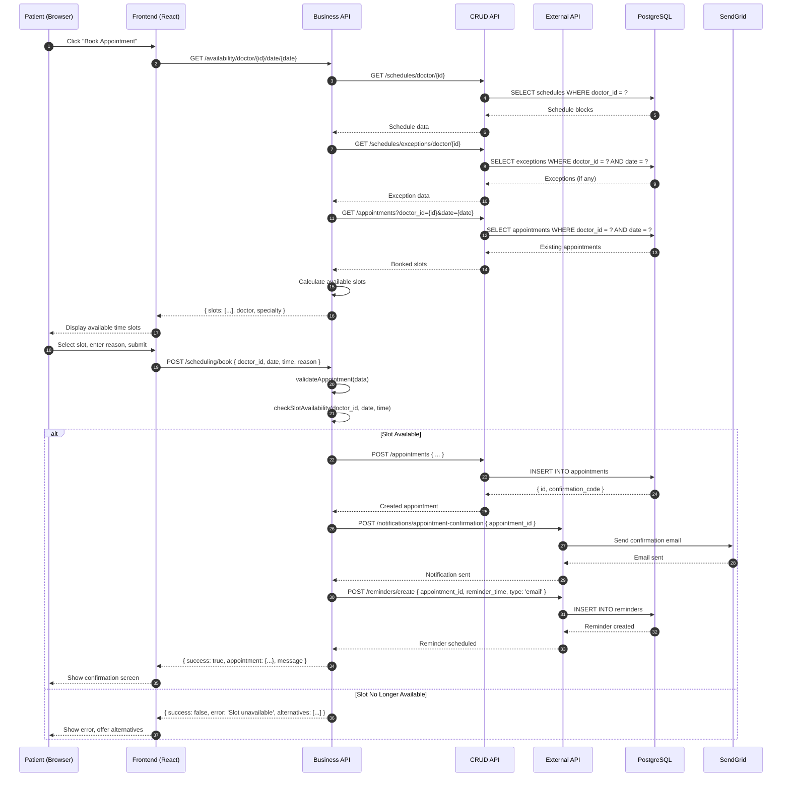
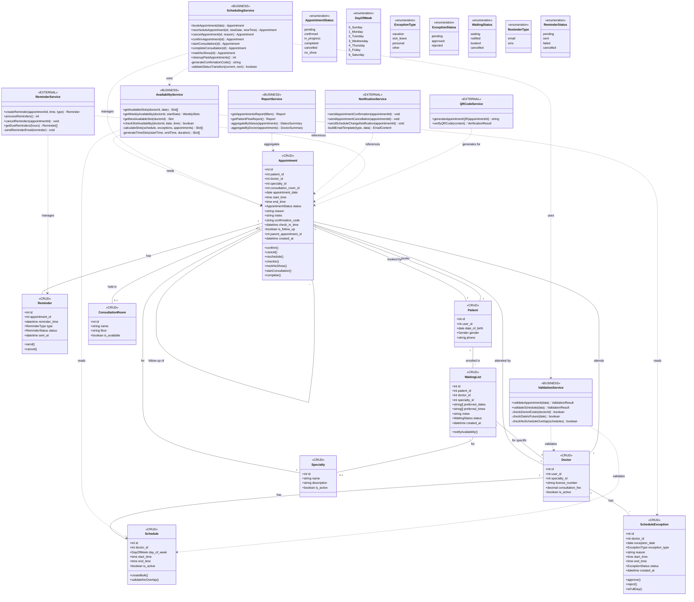

# 📅 Feature 1: Appointment Scheduling & Availability Management

## Architecture Design Document

**Feature ID:** 1  
**Feature Name:** Appointment Scheduling & Availability Management  
**Document Version:** 1.0  
**Last Updated:** February 2026  
**Author:** Senior Software Architect

---

## Table of Contents

1. [Feature Scoping](#1-feature-scoping)
2. [URI Design (Feature-Only)](#2-uri-design-feature-only)
3. [Feature Architecture (Data Flow)](#3-feature-architecture-data-flow)
4. [Feature Class Diagram](#4-feature-class-diagram)
5. [Feature Use Case Diagram](#5-feature-use-case-diagram)
6. [Assumptions & TODOs](#6-assumptions--todos)

---

## 1. Feature Scoping

### 1.1 Goal

Implement the complete appointment lifecycle, from doctor schedule configuration and real-time availability calculation to patient booking, administrative management, and automated notifications. This feature enables patients to book appointments with available doctors, doctors to manage their schedules and daily agendas, and administrators to oversee clinic operations.

---

### 1.2 Epics & User Stories

#### Epic 1.1: Doctor Schedule Configuration

| Story ID | User Story | Acceptance Summary |
|----------|------------|-------------------|
| **US 1.1.1** | As a doctor, I want to configure my weekly availability schedule so that patients can book during my working hours | Visual weekly grid, multiple blocks/day, preview slots, save & activate |
| **US 1.1.2** | As a doctor, I want to manage exceptions to my regular schedule so that I can handle vacations, holidays, and emergencies | Exception types (vacation, sick_leave, personal), date ranges, patient notifications, approval workflow |
| **US 1.1.3** | As a doctor, I want to view my configured schedule and exceptions so that I can verify my availability is correct | Calendar view, exception overlay, week/month toggle, export |

#### Epic 1.2: Availability Calculation Engine

| Story ID | User Story | Acceptance Summary |
|----------|------------|-------------------|
| **US 1.2.1** | As the system, I want to calculate available appointment slots in real-time so that patients see accurate availability | Consider schedule, exceptions, existing appointments; <500ms response; prevent double-booking; caching |

#### Epic 1.3: Patient Appointment Booking

| Story ID | User Story | Acceptance Summary |
|----------|------------|-------------------|
| **US 1.3.1** | As a patient, I want to book a new medical appointment step by step so that I can easily schedule a visit | 6-step wizard: specialty → doctor → date → time → reason → confirm; email confirmation |
| **US 1.3.2** | As a patient, I want to view and manage my appointments so that I can stay organized | List with status filters, cancel with reason, reschedule, history |
| **US 1.3.3** | As a patient, I want to confirm my attendance before an appointment so that the clinic knows I'm coming | One-click confirm from dashboard/email, deadline enforcement |

#### Epic 1.4: Administrative Appointment Management

| Story ID | User Story | Acceptance Summary |
|----------|------------|-------------------|
| **US 1.4.1** | As an administrator, I want to view all appointments in a calendar format so that I can manage the clinic's daily schedule | Monthly/weekly/daily views, color coding by status, filters |
| **US 1.4.2** | As an administrator, I want to manage appointments on behalf of patients so that I can help patients who call or visit | Create/reassign/reschedule, assign room, administrative notes |
| **US 1.4.3** | As an administrator, I want to generate appointment reports so that I can analyze clinic operations | Date range filters, export CSV/PDF, summary statistics |

#### Epic 1.5: Doctor Agenda Management

| Story ID | User Story | Acceptance Summary |
|----------|------------|-------------------|
| **US 1.5.1** | As a doctor, I want to view my daily appointment schedule so that I can prepare for consultations | Today's list ordered by time, status indicators, quick access to patient history, start consultation |
| **US 1.5.2** | As a doctor/receptionist, I want to check in patients when they arrive so that I know who is waiting | Mark arrived, record check-in time, waiting list |
| **US 1.5.3** | As a doctor, I want to mark patients who don't attend as no-show so that I can track attendance | Mark no-show with notes, patient notification, statistics |

#### Epic 1.6: Appointment Notifications

| Story ID | User Story | Acceptance Summary |
|----------|------------|-------------------|
| **US 1.6.1** | As the system, I want to send automatic notifications for appointments so that patients and doctors stay informed | Confirmation email, 24h/1h reminders, change notifications |
| **US 1.6.2** | As a patient with an existing appointment, I want to be notified of any changes so that I can adjust my plans | Doctor exception notifications, reschedule notices, quick actions |

---

### 1.3 In-Scope

| Category | Items |
|----------|-------|
| **Schedule Management** | Weekly schedule CRUD, bulk schedule creation, schedule exceptions (vacation, sick_leave, personal), exception approval workflow |
| **Availability** | Real-time slot calculation, weekly availability, next available slot finder, slot availability check |
| **Booking Operations** | Book appointment, reschedule, cancel, confirm (authenticated & public token), check-in |
| **Status Management** | Pending → Confirmed → In-Progress → Completed/Cancelled/No-Show transitions |
| **Administrative** | Clinic calendar view, appointment filtering, room assignment, report generation |
| **Notifications** | Email confirmations, reminders, cancellation notices, schedule change alerts |
| **Waiting List** | Patient waiting list enrollment for preferred slots (CRUD operations) |

---

### 1.4 Out-of-Scope

| Category | Items | Belongs To |
|----------|-------|------------|
| **User Authentication** | Login, logout, JWT handling | Feature 0 |
| **User/Doctor/Patient CRUD** | Profile management, registration | Feature 0 |
| **Specialties & Rooms** | Entity creation/management | Feature 0 |
| **Medical Consultation** | SOAP notes, vital signs, diagnosis | Feature 2 |
| **Prescriptions** | Creation, QR codes, renewals | Feature 2 |
| **Lab Reports** | Ordering, results, uploads | Feature 2 |
| **Billing** | Invoice generation, payments, insurance | Feature 3 |
| **Quality Surveys** | Satisfaction surveys, doctor ratings | Feature 3 |
| **Advanced Analytics** | Productivity reports, revenue reports | Feature 4 |

---

### 1.5 Dependencies on Previous Features

| Dependency | Feature | Required Endpoints | Usage |
|------------|---------|-------------------|-------|
| **Authentication** | Feature 0 | `POST /auth/login`, JWT middleware | All authenticated endpoints require valid JWT |
| **Doctor Data** | Feature 0 | `GET /api/v1/doctors`, `GET /api/v1/doctors/:id` | Display doctor info in booking wizard, validate doctor_id |
| **Patient Data** | Feature 0 | `GET /api/v1/patients/me` | Associate appointments with authenticated patient |
| **Specialty Data** | Feature 0 | `GET /api/v1/specialties` | Step 1 of booking wizard: select specialty |
| **Consultation Rooms** | Feature 0 | `GET /api/v1/consultation-rooms` | Assign room to appointment (admin) |
| **User Roles** | Feature 0 | Role middleware | Enforce patient/doctor/admin access |

---

## 2. URI Design (Feature-Only)

### 2.1 CRUD API Endpoints (Port 3001)

| Method | Path | Auth | Purpose | Key Request Fields | Key Response Fields | Notes/Edge Cases |
|--------|------|------|---------|-------------------|---------------------|------------------|
| **GET** | `/api/v1/appointments` | Admin | Get all appointments with filters | Query: `status`, `date`, `doctor_id`, `patient_id` | `Array<Appointment>` with patient/doctor/specialty objects | Pagination not explicitly documented |
| **GET** | `/api/v1/appointments/unbilled` | Admin | Get completed appointments without billing | — | `Array<Appointment>` | Used by billing feature but owned by appointments |
| **GET** | `/api/v1/appointments/patient` | Patient | Get authenticated patient's appointments | — | `Array<Appointment>` | Filters by JWT user's patient_id |
| **GET** | `/api/v1/appointments/doctor` | Doctor | Get authenticated doctor's appointments | — | `Array<Appointment>` | Filters by JWT user's doctor_id |
| **GET** | `/api/v1/appointments/by-patient/:patientUserId` | Doctor | Get specific patient's appointments | URL: `patientUserId` | `Array<Appointment>` | Doctor viewing patient history |
| **GET** | `/api/v1/appointments/:id` | Authenticated | Get appointment by ID | URL: `id` | `Appointment` object | Access control: owner, assigned doctor, or admin |
| **POST** | `/api/v1/appointments` | Patient | Create new appointment (basic) | `doctor_id`, `appointment_date`, `start_time`, `reason?`, `notes?` | `{ id, confirmation_code, status }` | Prefer Business API `/scheduling/book` for validation |
| **PUT** | `/api/v1/appointments/:id` | Admin | Full update of appointment | All appointment fields | Updated `Appointment` | Replaces entire record |
| **PATCH** | `/api/v1/appointments/:id` | Admin | Partial update of appointment | Subset of fields | Updated `Appointment` | Room assignment via this endpoint |
| **PATCH** | `/api/v1/appointments/:id/status` | Doctor, Admin | Update appointment status | `status` enum | Updated `Appointment` | Status transition validation |
| **PATCH** | `/api/v1/appointments/:id/confirm` | Admin | Confirm an appointment | — | Updated `Appointment` | Sets status to `confirmed` |
| **PATCH** | `/api/v1/appointments/:id/check-in` | Admin | Register patient arrival | — | Updated `Appointment` | Records `check_in_time` |
| **PATCH** | `/api/v1/appointments/:id/cancel` | Admin | Cancel an appointment | — | Updated `Appointment` | Sets status to `cancelled` |
| **DELETE** | `/api/v1/appointments/:id` | Authenticated (owner/admin) | Cancel appointment (soft delete) | URL: `id` | Success message | Patients can cancel their own |

### 2.2 CRUD API - Schedules Endpoints

| Method | Path | Auth | Purpose | Key Request Fields | Key Response Fields | Notes/Edge Cases |
|--------|------|------|---------|-------------------|---------------------|------------------|
| **GET** | `/api/v1/schedules` | Public | Get all schedules | Query: `doctor_id` | `Array<Schedule>` | Filter by doctor |
| **GET** | `/api/v1/schedules/doctor/:doctorId` | Public | Get doctor's schedule | URL: `doctorId` | `Array<Schedule>` with `day_of_week`, times | Public for booking wizard |
| **GET** | `/api/v1/schedules/me` | Doctor | Get authenticated doctor's schedule | — | `Array<Schedule>` | My schedule view |
| **PUT** | `/api/v1/schedules/me` | Doctor | Update authenticated doctor's schedule | Schedule array | Updated schedules | Bulk replacement |
| **GET** | `/api/v1/schedules/:id` | Doctor, Admin | Get schedule by ID | URL: `id` | `Schedule` object | Single schedule block |
| **POST** | `/api/v1/schedules` | Doctor, Admin | Create schedule | `doctor_id`, `day_of_week`, `start_time`, `end_time` | Created `Schedule` | Validate no overlapping blocks |
| **POST** | `/api/v1/schedules/bulk` | Doctor, Admin | Bulk create/update schedules | `doctor_id`, `schedules[]` array | Created schedules | Replaces all schedules for doctor |
| **PUT** | `/api/v1/schedules/:id` | Doctor, Admin | Update schedule | Schedule fields | Updated `Schedule` | Validate against exceptions |
| **DELETE** | `/api/v1/schedules/:id` | Doctor, Admin | Delete schedule | URL: `id` | Success message | May affect future appointments |

### 2.3 CRUD API - Schedule Exceptions Endpoints

| Method | Path | Auth | Purpose | Key Request Fields | Key Response Fields | Notes/Edge Cases |
|--------|------|------|---------|-------------------|---------------------|------------------|
| **GET** | `/api/v1/schedules/exceptions/doctor/:doctorId` | Public | Get doctor's exceptions | URL: `doctorId` | `Array<ScheduleException>` | Public for availability calc |
| **GET** | `/api/v1/schedules/exceptions/me` | Doctor | Get my exceptions | — | `Array<ScheduleException>` | Authenticated doctor only |
| **POST** | `/api/v1/schedules/exceptions` | Doctor, Admin | Create exception | `doctor_id`, `exception_date`, `exception_type`, `reason?`, `start_time?`, `end_time?` | Created exception | Partial day via start/end time |
| **DELETE** | `/api/v1/schedules/exceptions/:id` | Doctor, Admin | Delete exception | URL: `id` | Success message | Only future exceptions |
| **POST** | `/api/v1/schedules/exceptions/request` | Doctor | Request exception (needs approval) | Exception fields | Created request with `pending` status | Triggers admin review |
| **GET** | `/api/v1/schedules/exceptions/my-requests` | Doctor | Get my exception requests | — | `Array<ExceptionRequest>` | Track request status |
| **DELETE** | `/api/v1/schedules/exceptions/request/:id` | Doctor | Cancel exception request | URL: `id` | Success message | Only pending requests |
| **GET** | `/api/v1/schedules/exceptions/pending` | Admin | Get pending exception requests | — | `Array<ExceptionRequest>` | Admin approval queue |
| **PUT** | `/api/v1/schedules/exceptions/:id/approve` | Admin | Approve exception request | URL: `id` | Updated exception | Sets status to `approved` |
| **PUT** | `/api/v1/schedules/exceptions/:id/reject` | Admin | Reject exception request | URL: `id` | Updated exception | Sets status to `rejected` |

### 2.4 CRUD API - Waiting List Endpoints

| Method | Path | Auth | Purpose | Key Request Fields | Key Response Fields | Notes/Edge Cases |
|--------|------|------|---------|-------------------|---------------------|------------------|
| **GET** | `/api/v1/waiting-list` | Patient | Get patient's waiting list entries | — | `Array<WaitingListEntry>` | Authenticated patient |
| **POST** | `/api/v1/waiting-list` | Patient | Join waiting list | `doctor_id`, `specialty_id`, `preferred_dates[]`, `preferred_times[]`, `notes?` | Created entry | Notify when slot opens |
| **DELETE** | `/api/v1/waiting-list/:id` | Patient | Remove from waiting list | URL: `id` | Success message | Patient can remove self |

---

### 2.5 Business API Endpoints (Port 3002)

| Method | Path | Auth | Purpose | Key Request Fields | Key Response Fields | Notes/Edge Cases |
|--------|------|------|---------|-------------------|---------------------|------------------|
| **GET** | `/api/v1/availability/doctor/:doctorId/date/:date` | Public | Get available slots for doctor on date | URL: `doctorId`, `date` | `{ slots: Array<{ start, end }>, doctor, specialty }` | Core availability endpoint |
| **GET** | `/api/v1/availability/doctor/:doctorId/weekly` | Public | Get weekly availability | URL: `doctorId`, Query: `start_date` | `{ week: Array<{ date, slots[] }> }` | 7-day view for calendar |
| **GET** | `/api/v1/availability/doctor/:doctorId/next` | Public | Get next available slot | URL: `doctorId` | `{ date, time, slot: { start, end } }` | Quick booking shortcut |
| **POST** | `/api/v1/availability/check` | Public | Check if specific slot is available | `doctor_id`, `date`, `time` | `{ available: boolean, message }` | Pre-booking validation |
| **POST** | `/api/v1/scheduling/book` | Patient | Book appointment | `doctor_id`, `date`, `time`, `reason?` | `{ appointment: { id, confirmation_code, status }, message }` | Validates availability, creates appointment |
| **PUT** | `/api/v1/scheduling/reschedule/:appointmentId` | Patient, Admin | Reschedule appointment | URL: `appointmentId`, `new_date`, `new_time`, `reason?` | Updated appointment | Validates new slot availability |
| **POST** | `/api/v1/scheduling/cancel/:appointmentId` | Patient, Doctor, Admin | Cancel appointment | URL: `appointmentId`, `reason?` | Cancelled appointment | Triggers notification |
| **POST** | `/api/v1/scheduling/confirm/:appointmentId` | Doctor, Admin | Confirm appointment | URL: `appointmentId` | Confirmed appointment | Updates status |
| **POST** | `/api/v1/scheduling/confirm-public/:appointmentId` | Public | Confirm via email link | URL: `appointmentId`, Query: `token` | Confirmed appointment | Token validation |
| **POST** | `/api/v1/scheduling/start/:appointmentId` | Doctor | Start consultation | URL: `appointmentId` | `{ status: 'in_progress' }` | Transition to in_progress |
| **POST** | `/api/v1/scheduling/complete/:appointmentId` | Doctor | Complete consultation | URL: `appointmentId` | `{ status: 'completed' }` | Final status |
| **POST** | `/api/v1/scheduling/no-show/:appointmentId` | Doctor, Admin | Mark as no-show | URL: `appointmentId` | `{ status: 'no_show' }` | After grace period |
| **GET** | `/api/v1/scheduling/statistics/doctor/:doctorId` | Doctor, Admin | Get doctor appointment stats | URL: `doctorId` | `{ total, completed, cancelled, no_show }` | Dashboard widget |
| **POST** | `/api/v1/scheduling/cleanup-past` | Doctor, Admin | Auto-mark past pending as no-show | — | `{ updated_count }` | Maintenance operation |
| **POST** | `/api/v1/validations/appointment` | Public | Validate booking data | `doctor_id`, `date`, `time` | `{ valid: boolean, errors[] }` | Pre-submission validation |
| **POST** | `/api/v1/validations/schedule` | Public | Validate schedule data | Schedule fields | `{ valid: boolean, errors[] }` | Schedule config validation |

### 2.6 Business API - Reports (Feature 1 Relevant)

| Method | Path | Auth | Purpose | Key Request Fields | Key Response Fields | Notes/Edge Cases |
|--------|------|------|---------|-------------------|---------------------|------------------|
| **GET** | `/api/v1/reports/appointments` | Admin, Doctor | Generate appointment report | Query: `start_date`, `end_date`, `doctor_id?`, `status?` | Report data with statistics | Export support |
| **GET** | `/api/v1/reports/my-appointments` | Doctor | Get doctor's appointment history | — | `Array<Appointment>` | Personal view |
| **GET** | `/api/v1/reports/patient-flow` | Admin | Patient flow report | — | Flow statistics | Operational insight |

---

### 2.7 External API Endpoints (Port 3003)

| Method | Path | Auth | Purpose | Key Request Fields | Key Response Fields | Notes/Edge Cases |
|--------|------|------|---------|-------------------|---------------------|------------------|
| **POST** | `/notifications/appointment-confirmation` | Admin, Doctor | Send confirmation email | `appointment_id` | Success status | Triggered on booking |
| **POST** | `/notifications/appointment-cancellation` | Admin, Doctor | Send cancellation email | `appointment_id` | Success status | Triggered on cancel |
| **POST** | `/reminders/create` | Admin | Create reminder | `appointment_id`, `reminder_time`, `type` | Created reminder | Schedule 24h/1h reminders |
| **POST** | `/reminders/process` | Admin | Process due reminders | — | `{ sent_count }` | Cron job trigger |
| **GET** | `/reminders/pending/count` | Admin | Get pending reminder count | — | `{ count }` | Admin dashboard |
| **GET** | `/reminders/due/:hours` | Admin | Get reminders due in X hours | URL: `hours` | `Array<Reminder>` | Preview upcoming |
| **GET** | `/reminders/appointment/:appointmentId` | Admin, Doctor | Get reminder history | URL: `appointmentId` | `Array<Reminder>` | Audit trail |
| **DELETE** | `/reminders/appointment/:appointmentId` | Admin | Cancel pending reminders | URL: `appointmentId` | Success message | On cancellation |
| **POST** | `/qr-codes/appointment/:appointmentId` | Admin, Doctor, Patient | Generate appointment QR | URL: `appointmentId` | `{ qr_code: base64 }` | Self-check-in support |

---

### 2.8 Endpoint Overlap Analysis

| Endpoint | Primary Feature | Also Used By | Rationale |
|----------|-----------------|--------------|-----------|
| `GET /api/v1/doctors` | Feature 0 | Feature 1 (booking wizard step 2) | Doctor selection in booking flow |
| `GET /api/v1/specialties` | Feature 0 | Feature 1 (booking wizard step 1) | Specialty selection in booking flow |
| `GET /api/v1/consultation-rooms` | Feature 0 | Feature 1 (room assignment) | Admin assigns room to appointment |
| `POST /scheduling/start` | Feature 1 | Feature 2 (consultation start) | Shared transition point |
| `POST /scheduling/complete` | Feature 1 | Feature 2 (consultation completion) | Shared transition point |
| `GET /appointments/unbilled` | Feature 1 | Feature 3 (billing creation) | Billing references completed appointments |

---

## 3. Feature Architecture (Data Flow)

### 3.1 End-to-End Architecture

```
┌──────────────────────────────────────────────────────────────────────────────────┐
│                                 PRESENTATION LAYER                                │
│                          React SPA (Vercel Edge Network)                          │
│  ┌─────────────────┐  ┌─────────────────┐  ┌─────────────────────────────────┐   │
│  │ Patient Booking │  │ Doctor Schedule │  │ Admin Calendar                  │   │
│  │ Wizard          │  │ Manager         │  │ & Appointment Management        │   │
│  └────────┬────────┘  └────────┬────────┘  └────────────────┬────────────────┘   │
└───────────┼─────────────────────┼───────────────────────────┼────────────────────┘
            │                     │                           │
            │ HTTPS/JWT           │ HTTPS/JWT                 │ HTTPS/JWT
            ▼                     ▼                           ▼
┌──────────────────────────────────────────────────────────────────────────────────┐
│                               BUSINESS LOGIC LAYER                                │
│                            Business API (Render :3002)                            │
│  ┌─────────────────────────────────────────────────────────────────────────────┐ │
│  │                         AvailabilityService                                  │ │
│  │  • getAvailableSlots(doctorId, date)                                        │ │
│  │  • getWeeklyAvailability(doctorId, startDate)                               │ │
│  │  • checkSlotAvailability(doctorId, date, time)                              │ │
│  │  • Algorithm: Schedule ∩ ¬Exceptions ∩ ¬ExistingAppointments                │ │
│  └─────────────────────────────────────────────────────────────────────────────┘ │
│  ┌─────────────────────────────────────────────────────────────────────────────┐ │
│  │                         SchedulingService                                    │ │
│  │  • bookAppointment(data) → validates + creates + generates confirmation_code│ │
│  │  • rescheduleAppointment(id, newDate, newTime)                              │ │
│  │  • cancelAppointment(id, reason)                                            │ │
│  │  • confirmAppointment(id) / markNoShow(id)                                  │ │
│  │  • startConsultation(id) / completeConsultation(id)                         │ │
│  └─────────────────────────────────────────────────────────────────────────────┘ │
│  ┌─────────────────────────────────────────────────────────────────────────────┐ │
│  │                         ValidationService                                    │ │
│  │  • validateAppointment(data) → checks doctor exists, slot available         │ │
│  │  • validateSchedule(data) → checks no overlapping blocks                    │ │
│  └─────────────────────────────────────────────────────────────────────────────┘ │
│  ┌─────────────────────────────────────────────────────────────────────────────┐ │
│  │                         ReportService (Appointment Reports)                  │ │
│  │  • getAppointmentsReport(filters)                                           │ │
│  │  • getPatientFlowReport()                                                   │ │
│  └─────────────────────────────────────────────────────────────────────────────┘ │
└───────────────────────────────────┬──────────────────────────────────────────────┘
                                    │
            ┌───────────────────────┴───────────────────────┐
            ▼                                               ▼
┌───────────────────────────────────┐     ┌────────────────────────────────────────┐
│         DATA ACCESS LAYER         │     │       EXTERNAL INTEGRATION LAYER       │
│     CRUD API (Render :3001)       │     │      External API (Render :3003)       │
│  ┌─────────────────────────────┐  │     │  ┌──────────────────────────────────┐  │
│  │   AppointmentRepository     │  │     │  │     NotificationService          │  │
│  │   • create/read/update      │  │     │  │     • sendAppointmentConfirmation│  │
│  │   • filterByStatus/Date     │  │     │  │     • sendAppointmentCancellation│  │
│  └─────────────────────────────┘  │     │  └──────────────────────────────────┘  │
│  ┌─────────────────────────────┐  │     │  ┌──────────────────────────────────┐  │
│  │     ScheduleRepository      │  │     │  │       ReminderService            │  │
│  │     • bulkCreate            │  │     │  │       • createReminder           │  │
│  │     • getByDoctor           │  │     │  │       • processReminders         │  │
│  └─────────────────────────────┘  │     │  └──────────────────────────────────┘  │
│  ┌─────────────────────────────┐  │     │  ┌──────────────────────────────────┐  │
│  │ ScheduleExceptionRepository │  │     │  │       QRCodeService              │  │
│  │   • create/approve/reject   │  │     │  │       • generateAppointmentQR    │  │
│  └─────────────────────────────┘  │     │  └──────────────────────────────────┘  │
│  ┌─────────────────────────────┐  │     └────────────────────────────────────────┘
│  │   WaitingListRepository     │  │                       │
│  │   • enroll/notify/remove    │  │                       │ SendGrid API
│  └─────────────────────────────┘  │                       ▼
└───────────────────┬───────────────┘     ┌────────────────────────────────────────┐
                    │                     │           EMAIL SERVICE                 │
                    │                     │   (Appointment Confirmations/Reminders) │
                    │                     └────────────────────────────────────────┘
                    │ Supabase Client
                    ▼
┌──────────────────────────────────────────────────────────────────────────────────┐
│                               PERSISTENCE LAYER                                   │
│                          Supabase PostgreSQL Database                             │
│  ┌────────────────┐ ┌───────────────┐ ┌────────────────────┐ ┌────────────────┐  │
│  │  appointments  │ │   schedules   │ │ schedule_exceptions│ │  waiting_list  │  │
│  │  • id          │ │ • id          │ │ • id               │ │ • id           │  │
│  │  • patient_id  │ │ • doctor_id   │ │ • doctor_id        │ │ • patient_id   │  │
│  │  • doctor_id   │ │ • day_of_week │ │ • exception_date   │ │ • doctor_id    │  │
│  │  • specialty_id│ │ • start_time  │ │ • exception_type   │ │ • specialty_id │  │
│  │  • room_id     │ │ • end_time    │ │ • reason           │ │ • preferred_*  │  │
│  │  • date/time   │ │ • is_active   │ │ • start_time       │ │ • status       │  │
│  │  • status      │ └───────────────┘ │ • end_time         │ └────────────────┘  │
│  │  • confirm_code│                   │ • status           │                     │
│  │  • check_in_*  │                   └────────────────────┘                     │
│  └────────────────┘                                                              │
│                         ┌──────────────┐ ┌──────────────┐                        │
│                         │   reminders  │ │notifications │                        │
│                         │• appointment_│ │• user_id     │                        │
│                         │  id          │ │• title/msg   │                        │
│                         │• reminder_   │ │• type        │                        │
│                         │  time        │ │• is_read     │                        │
│                         │• type/status │ └──────────────┘                        │
│                         └──────────────┘                                         │
└──────────────────────────────────────────────────────────────────────────────────┘
```

---

### 3.2 Validation Points

| Point | Layer | Validation | Action on Failure |
|-------|-------|------------|-------------------|
| **V1** | Frontend | Form validation (required fields, date format) | Show inline error, block submission |
| **V2** | Business API | `validateAppointment()` - doctor exists, date is future, time format | Return 400 with `errors[]` array |
| **V3** | Business API | `checkSlotAvailability()` - slot not already booked | Return 409 Conflict, suggest alternatives |
| **V4** | Business API | `validateSchedule()` - no overlapping schedule blocks | Return 400 with conflict details |
| **V5** | CRUD API | Database constraints (foreign keys, unique codes) | Return 500 with error message |
| **V6** | Auth Middleware | JWT validation, role checking | Return 401 Unauthorized or 403 Forbidden |

---

### 3.3 Transaction Boundaries

| Operation | Transaction Scope | Rollback Trigger |
|-----------|-------------------|------------------|
| **Book Appointment** | `appointments` INSERT + `reminders` INSERT | Reminder creation failure → rollback appointment |
| **Cancel Appointment** | `appointments` UPDATE + `reminders` DELETE | Either failure → rollback both |
| **Reschedule** | Check availability → UPDATE appointment → Update reminders | Availability check or update failure |
| **Bulk Schedule Create** | DELETE existing + INSERT all new | Any insertion failure → rollback all |
| **Exception Approval** | UPDATE exception status + Notify affected patients | Notification failure (non-blocking, log only) |

---

### 3.4 Concurrency Concerns

| Scenario | Risk | Mitigation |
|----------|------|------------|
| **Double Booking** | Two patients book same slot simultaneously | Optimistic locking: check availability in transaction, unique constraint on (doctor_id, date, start_time, status != cancelled) |
| **Schedule Update During Booking** | Doctor modifies schedule while patient books | Availability check uses consistent snapshot; booking re-validates at insert time |
| **Concurrent Check-ins** | Multiple receptionists check in same patient | Idempotent operation: `check_in_time` only set if null |
| **Exception Overlap** | Multiple exception requests for same date | First-come-first-served; reject duplicates at database level |

---

### 3.5 Error Handling Strategy

| Error Type | HTTP Code | Response Format | Frontend Handling |
|------------|-----------|-----------------|-------------------|
| **Validation Error** | 400 | `{ success: false, errors: [{ field, message }] }` | Display field-specific errors |
| **Unauthorized** | 401 | `{ success: false, error: 'Token invalid/expired' }` | Redirect to login |
| **Forbidden** | 403 | `{ success: false, error: 'Insufficient permissions' }` | Show access denied message |
| **Not Found** | 404 | `{ success: false, error: 'Resource not found' }` | Show "not found" page |
| **Conflict (Double Book)** | 409 | `{ success: false, error: 'Slot no longer available', alternatives: [...] }` | Show alternatives, re-fetch slots |
| **Server Error** | 500 | `{ success: false, error: 'Internal error', ref: uuid }` | Show generic error, log reference |

---

### 3.6 Appointment Booking Sequence Diagram



---

## 4. Feature Class Diagram



---

## 5. Feature Use Case Diagram

```mermaid
flowchart LR
    %% ============================================
    %% ACTORS DEFINITION
    %% ============================================

    subgraph Actors["👥 PRIMARY ACTORS"]
        direction TB
        Visitor(["🌐 Visitor<br/>(Unauthenticated)"])
        Patient(["🧑‍🤝‍🧑 Patient"])
        Doctor(["👨‍⚕️ Doctor"])
        Admin(["👨‍💼 Administrator"])
    end

    subgraph ExtActors["🔌 EXTERNAL ACTORS"]
        direction TB
        EmailService(["📧 Email<br/>Service"])
        System(["⚙️ System<br/>(Scheduled Jobs)"])
    end

    %% ============================================
    %% FEATURE 1 USE CASES
    %% ============================================

    subgraph F1["📅 FEATURE 1: APPOINTMENT SCHEDULING"]
        direction TB

        subgraph F1_Schedule["Epic 1.1: Schedule Configuration"]
            UC101(["⚙️ UC-101<br/>Configure Weekly Schedule"])
            UC102(["📆 UC-102<br/>Manage Schedule Exceptions"])
            UC103(["👁️ UC-103<br/>View My Schedule"])
            UC104(["✅ UC-104<br/>Approve Exception Request"])
        end

        subgraph F1_Availability["Epic 1.2: Availability Engine"]
            UC105(["🔍 UC-105<br/>Check Available Slots"])
            UC106{{"⚡ UC-106<br/>Calculate Real-Time Availability"}}
        end

        subgraph F1_Booking["Epic 1.3: Patient Booking"]
            UC107(["📝 UC-107<br/>Book New Appointment"])
            UC108(["📋 UC-108<br/>View My Appointments"])
            UC109(["❌ UC-109<br/>Cancel Appointment"])
            UC110(["🔄 UC-110<br/>Reschedule Appointment"])
            UC111(["✅ UC-111<br/>Confirm Attendance"])
        end

        subgraph F1_Admin["Epic 1.4: Admin Management"]
            UC112(["📆 UC-112<br/>View Clinic Calendar"])
            UC113(["🏠 UC-113<br/>Assign Consultation Room"])
            UC114(["📤 UC-114<br/>Export Appointments Report"])
            UC115(["🔄 UC-115<br/>Reschedule (Admin)"])
        end

        subgraph F1_Agenda["Epic 1.5: Doctor Agenda"]
            UC116(["📋 UC-116<br/>View Daily Agenda"])
            UC117(["✔️ UC-117<br/>Check-in Patient"])
            UC118(["⚠️ UC-118<br/>Mark No-Show"])
            UC119(["▶️ UC-119<br/>Start Consultation"])
        end

        subgraph F1_Notifications["Epic 1.6: Notifications"]
            UC120(["📧 UC-120<br/>Send Confirmation Email"])
            UC121(["⏰ UC-121<br/>Send Appointment Reminder"])
            UC122(["📢 UC-122<br/>Notify Schedule Change"])
        end

        subgraph F1_Waiting["Waiting List"]
            UC123(["📋 UC-123<br/>Join Waiting List"])
        end
    end

    %% ============================================
    %% VISITOR RELATIONSHIPS
    %% ============================================

    Visitor --> UC105

    %% ============================================
    %% PATIENT RELATIONSHIPS
    %% ============================================

    Patient --> UC105
    Patient --> UC107
    Patient --> UC108
    Patient --> UC109
    Patient --> UC110
    Patient --> UC111
    Patient --> UC123

    %% ============================================
    %% DOCTOR RELATIONSHIPS
    %% ============================================

    Doctor --> UC101
    Doctor --> UC102
    Doctor --> UC103
    Doctor --> UC116
    Doctor --> UC117
    Doctor --> UC118
    Doctor --> UC119

    %% ============================================
    %% ADMINISTRATOR RELATIONSHIPS
    %% ============================================

    Admin --> UC104
    Admin --> UC112
    Admin --> UC113
    Admin --> UC114
    Admin --> UC115
    Admin --> UC117
    Admin --> UC118

    %% ============================================
    %% EXTERNAL ACTOR RELATIONSHIPS
    %% ============================================

    EmailService -.-> UC120
    EmailService -.-> UC121
    EmailService -.-> UC122
    System -.-> UC106
    System -.-> UC121

    %% ============================================
    %% INCLUDE RELATIONSHIPS
    %% ============================================

    UC107 -.->|include| UC105
    UC107 -.->|include| UC106
    UC110 -.->|include| UC105
    UC110 -.->|include| UC106
    UC115 -.->|include| UC105

    %% ============================================
    %% EXTEND RELATIONSHIPS
    %% ============================================

    UC120 -.->|extend| UC107
    UC121 -.->|extend| UC107
    UC122 -.->|extend| UC102
    UC122 -.->|extend| UC109
    UC122 -.->|extend| UC110
    UC119 -.->|extend| UC117

    %% ============================================
    %% STYLING
    %% ============================================

    classDef actor fill:#E1F5FE,stroke:#0288D1,stroke-width:2px,color:#01579B
    classDef external fill:#FFF3E0,stroke:#FF9800,stroke-width:2px,color:#E65100
    classDef usecase fill:#E8F5E9,stroke:#4CAF50,stroke-width:1px,color:#1B5E20
    classDef system fill:#FCE4EC,stroke:#E91E63,stroke-width:1px,color:#880E4F

    class Visitor,Patient,Doctor,Admin actor
    class EmailService,System external
    class UC106 system
```



---

### 5.1 Use Case Traceability Matrix

| UC ID | Use Case Name | Epic | User Story | Primary Actor | API Endpoints |
|-------|---------------|------|------------|---------------|---------------|
| UC-101 | Configure Weekly Schedule | 1.1 | US 1.1.1 | Doctor | `POST /schedules`, `POST /schedules/bulk`, `PUT /schedules/me` |
| UC-102 | Manage Schedule Exceptions | 1.1 | US 1.1.2 | Doctor | `POST /schedules/exceptions`, `DELETE /schedules/exceptions/:id`, `POST /schedules/exceptions/request` |
| UC-103 | View My Schedule | 1.1 | US 1.1.3 | Doctor | `GET /schedules/me`, `GET /schedules/exceptions/me` |
| UC-104 | Approve Exception Request | 1.1 | US 1.1.2 | Admin | `GET /schedules/exceptions/pending`, `PUT /schedules/exceptions/:id/approve`, `PUT /schedules/exceptions/:id/reject` |
| UC-105 | Check Available Slots | 1.2 | US 1.2.1 | Visitor, Patient | `GET /availability/doctor/:id/date/:date`, `GET /availability/doctor/:id/weekly`, `POST /availability/check` |
| UC-106 | Calculate Real-Time Availability | 1.2 | US 1.2.1 | System | Internal service: `AvailabilityService.getAvailableSlots()` |
| UC-107 | Book New Appointment | 1.3 | US 1.3.1 | Patient | `POST /scheduling/book` |
| UC-108 | View My Appointments | 1.3 | US 1.3.2 | Patient | `GET /appointments/patient` |
| UC-109 | Cancel Appointment | 1.3 | US 1.3.2 | Patient | `POST /scheduling/cancel/:id`, `DELETE /appointments/:id` |
| UC-110 | Reschedule Appointment | 1.3 | US 1.3.2 | Patient | `PUT /scheduling/reschedule/:id` |
| UC-111 | Confirm Attendance | 1.3 | US 1.3.3 | Patient | `POST /scheduling/confirm/:id`, `POST /scheduling/confirm-public/:id` |
| UC-112 | View Clinic Calendar | 1.4 | US 1.4.1 | Admin | `GET /appointments` with filters |
| UC-113 | Assign Consultation Room | 1.4 | US 1.4.2 | Admin | `PATCH /appointments/:id` |
| UC-114 | Export Appointments Report | 1.4 | US 1.4.3 | Admin | `GET /reports/appointments` |
| UC-115 | Reschedule (Admin) | 1.4 | US 1.4.2 | Admin | `PUT /scheduling/reschedule/:id` |
| UC-116 | View Daily Agenda | 1.5 | US 1.5.1 | Doctor | `GET /appointments/doctor` |
| UC-117 | Check-in Patient | 1.5 | US 1.5.2 | Doctor, Admin | `PATCH /appointments/:id/check-in` |
| UC-118 | Mark No-Show | 1.5 | US 1.5.3 | Doctor, Admin | `POST /scheduling/no-show/:id` |
| UC-119 | Start Consultation | 1.5 | US 1.5.1 | Doctor | `POST /scheduling/start/:id` |
| UC-120 | Send Confirmation Email | 1.6 | US 1.6.1 | Email Service | `POST /notifications/appointment-confirmation` |
| UC-121 | Send Appointment Reminder | 1.6 | US 1.6.1 | Email Service, System | `POST /reminders/create`, `POST /reminders/process` |
| UC-122 | Notify Schedule Change | 1.6 | US 1.6.2 | Email Service | `POST /notifications/appointment-cancellation`, internal triggers |
| UC-123 | Join Waiting List | N/A | US 1.3.1 (implied) | Patient | `POST /waiting-list` |

---

## 6. Assumptions & TODOs

### Assumptions

1. **A1**: The availability calculation uses a default slot duration of 30 minutes if not specified by the specialty or doctor.

2. **A2**: Schedule exceptions with `start_time` and `end_time` represent partial-day blocks; absence of these fields indicates a full-day exception.

3. **A3**: The `confirmation_code` is generated using a pattern like `APT-{YEAR}-{SEQUENTIAL}` to ensure uniqueness.

4. **A4**: The check-in operation is idempotent—calling it multiple times for the same appointment will not produce errors or duplicate timestamps.

5. **A5**: Email confirmations and reminders are sent asynchronously via the External API; booking success does not depend on email delivery.

6. **A6**: The waiting list notification (`notifyAvailability`) is triggered by a scheduled job or manual admin action when slots become available.

7. **A7**: Public confirmation via token (`/scheduling/confirm-public/:id`) uses a time-limited token embedded in the email link (e.g., JWT with 24h expiration).

---

### TODOs

1. **TODO-1**: Define exact caching strategy and TTL for availability calculations (currently assumed 5 minutes based on US 1.2.1 notes).

2. **TODO-2**: Implement database unique constraint on `(doctor_id, appointment_date, start_time, status)` WHERE `status NOT IN ('cancelled', 'no_show')` to prevent double-booking at DB level.

3. **TODO-3**: Add SMS notification support as noted in US 1.6.1 (currently only email is implemented in External API).

4. **TODO-4**: Implement grace period configuration for no-show marking (US 1.5.3 mentions 15 minutes as default, but no endpoint for configuration exists).

5. **TODO-5**: Add iCal/ICS export for doctor schedules (mentioned in US 1.1.3 but no endpoint documented).

6. **TODO-6**: Implement automated batch notification for schedule exception changes affecting multiple appointments (US 1.6.2).

7. **TODO-7**: Add endpoint for patient self-check-in kiosk mode using QR code (mentioned in US 1.5.2 as optional).

8. **TODO-8**: Document buffer time between appointments configuration (mentioned in US 1.2.1 but not reflected in schedule schema).

9. **TODO-9**: Implement recurring exception support (e.g., every Monday off) as mentioned in US 1.1.2.

10. **TODO-10**: Add pagination to `GET /appointments` endpoint for large clinics with high appointment volumes.

---

**© 2026 Medical Appointment System - Feature 1 Architecture Document v1.0**
