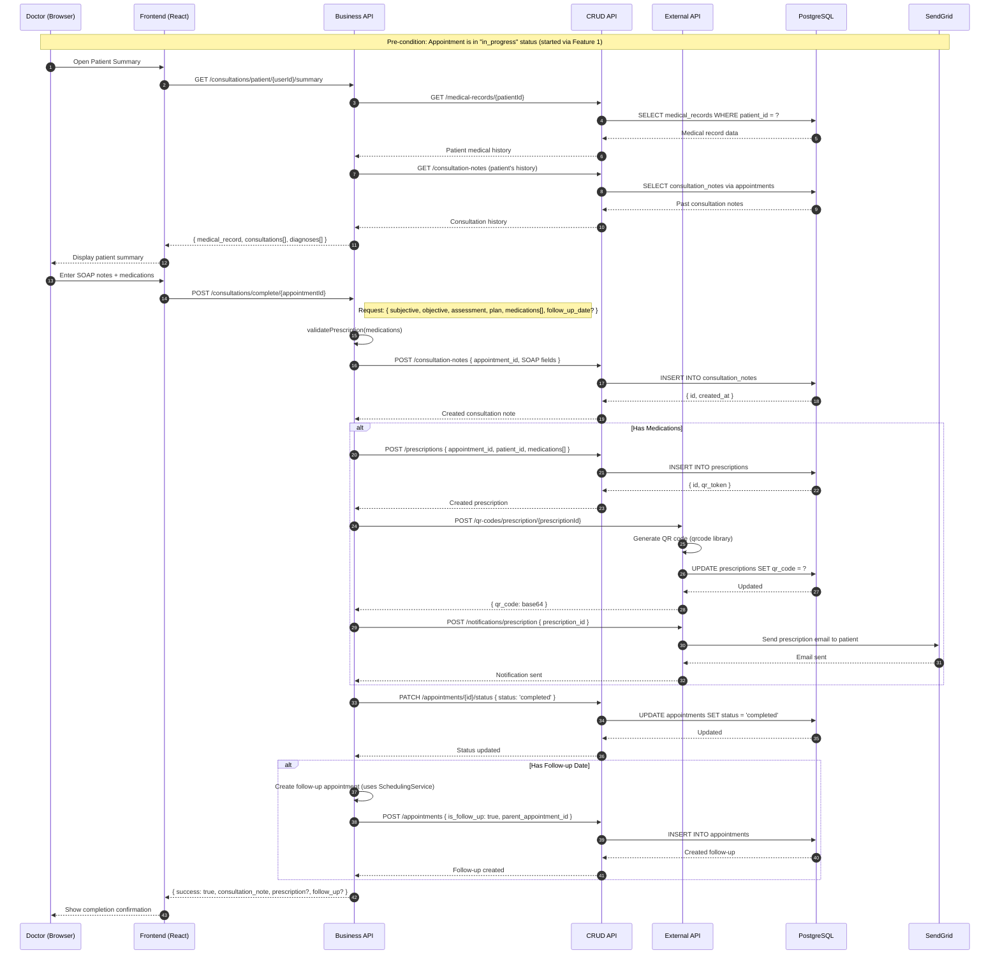
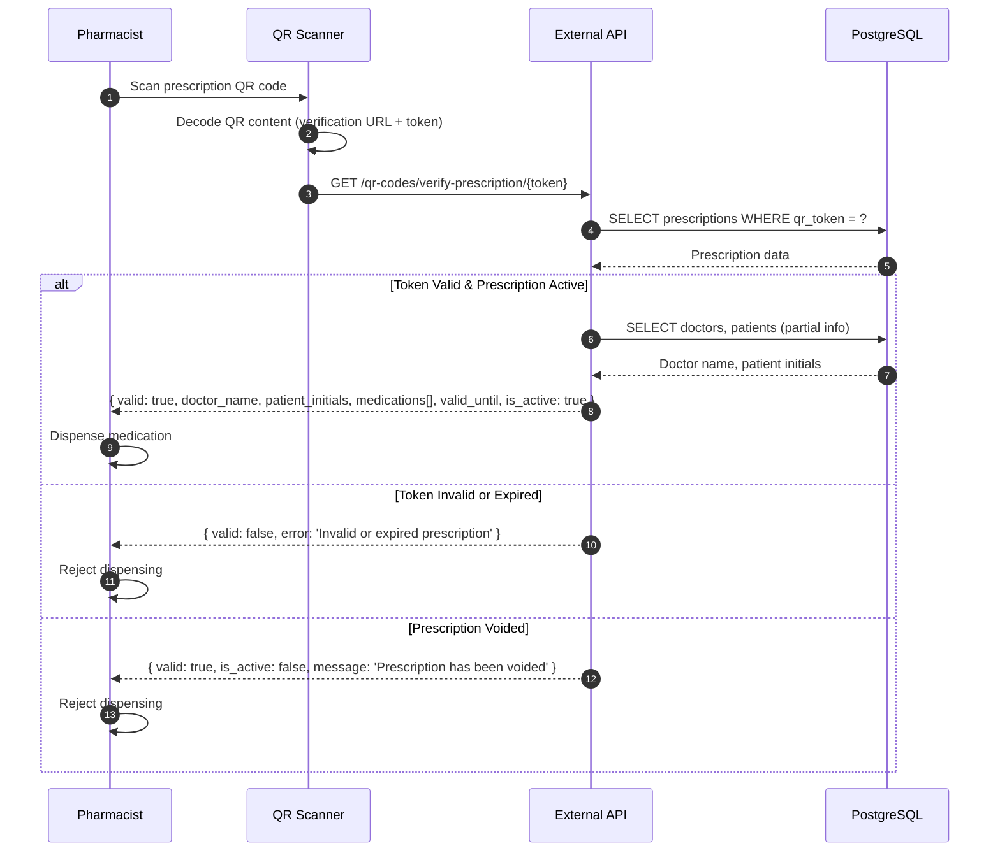
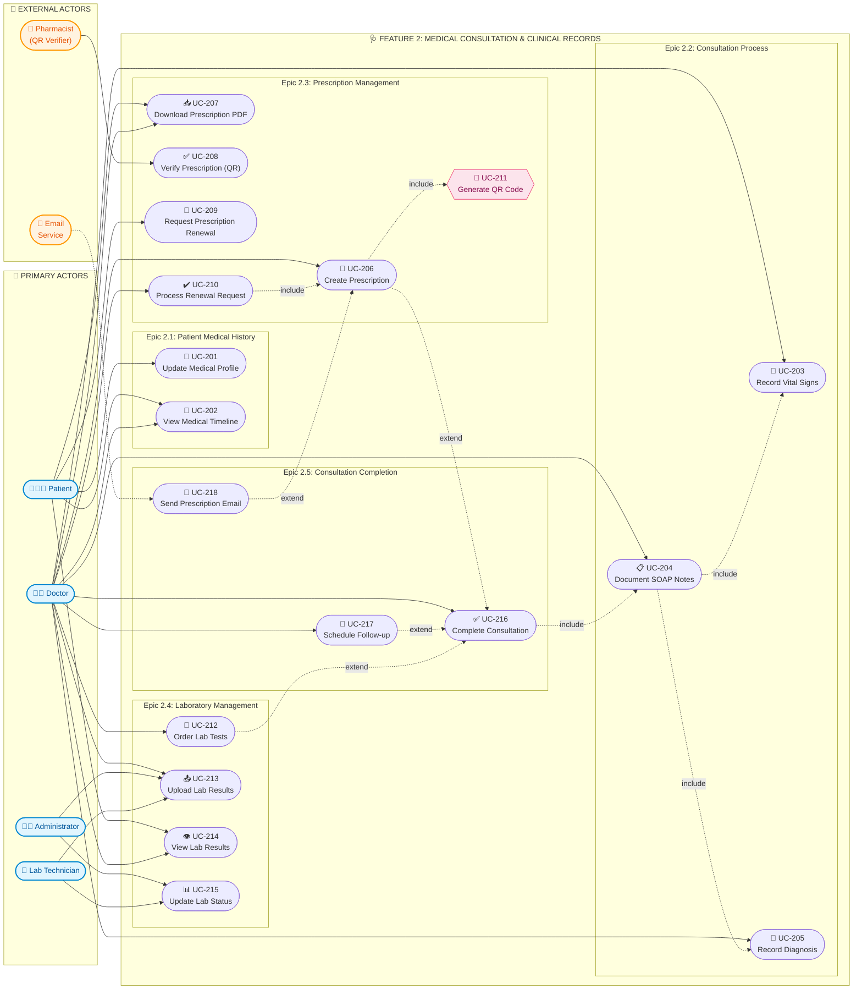

# 🩺 Feature 2: Medical Consultation & Clinical Records

## Architecture Design Document

**Feature ID:** 2  
**Feature Name:** Medical Consultation & Clinical Records  
**Document Version:** 1.0  
**Last Updated:** February 2026  
**Author:** Senior Software Architect

---

## Table of Contents

1. [Feature Scoping](#1-feature-scoping)
2. [URI Design (Feature-Only)](#2-uri-design-feature-only)
3. [Feature Architecture (Data Flow)](#3-feature-architecture-data-flow)
4. [Feature Class Diagram](#4-feature-class-diagram)
5. [Feature Use Case Diagram](#5-feature-use-case-diagram)
6. [Assumptions & TODOs](#6-assumptions--todos)

---

## 1. Feature Scoping

### 1.1 Goal

Digitize the complete medical consultation process from vital signs recording through SOAP documentation to prescription generation, while maintaining comprehensive clinical records for each patient. This feature enables doctors to conduct thorough consultations, create prescriptions with QR verification, order laboratory tests, and ensure continuity of care through follow-up scheduling.

---

### 1.2 Epics & User Stories

#### Epic 2.1: Patient Medical History

| Story ID | User Story | Acceptance Summary |
|----------|------------|-------------------|
| **US 2.1.1** | As a patient, I want to view and update my medical information so that doctors have accurate information for my care | Edit allergies, chronic conditions, medications, emergency contacts, insurance info, blood type, surgical history, lifestyle info |
| **US 2.1.2** | As a doctor viewing a patient, I want to see a timeline of all medical events so that I understand the patient's complete history | Chronological list of consultations, diagnoses, prescriptions, lab results; filter by type/date; export to PDF |

#### Epic 2.2: Consultation Process

| Story ID | User Story | Acceptance Summary |
|----------|------------|-------------------|
| **US 2.2.1** | As a doctor or nurse, I want to record patient vital signs so that I have baseline measurements for the consultation | Input BP, heart rate, temperature, respiratory rate, O2 saturation, weight, height; auto-BMI; alerts for abnormal values; history chart |
| **US 2.2.2** | As a doctor, I want to document the consultation using SOAP format so that I follow medical documentation standards | Subjective (symptoms), Objective (exam findings), Assessment (ICD-10 diagnosis), Plan (treatment); rich text; templates; auto-save |
| **US 2.2.3** | As a doctor, I want to record diagnoses with standard codes so that diagnoses are consistent and reportable | ICD-10 search/autocomplete, multiple diagnoses (primary/secondary), confirmed/suspected status, common diagnoses quick selection |

#### Epic 2.3: Prescription Management

| Story ID | User Story | Acceptance Summary |
|----------|------------|-------------------|
| **US 2.3.1** | As a doctor, I want to create medical prescriptions during consultation so that patients receive proper medication instructions | Multiple medications with dosage/frequency/duration; allergy alerts; unique prescription code; QR code generation |
| **US 2.3.2** | As a patient or doctor, I want to download prescriptions as PDF so that I can print or share them with pharmacies | Professional PDF with clinic branding, patient/doctor info, medications, QR code, doctor signature |
| **US 2.3.3** | As a pharmacist or anyone with the QR code, I want to verify prescription authenticity so that I can confirm it's valid | Public page (no login); enter code or scan QR; display verification status, doctor name, date, patient initials; privacy protected |
| **US 2.3.4** | As a patient, I want to request renewal of my prescriptions so that I can continue medications without a full visit | View eligible prescriptions, submit request with notes, track status, doctor approval/rejection with reason |

#### Epic 2.4: Laboratory Management

| Story ID | User Story | Acceptance Summary |
|----------|------------|-------------------|
| **US 2.4.1** | As a doctor, I want to order laboratory tests during consultation so that I can request diagnostic tests | Select from catalog, custom tests, priority (routine/urgent/STAT), special instructions, multiple tests per order, print order form |
| **US 2.4.2** | As a lab technician or administrator, I want to manage laboratory orders and results so that tests are processed and results delivered | View pending orders, update status (pending→collected→processing→completed), enter results, upload documents, mark normal/abnormal/critical |
| **US 2.4.3** | As a patient, I want to view my laboratory results so that I can see my test outcomes | List orders with status, view completed results, download PDFs, abnormal indicators, compare over time, doctor's notes |

#### Epic 2.5: Consultation Completion

| Story ID | User Story | Acceptance Summary |
|----------|------------|-------------------|
| **US 2.5.1** | As a doctor, I want to complete the consultation with a summary so that the appointment is properly closed | Review vitals/notes/prescriptions/lab orders, add final notes, set follow-up recommendation, mark complete, record end time, generate summary |
| **US 2.5.2** | As a doctor completing a consultation, I want to schedule a follow-up appointment so that continuity of care is maintained | Quick access to schedule, show available slots, suggest dates based on timeframe, pre-fill reason, link to original consultation |

---

### 1.3 In-Scope

| Category | Items |
|----------|-------|
| **Medical Records** | Patient medical profile CRUD, medical history timeline, chronic conditions, allergies, surgical history |
| **Consultation Process** | Vital signs recording (BP, HR, temp, etc.), SOAP documentation (Subjective, Objective, Assessment, Plan) |
| **Diagnosis** | ICD-10 code recording (within assessment field), primary/secondary diagnosis tracking |
| **Prescriptions** | Create prescriptions with medications, QR code generation, PDF download, prescription renewal workflow |
| **QR Verification** | Public prescription verification endpoint, token-based verification |
| **Laboratory** | Lab test ordering, status tracking (pending→collected→processing→completed), result entry/upload, patient result viewing |
| **Consultation Completion** | Complete consultation workflow, follow-up appointment creation |
| **Notifications** | Prescription notification emails, lab result notifications |

---

### 1.4 Out-of-Scope

| Category | Items | Belongs To |
|----------|-------|------------|
| **User Authentication** | Login, logout, JWT handling | Feature 0 |
| **Appointment Booking** | Scheduling, availability, calendar | Feature 1 |
| **Check-in/No-show** | Patient arrival, no-show marking | Feature 1 |
| **Start Consultation** | Transition from `confirmed` → `in_progress` | Feature 1 (shared boundary) |
| **Billing** | Invoice creation, payments, insurance claims | Feature 3 |
| **Doctor Ratings** | Post-consultation ratings and surveys | Feature 3 |
| **Analytics/Reports** | Productivity reports, revenue reports | Feature 4 |

---

### 1.5 Dependencies on Previous Features

| Dependency | Feature | Required Endpoints | Usage |
|------------|---------|-------------------|-------|
| **Authentication** | Feature 0 | `POST /auth/login`, JWT middleware | All authenticated endpoints require valid JWT |
| **Patient Data** | Feature 0 | `GET /api/v1/patients/me`, `GET /api/v1/patients/:id` | Patient profile for medical records association |
| **Doctor Data** | Feature 0 | `GET /api/v1/doctors/:id` | Doctor information for prescriptions, consultation notes |
| **Appointment** | Feature 1 | `GET /api/v1/appointments/:id` | Link consultation notes, prescriptions, lab orders to appointments |
| **Start Consultation** | Feature 1 | `POST /api/v1/scheduling/start/:id` | Transition appointment to `in_progress` before documenting |
| **Specialty Data** | Feature 0 | `GET /api/v1/specialties` | Display doctor specialty in consultation context |

---

## 2. URI Design (Feature-Only)

### 2.1 CRUD API - Medical Records Endpoints (Port 3001)

| Method | Path | Auth | Purpose | Key Request Fields | Key Response Fields | Notes/Edge Cases |
|--------|------|------|---------|-------------------|---------------------|------------------|
| **GET** | `/api/v1/medical-records` | Patient | Get authenticated patient's medical record | — | `{ chronic_conditions[], current_medications[], surgical_history[], family_history, lifestyle_info }` | Auto-creates record if missing |
| **GET** | `/api/v1/medical-records/:patientId` | Doctor, Admin | Get medical record by patient ID | URL: `patientId` | Full `MedicalRecord` object | Used during consultation |
| **POST** | `/api/v1/medical-records` | Doctor | Create medical record entry (notes, updates) | Record fields | Created record | Doctor adds entries during consultation |
| **PUT** | `/api/v1/medical-records` | Patient | Update authenticated patient's medical record | `chronic_conditions[]`, `allergies[]`, etc. | Updated record | Patient self-update |
| **PUT** | `/api/v1/medical-records/:patientId` | Doctor, Admin | Update medical record by patient ID | URL: `patientId`, record fields | Updated record | Doctor updates during consultation |

### 2.2 CRUD API - Consultation Notes Endpoints

| Method | Path | Auth | Purpose | Key Request Fields | Key Response Fields | Notes/Edge Cases |
|--------|------|------|---------|-------------------|---------------------|------------------|
| **GET** | `/api/v1/consultation-notes` | Patient, Doctor | Get consultation notes for current user | — | `Array<ConsultationNote>` | Role-based filtering |
| **GET** | `/api/v1/consultation-notes/appointment/:appointmentId` | Patient, Doctor, Admin | Get consultation note by appointment | URL: `appointmentId` | `ConsultationNote` with SOAP fields | Returns null if none exists |
| **GET** | `/api/v1/consultation-notes/:id` | Authenticated | Get consultation note by ID | URL: `id` | `ConsultationNote` object | Access control per ownership |
| **POST** | `/api/v1/consultation-notes` | Doctor | Create consultation note | `appointment_id`, `subjective`, `objective`, `assessment`, `plan` | Created note with `id`, timestamps | One note per appointment enforced |
| **PUT** | `/api/v1/consultation-notes/:id` | Doctor | Update consultation note | URL: `id`, SOAP fields | Updated note | Only before consultation complete |
| **DELETE** | `/api/v1/consultation-notes/:id` | Admin | Delete consultation note | URL: `id` | Success message | Soft delete with audit trail |

### 2.3 CRUD API - Prescriptions Endpoints

| Method | Path | Auth | Purpose | Key Request Fields | Key Response Fields | Notes/Edge Cases |
|--------|------|------|---------|-------------------|---------------------|------------------|
| **GET** | `/api/v1/prescriptions` | Patient, Doctor | Get prescriptions for current user | — | `Array<Prescription>` | Patients see own, doctors see issued |
| **GET** | `/api/v1/prescriptions/appointment/:appointmentId` | Doctor, Admin | Get prescriptions for appointment | URL: `appointmentId` | `Array<Prescription>` | May have multiple per appointment |
| **GET** | `/api/v1/prescriptions/:id` | Patient, Doctor, Admin | Get prescription by ID with QR code | URL: `id` | `{ id, medications[], qr_code, qr_token, valid_until, is_active }` | QR code as base64 image |
| **POST** | `/api/v1/prescriptions` | Doctor | Create prescription | `appointment_id`, `patient_id`, `medications[]`, `instructions`, `valid_until` | Created prescription with `qr_token` | Auto-generates QR on creation |
| **PUT** | `/api/v1/prescriptions/:id` | Doctor | Update prescription | URL: `id`, prescription fields | Updated prescription | Only active prescriptions |
| **DELETE** | `/api/v1/prescriptions/:id` | Doctor, Admin | Deactivate prescription (soft delete) | URL: `id` | Success message | Sets `is_active = false` |
| **POST** | `/api/v1/prescriptions/generate-qr-codes` | Admin | Generate QR codes for prescriptions without QR | — | `{ generated_count }` | Maintenance/migration tool |

### 2.4 CRUD API - Prescription Renewals Endpoints

| Method | Path | Auth | Purpose | Key Request Fields | Key Response Fields | Notes/Edge Cases |
|--------|------|------|---------|-------------------|---------------------|------------------|
| **GET** | `/api/v1/prescription-renewals` | Patient, Doctor | Get renewals for current user | — | `Array<PrescriptionRenewal>` | Patient sees own, doctor sees pending |
| **GET** | `/api/v1/prescription-renewals/pending-count` | Doctor | Get count of pending renewals | — | `{ count }` | Dashboard widget |
| **GET** | `/api/v1/prescription-renewals/:id` | Patient, Doctor | Get renewal by ID | URL: `id` | `PrescriptionRenewal` object | Access control per ownership |
| **POST** | `/api/v1/prescription-renewals` | Patient | Request prescription renewal | `prescription_id`, `reason?` | Created renewal with `pending` status | Validates prescription eligibility |
| **PUT** | `/api/v1/prescription-renewals/:id/approve` | Doctor | Approve renewal request | URL: `id` | Updated renewal + new prescription | Creates new prescription automatically |
| **PUT** | `/api/v1/prescription-renewals/:id/reject` | Doctor | Reject renewal request | URL: `id`, `reason?` | Updated renewal with `rejected` status | Notifies patient |
| **DELETE** | `/api/v1/prescription-renewals/:id` | Patient | Cancel renewal request | URL: `id` | Success message | Only pending requests |

### 2.5 CRUD API - Lab Reports Endpoints

| Method | Path | Auth | Purpose | Key Request Fields | Key Response Fields | Notes/Edge Cases |
|--------|------|------|---------|-------------------|---------------------|------------------|
| **GET** | `/api/v1/medical-records/lab-reports` | Patient | Get authenticated patient's lab reports | — | `Array<LabReport>` | All statuses |
| **GET** | `/api/v1/medical-records/lab-reports/all` | Admin | Get all lab reports | — | `Array<LabReport>` | Admin oversight |
| **GET** | `/api/v1/medical-records/lab-reports/doctor` | Doctor | Get lab reports for doctor's patients | — | `Array<LabReport>` | Ordered by this doctor |
| **GET** | `/api/v1/medical-records/lab-reports/appointment/:appointmentId` | Doctor, Admin | Get lab reports for appointment | URL: `appointmentId` | `Array<LabReport>` | Multiple tests per appointment |
| **POST** | `/api/v1/medical-records/lab-reports` | Doctor | Create lab report/order | `patient_id`, `appointment_id?`, `test_name`, `test_description?`, `priority`, `notes?` | Created lab report with `pending` status | Notifies patient |
| **PUT** | `/api/v1/medical-records/lab-reports/:reportId/results` | Doctor | Upload results for lab report | URL: `reportId`, `results`, `result_file_url?` | Updated report | Sets `completed_at` timestamp |
| **POST** | `/api/v1/medical-records/lab-reports/:reportId/results` | Admin | Add results to lab report | URL: `reportId`, result data | Updated report | Admin result entry |
| **PATCH** | `/api/v1/medical-records/lab-reports/:reportId/status` | Admin | Update lab report status | URL: `reportId`, `status` enum | Updated report | Status progression tracking |
| **POST** | `/api/v1/medical-records/lab-reports/patient-upload` | Patient | Patient uploads external lab results | File upload, `test_name` | Created external report | Patient-initiated |
| **PUT** | `/api/v1/medical-records/lab-reports/:reportId/patient-results` | Patient | Patient uploads results for pending report | URL: `reportId`, result file | Updated report | For pending own reports |

---

### 2.6 Business API Endpoints (Port 3002)

| Method | Path | Auth | Purpose | Key Request Fields | Key Response Fields | Notes/Edge Cases |
|--------|------|------|---------|-------------------|---------------------|------------------|
| **POST** | `/api/v1/consultations/start/:appointmentId` | Doctor | Start consultation workflow | URL: `appointmentId` | `{ status: 'in_progress', started_at }` | Updates appointment status |
| **POST** | `/api/v1/consultations/complete/:appointmentId` | Doctor | Complete consultation with notes | URL: `appointmentId`, `subjective`, `objective`, `assessment`, `plan`, `follow_up_date?`, `follow_up_reason?` | Completed consultation + optional follow-up | Creates ConsultationNote, updates status |
| **GET** | `/api/v1/consultations/patient/:patientUserId/summary` | Doctor, Admin | Get consultation summary for patient | URL: `patientUserId` | `{ consultations[], diagnoses[], prescriptions_count, lab_reports_count }` | Aggregated patient history |
| **GET** | `/api/v1/consultations/patient/:patientUserId/appointments` | Doctor, Admin | Get all appointment history for patient | URL: `patientUserId` | `Array<Appointment>` with consultation data | Includes notes, prescriptions |
| **GET** | `/api/v1/consultations/:appointmentId/prescriptions` | Doctor | Get prescriptions for appointment | URL: `appointmentId` | `Array<Prescription>` | During consultation view |
| **POST** | `/api/v1/consultations/:appointmentId/prescription` | Doctor | Add prescription during consultation | URL: `appointmentId`, `medications[]`, `instructions?` | Created prescription with QR | Shortcut endpoint |
| **POST** | `/api/v1/consultations/:appointmentId/create-follow-up` | Doctor | Create follow-up appointment | URL: `appointmentId` | Created follow-up appointment | Uses saved notes for date/reason |
| **POST** | `/api/v1/validations/medical-record` | Public | Validate medical record data | Record fields | `{ valid: boolean, errors[] }` | Pre-submission validation |
| **POST** | `/api/v1/validations/prescription` | Public | Validate prescription data | Prescription fields | `{ valid: boolean, errors[] }` | Pre-submission validation |
| **GET** | `/api/v1/validations/patient-profile/me` | Patient | Validate current user's patient profile | — | `{ valid: boolean, missing_fields[] }` | Profile completeness check |
| **GET** | `/api/v1/validations/patient-profile/:patientUserId` | Admin, Doctor | Validate patient profile completeness | URL: `patientUserId` | `{ valid: boolean, missing_fields[] }` | Pre-consultation check |

---

### 2.7 External API Endpoints (Port 3003)

| Method | Path | Auth | Purpose | Key Request Fields | Key Response Fields | Notes/Edge Cases |
|--------|------|------|---------|-------------------|---------------------|------------------|
| **GET** | `/qr-codes/verify-prescription/:token` | Public | Verify prescription by QR token | URL: `token` | `{ prescription: { id, patient_name, doctor_name, medications[], valid_until, is_active } }` | Privacy: no full patient details |
| **POST** | `/qr-codes/prescription/:prescriptionId` | Admin, Doctor | Generate QR code for prescription | URL: `prescriptionId` | `{ qr_code: base64 }` | Regenerate if needed |
| **POST** | `/qr-codes/verify` | Admin, Doctor | Verify QR code content | `content` | `{ valid: boolean, type, data }` | General QR verification |
| **POST** | `/notifications/prescription` | Admin, Doctor | Send prescription notification email | `prescription_id` | Success status | Email to patient |
| **POST** | `/notifications/custom` | Admin | Send custom notification | `user_id`, `title`, `message`, `send_email` | Success status | Lab result notifications |

---

### 2.8 Endpoint Overlap Analysis

| Endpoint | Primary Feature | Also Used By | Rationale |
|----------|-----------------|--------------|-----------|
| `POST /scheduling/start/:id` | Feature 1 | Feature 2 (consultation start) | Shared transition point; Feature 1 owns status change, Feature 2 depends on it |
| `POST /scheduling/complete/:id` | Feature 1 | Feature 2 (consultation completion) | Status transition owned by Feature 1, notes by Feature 2 |
| `POST /consultations/complete/:id` | Feature 2 | Feature 1 (status) | Feature 2 owns consultation notes, integrates with Feature 1 status |
| `GET /api/v1/patients/:id` | Feature 0 | Feature 2 (patient context) | Patient data needed for medical records association |
| `GET /api/v1/appointments/:id` | Feature 1 | Feature 2 (appointment context) | Consultation notes linked to appointments |

---

## 3. Feature Architecture (Data Flow)

### 3.1 End-to-End Architecture

```
┌──────────────────────────────────────────────────────────────────────────────────┐
│                                 PRESENTATION LAYER                                │
│                          React SPA (Vercel Edge Network)                          │
│  ┌─────────────────────┐  ┌──────────────────┐  ┌───────────────────────────┐    │
│  │ Patient Medical     │  │ Doctor           │  │ Lab Technician/Admin      │    │
│  │ Profile View        │  │ Consultation     │  │ Lab Results Management    │    │
│  │ & Lab Results       │  │ Workspace        │  │                           │    │
│  └──────────┬──────────┘  └────────┬─────────┘  └─────────────┬─────────────┘    │
└─────────────┼──────────────────────┼──────────────────────────┼──────────────────┘
              │                      │                          │
              │ HTTPS/JWT            │ HTTPS/JWT                │ HTTPS/JWT
              ▼                      ▼                          ▼
┌──────────────────────────────────────────────────────────────────────────────────┐
│                               BUSINESS LOGIC LAYER                                │
│                            Business API (Render :3002)                            │
│  ┌─────────────────────────────────────────────────────────────────────────────┐ │
│  │                         ConsultationService                                  │ │
│  │  • startConsultation(appointmentId) → validates appointment status          │ │
│  │  • completeConsultation(appointmentId, notes) → saves SOAP, updates status  │ │
│  │  • getPatientSummary(patientUserId) → aggregates medical history            │ │
│  │  • addPrescription(appointmentId, medications) → creates Rx + QR            │ │
│  │  • createFollowUp(appointmentId) → schedules follow-up appointment          │ │
│  └─────────────────────────────────────────────────────────────────────────────┘ │
│  ┌─────────────────────────────────────────────────────────────────────────────┐ │
│  │                         ValidationService                                    │ │
│  │  • validateMedicalRecord(data) → checks required fields, data types         │ │
│  │  • validatePrescription(data) → validates medications, dosage formats       │ │
│  │  • validatePatientProfile(patientUserId) → checks profile completeness      │ │
│  └─────────────────────────────────────────────────────────────────────────────┘ │
└───────────────────────────────────┬──────────────────────────────────────────────┘
                                    │
            ┌───────────────────────┴───────────────────────┐
            ▼                                               ▼
┌───────────────────────────────────┐     ┌────────────────────────────────────────┐
│         DATA ACCESS LAYER         │     │       EXTERNAL INTEGRATION LAYER       │
│     CRUD API (Render :3001)       │     │      External API (Render :3003)       │
│  ┌─────────────────────────────┐  │     │  ┌──────────────────────────────────┐  │
│  │   MedicalRecordRepository   │  │     │  │       QRCodeService              │  │
│  │   • create/read/update      │  │     │  │   • generatePrescriptionQR(id)   │  │
│  │   • getByPatientId          │  │     │  │   • verifyPrescription(token)    │  │
│  └─────────────────────────────┘  │     │  └──────────────────────────────────┘  │
│  ┌─────────────────────────────┐  │     │  ┌──────────────────────────────────┐  │
│  │ ConsultationNoteRepository  │  │     │  │     NotificationService          │  │
│  │   • create/read/update      │  │     │  │   • sendPrescriptionNotification │  │
│  │   • getByAppointmentId      │  │     │  │   • sendLabResultNotification    │  │
│  └─────────────────────────────┘  │     │  └──────────────────────────────────┘  │
│  ┌─────────────────────────────┐  │     └────────────────────────────────────────┘
│  │   PrescriptionRepository    │  │                       │
│  │   • create with QR token    │  │                       │ SendGrid API
│  │   • getByPatient/Doctor     │  │                       ▼
│  │   • deactivate              │  │     ┌────────────────────────────────────────┐
│  └─────────────────────────────┘  │     │           EMAIL SERVICE                 │
│  ┌─────────────────────────────┐  │     │   (Prescription & Lab Notifications)   │
│  │ PrescriptionRenewalRepo     │  │     └────────────────────────────────────────┘
│  │   • create/approve/reject   │  │                       │
│  │   • getPendingForDoctor     │  │                       │ Public Access
│  └─────────────────────────────┘  │                       ▼
│  ┌─────────────────────────────┐  │     ┌────────────────────────────────────────┐
│  │     LabReportRepository     │  │     │        PHARMACY / PUBLIC               │
│  │   • create order            │  │     │   (QR Prescription Verification)       │
│  │   • updateStatus/Results    │  │     └────────────────────────────────────────┘
│  │   • getByPatient/Doctor     │  │
│  └─────────────────────────────┘  │
└───────────────────┬───────────────┘
                    │ Supabase Client
                    ▼
┌──────────────────────────────────────────────────────────────────────────────────┐
│                               PERSISTENCE LAYER                                   │
│                          Supabase PostgreSQL Database                             │
│  ┌─────────────────┐ ┌───────────────────┐ ┌─────────────────┐ ┌───────────────┐ │
│  │ medical_records │ │ consultation_notes│ │  prescriptions  │ │  lab_reports  │ │
│  │ • id            │ │ • id              │ │ • id            │ │ • id          │ │
│  │ • patient_id    │ │ • appointment_id  │ │ • appointment_id│ │ • patient_id  │ │
│  │ • chronic_cond[]│ │ • subjective      │ │ • patient_id    │ │ • appointment_│ │
│  │ • medications[] │ │ • objective       │ │ • doctor_id     │ │   id          │ │
│  │ • surgical_hist│ │ • assessment      │ │ • medications   │ │ • doctor_id   │ │
│  │ • family_hist   │ │ • plan            │ │ • qr_code       │ │ • test_name   │ │
│  │ • lifestyle     │ │ • created_at      │ │ • qr_token      │ │ • priority    │ │
│  └─────────────────┘ │ • updated_at      │ │ • valid_until   │ │ • status      │ │
│                      └───────────────────┘ │ • is_active     │ │ • results     │ │
│                                            └─────────────────┘ │ • result_file │ │
│  ┌───────────────────────────────────────┐                     └───────────────┘ │
│  │       prescription_renewals           │                                       │
│  │ • id                                  │                                       │
│  │ • prescription_id                     │                                       │
│  │ • patient_id                          │                                       │
│  │ • reason                              │                                       │
│  │ • status (pending/approved/rejected)  │                                       │
│  │ • new_prescription_id                 │                                       │
│  └───────────────────────────────────────┘                                       │
└──────────────────────────────────────────────────────────────────────────────────┘
```

---

### 3.2 Validation Points

| Point | Layer | Validation | Action on Failure |
|-------|-------|------------|-------------------|
| **V1** | Frontend | Form validation (required SOAP fields, medication format) | Show inline error, block submission |
| **V2** | Business API | `validatePrescription()` - at least one medication, valid dosage format | Return 400 with `errors[]` array |
| **V3** | Business API | `validateMedicalRecord()` - valid blood type enum, phone format | Return 400 with validation errors |
| **V4** | Business API | Appointment status check - must be `in_progress` to save consultation notes | Return 409 Conflict |
| **V5** | CRUD API | Database constraints (FK, unique appointment_id for notes) | Return 500 with constraint error |
| **V6** | External API | QR token validation - token exists, prescription active | Return 404 or `{ valid: false }` |
| **V7** | Auth Middleware | JWT validation, role checking (Doctor for prescriptions) | Return 401/403 |

---

### 3.3 Transaction Boundaries

| Operation | Transaction Scope | Rollback Trigger |
|-----------|-------------------|------------------|
| **Complete Consultation** | `consultation_notes` INSERT + `appointments` UPDATE (status) | Either failure → rollback both |
| **Create Prescription** | `prescriptions` INSERT + QR generation | QR generation failure (non-blocking, retry later) |
| **Approve Renewal** | `prescription_renewals` UPDATE + new `prescriptions` INSERT | New prescription failure → rollback approval |
| **Complete Lab Report** | `lab_reports` UPDATE + notification trigger | Notification failure (non-blocking, log only) |
| **Consultation with Follow-up** | Notes + status + follow-up appointment | Follow-up creation failure (non-blocking, can retry) |

---

### 3.4 Concurrency Concerns

| Scenario | Risk | Mitigation |
|----------|------|------------|
| **Simultaneous Note Edits** | Two doctors edit same consultation note | Optimistic locking: `updated_at` timestamp check; last write wins with conflict notification |
| **Prescription While Completing** | Doctor creates prescription while another completes consultation | Both operations independent; prescriptions linked by `appointment_id` |
| **Renewal Processing** | Multiple doctors approve same renewal | First-come-first-served; status check in transaction |
| **Lab Status Updates** | Admin and doctor update same report | Status progression enforced (can't go backwards) |

---

### 3.5 Error Handling Strategy

| Error Type | HTTP Code | Response Format | Frontend Handling |
|------------|-----------|-----------------|-------------------|
| **Validation Error** | 400 | `{ success: false, errors: [{ field, message }] }` | Display field-specific errors |
| **Unauthorized** | 401 | `{ success: false, error: 'Token invalid/expired' }` | Redirect to login |
| **Forbidden** | 403 | `{ success: false, error: 'Only doctors can create prescriptions' }` | Show access denied |
| **Not Found** | 404 | `{ success: false, error: 'Prescription not found' }` | Show "not found" message |
| **Conflict** | 409 | `{ success: false, error: 'Consultation notes already exist' }` | Prompt to edit instead |
| **Invalid QR Token** | 404 | `{ success: false, error: 'Invalid or expired prescription token' }` | Show verification failed |
| **Server Error** | 500 | `{ success: false, error: 'Internal error', ref: uuid }` | Show generic error, log reference |

---

### 3.6 Medical Consultation Sequence Diagram



---

### 3.7 Prescription Verification Flow



---

## 4. Feature Class Diagram

```mermaid
classDiagram
    direction TB

    %% ============================================
    %% CLINICAL RECORDS ENTITIES (CRUD API)
    %% ============================================

    class MedicalRecord {
        <<CRUD>>
        +int id
        +int patient_id
        +string[] chronic_conditions
        +string[] current_medications
        +string[] allergies
        +string[] surgical_history
        +string family_history
        +string lifestyle_info
        +string blood_type
        +datetime created_at
        +datetime updated_at
        +addEntry()
        +getTimeline()
        +updateConditions()
    }

    class ConsultationNote {
        <<CRUD>>
        +int id
        +int appointment_id
        +string subjective
        +string objective
        +string assessment
        +string plan
        +datetime created_at
        +datetime updated_at
        +validate()
    }

    class LabReport {
        <<CRUD>>
        +int id
        +int patient_id
        +int appointment_id
        +int doctor_id
        +string test_name
        +string test_description
        +LabPriority priority
        +LabStatus status
        +json results
        +string result_file_url
        +string notes
        +datetime created_at
        +datetime completed_at
        +uploadResults()
        +updateStatus()
        +markAbnormal()
    }

    %% ============================================
    %% PRESCRIPTION ENTITIES (CRUD API)
    %% ============================================

    class Prescription {
        <<CRUD>>
        +int id
        +int appointment_id
        +int patient_id
        +int doctor_id
        +Medication[] medications
        +string instructions
        +date valid_until
        +boolean is_active
        +string qr_code
        +string qr_token
        +datetime created_at
        +generateQR()
        +verify()
        +deactivate()
    }

    class Medication {
        <<VALUE_OBJECT>>
        +string name
        +string dosage
        +string frequency
        +string duration
        +string route
        +string instructions
    }

    class PrescriptionRenewal {
        <<CRUD>>
        +int id
        +int prescription_id
        +int patient_id
        +string reason
        +RenewalStatus status
        +int new_prescription_id
        +string rejection_reason
        +datetime requested_at
        +datetime processed_at
        +approve()
        +reject()
        +cancel()
    }

    %% ============================================
    %% REFERENCE ENTITIES (FROM FEATURES 0 & 1)
    %% ============================================

    class Patient {
        <<CRUD>>
        +int id
        +int user_id
        +date date_of_birth
        +Gender gender
        +string phone
        +string address
        +string emergency_contact_name
        +string emergency_contact_phone
        +string blood_type
        +string[] allergies
    }

    class Doctor {
        <<CRUD>>
        +int id
        +int user_id
        +int specialty_id
        +string license_number
        +boolean is_active
    }

    class Appointment {
        <<CRUD>>
        +int id
        +int patient_id
        +int doctor_id
        +int specialty_id
        +date appointment_date
        +time start_time
        +AppointmentStatus status
        +string reason
        +boolean is_follow_up
        +int parent_appointment_id
    }

    %% ============================================
    %% BUSINESS SERVICES
    %% ============================================

    class ConsultationService {
        <<BUSINESS>>
        +startConsultation(appointmentId) void
        +completeConsultation(appointmentId, notes) ConsultationResult
        +getPatientSummary(patientUserId) PatientSummary
        +getPatientAppointments(patientUserId) Appointment[]
        +addPrescription(appointmentId, medications) Prescription
        +createFollowUp(appointmentId) Appointment
        -validateAppointmentStatus(appointmentId) boolean
        -calculateConsultationDuration(appointmentId) number
    }

    class ValidationService {
        <<BUSINESS>>
        +validateMedicalRecord(data) ValidationResult
        +validatePrescription(data) ValidationResult
        +validatePatientProfile(patientUserId) ProfileValidation
        -checkRequiredFields(data, fields) boolean
        -validateMedicationFormat(medications) boolean
    }

    %% ============================================
    %% EXTERNAL SERVICES
    %% ============================================

    class QRCodeService {
        <<EXTERNAL>>
        +generatePrescriptionQR(prescriptionId) string
        +verifyPrescription(token) VerificationResult
        +verifyQRCode(content) VerificationResult
        -generateSecureToken() string
        -encodeVerificationURL(token) string
    }

    class NotificationService {
        <<EXTERNAL>>
        +sendPrescriptionNotification(prescriptionId) void
        +sendLabResultNotification(labReportId) void
        +sendCustomNotification(userId, title, message) void
        -buildEmailTemplate(type, data) EmailContent
    }

    %% ============================================
    %% ENUMERATIONS
    %% ============================================

    class LabPriority {
        <<enumeration>>
        routine
        urgent
        stat
    }

    class LabStatus {
        <<enumeration>>
        pending
        sample_collected
        processing
        completed
    }

    class RenewalStatus {
        <<enumeration>>
        pending
        approved
        rejected
    }

    class AppointmentStatus {
        <<enumeration>>
        pending
        confirmed
        in_progress
        completed
        cancelled
        no_show
    }

    %% ============================================
    %% RELATIONSHIPS
    %% ============================================

    %% Patient Medical Data
    Patient "1" -- "1" MedicalRecord : has
    Patient "1" -- "*" LabReport : has
    Patient "1" -- "*" Prescription : receives
    Patient "1" -- "*" PrescriptionRenewal : requests

    %% Doctor Relations
    Doctor "1" -- "*" ConsultationNote : creates
    Doctor "1" -- "*" Prescription : issues
    Doctor "1" -- "*" LabReport : orders
    Doctor "1" -- "*" PrescriptionRenewal : processes

    %% Appointment Relations
    Appointment "1" -- "0..1" ConsultationNote : documented by
    Appointment "1" -- "*" Prescription : generates
    Appointment "1" -- "*" LabReport : generates
    Appointment "0..1" -- "*" Appointment : follow-up of

    %% Prescription Relations
    Prescription "1" o-- "*" Medication : contains
    Prescription "1" -- "*" PrescriptionRenewal : renewed by
    PrescriptionRenewal "1" -- "0..1" Prescription : creates new

    %% Service Dependencies
    ConsultationService ..> ConsultationNote : creates
    ConsultationService ..> Prescription : creates
    ConsultationService ..> Appointment : manages status
    ConsultationService ..> MedicalRecord : reads

    ValidationService ..> MedicalRecord : validates
    ValidationService ..> Prescription : validates
    ValidationService ..> Patient : validates profile

    QRCodeService ..> Prescription : generates QR for
    NotificationService ..> Prescription : notifies about
    NotificationService ..> LabReport : notifies about
```



---

## 5. Feature Use Case Diagram



---

### 5.1 Use Case Traceability Matrix

| UC ID | Use Case Name | Epic | User Story | Primary Actor | API Endpoints |
|-------|---------------|------|------------|---------------|---------------|
| UC-201 | Update Medical Profile | 2.1 | US 2.1.1 | Patient | `PUT /api/v1/medical-records`, `PUT /api/v1/patients/me` |
| UC-202 | View Medical Timeline | 2.1 | US 2.1.2 | Patient, Doctor | `GET /api/v1/medical-records/:patientId`, `GET /api/v1/consultations/patient/:id/summary` |
| UC-203 | Record Vital Signs | 2.2 | US 2.2.1 | Doctor | Part of `POST /api/v1/consultation-notes` (objective field) |
| UC-204 | Document SOAP Notes | 2.2 | US 2.2.2 | Doctor | `POST /api/v1/consultation-notes`, `PUT /api/v1/consultation-notes/:id` |
| UC-205 | Record Diagnosis | 2.2 | US 2.2.3 | Doctor | Part of `POST /api/v1/consultation-notes` (assessment field) |
| UC-206 | Create Prescription | 2.3 | US 2.3.1 | Doctor | `POST /api/v1/prescriptions`, `POST /api/v1/consultations/:id/prescription` |
| UC-207 | Download Prescription PDF | 2.3 | US 2.3.2 | Patient, Doctor | `GET /api/v1/prescriptions/:id` (includes QR code) |
| UC-208 | Verify Prescription (QR) | 2.3 | US 2.3.3 | Pharmacist | `GET /qr-codes/verify-prescription/:token` |
| UC-209 | Request Prescription Renewal | 2.3 | US 2.3.4 | Patient | `POST /api/v1/prescription-renewals` |
| UC-210 | Process Renewal Request | 2.3 | US 2.3.4 | Doctor | `PUT /api/v1/prescription-renewals/:id/approve`, `PUT /api/v1/prescription-renewals/:id/reject` |
| UC-211 | Generate QR Code | 2.3 | US 2.3.1 | System | `POST /qr-codes/prescription/:prescriptionId` |
| UC-212 | Order Lab Tests | 2.4 | US 2.4.1 | Doctor | `POST /api/v1/medical-records/lab-reports` |
| UC-213 | Upload Lab Results | 2.4 | US 2.4.2 | Doctor, Admin, LabTech | `PUT /api/v1/medical-records/lab-reports/:id/results`, `POST /api/v1/medical-records/lab-reports/:id/results` |
| UC-214 | View Lab Results | 2.4 | US 2.4.3 | Patient, Doctor | `GET /api/v1/medical-records/lab-reports`, `GET /api/v1/medical-records/lab-reports/doctor` |
| UC-215 | Update Lab Status | 2.4 | US 2.4.2 | Admin, LabTech | `PATCH /api/v1/medical-records/lab-reports/:id/status` |
| UC-216 | Complete Consultation | 2.5 | US 2.5.1 | Doctor | `POST /api/v1/consultations/complete/:id` |
| UC-217 | Schedule Follow-up | 2.5 | US 2.5.2 | Doctor | `POST /api/v1/consultations/:id/create-follow-up` |
| UC-218 | Send Prescription Email | 2.3 | US 2.3.2 | Email Service | `POST /notifications/prescription` |

---

## 6. Assumptions & TODOs

### Assumptions

1. **A1**: Vital signs are recorded as part of the `objective` section in SOAP notes rather than as a separate entity. No dedicated vitals table exists in the current schema.

2. **A2**: ICD-10 diagnosis codes are stored as free text within the `assessment` field of consultation notes. No separate diagnosis entity or ICD-10 lookup table is defined.

3. **A3**: The `Medication` is a value object (embedded JSON array) within `Prescription`, not a separate entity with independent lifecycle.

4. **A4**: QR code generation happens automatically when a prescription is created via the CRUD API, with the `qr_token` stored in the database.

5. **A5**: The Lab Technician role is implemented as an Administrator with specific permissions, not as a separate role in the system.

6. **A6**: Prescription PDF generation is handled client-side using the prescription data (including base64 QR code) returned from `GET /prescriptions/:id`.

7. **A7**: Follow-up appointments created via `createFollowUp` use the saved `follow_up_date` and `follow_up_reason` from the consultation completion request.

---

### TODOs

1. **TODO-1**: Add dedicated vital signs entity/table to properly track BP, HR, temperature, etc. over time with reference ranges.

2. **TODO-2**: Implement ICD-10 code lookup endpoint with autocomplete functionality for the diagnosis field.

3. **TODO-3**: Add drug interaction checking service integration to warn doctors of potential medication conflicts.

4. **TODO-4**: Implement allergy alert system that cross-references patient allergies with prescribed medications.

5. **TODO-5**: Add prescription PDF server-side generation endpoint for proper clinic branding and digital signature support.

6. **TODO-6**: Implement lab test catalog endpoint (`GET /api/v1/lab-tests`) for standardized test selection.

7. **TODO-7**: Add critical lab result alert system that immediately notifies the ordering doctor.

8. **TODO-8**: Implement consultation note template system for common conditions to reduce documentation time.

9. **TODO-9**: Add audit trail for prescription modifications and deactivations per HIPAA compliance requirements.

10. **TODO-10**: Implement lab result comparison charts endpoint for tracking values over time.

---

**© 2026 Medical Appointment System - Feature 2 Architecture Document v1.0**
