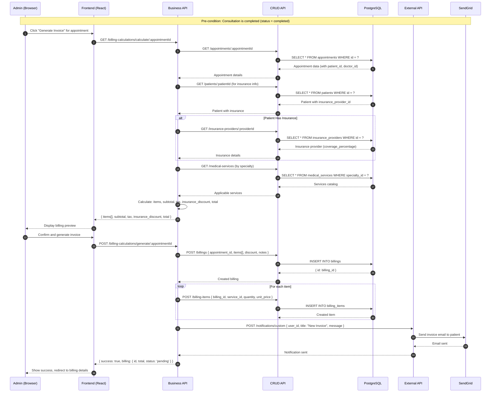
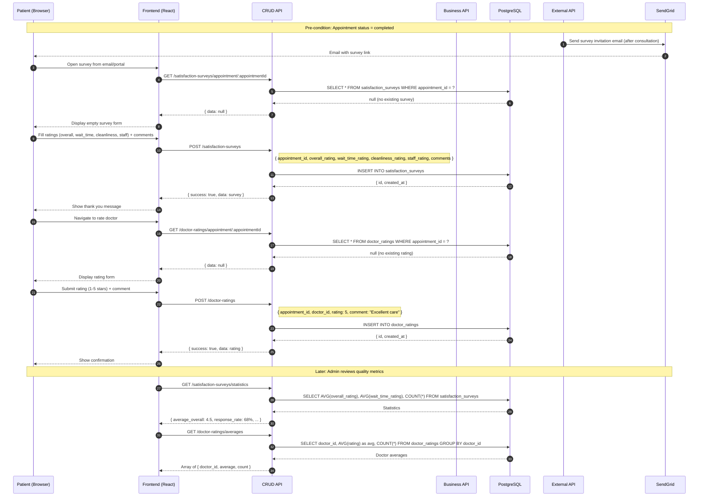
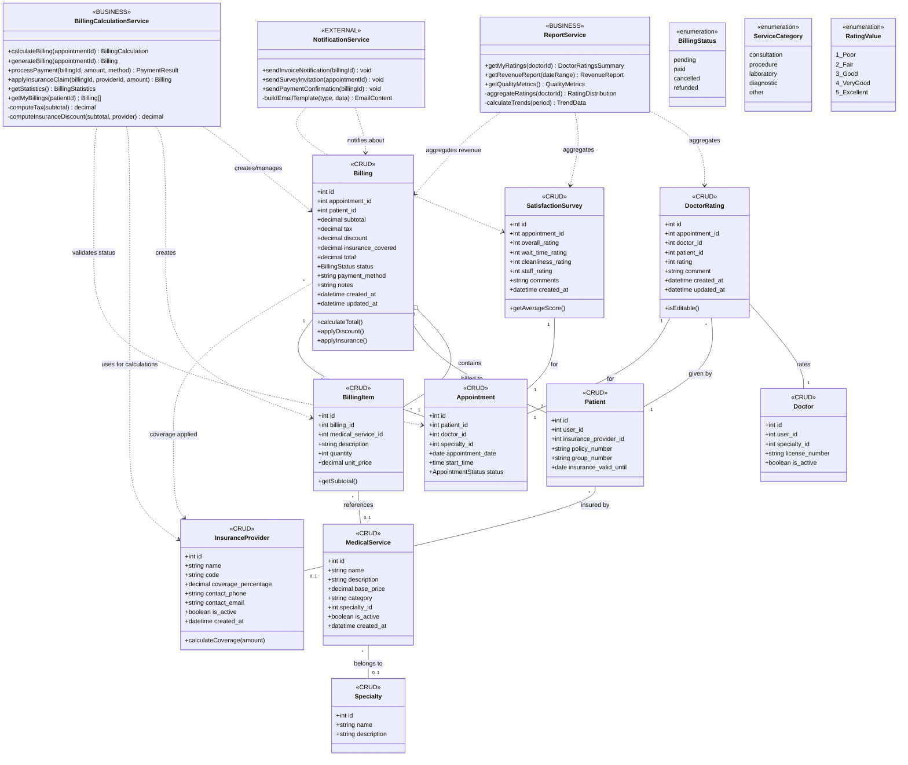
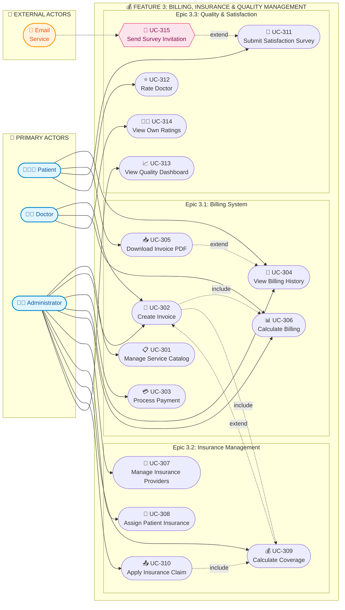

# 💰 Feature 3: Billing, Insurance & Quality Management

## Architecture Design Document

**Feature ID:** 3  
**Feature Name:** Billing, Insurance & Quality Management  
**Document Version:** 1.0  
**Last Updated:** February 2026  
**Author:** Senior Software Architect

---

## Table of Contents

1. [Feature Scoping](#1-feature-scoping)
2. [URI Design (Feature-Only)](#2-uri-design-feature-only)
3. [Feature Architecture (Data Flow)](#3-feature-architecture-data-flow)
4. [Feature Class Diagram](#4-feature-class-diagram)
5. [Feature Use Case Diagram](#5-feature-use-case-diagram)
6. [Assumptions & TODOs](#6-assumptions--todos)

---

## 1. Feature Scoping

### 1.1 Goal

Manage the clinic's financial operations including medical service pricing, patient invoicing with insurance coverage calculations, and payment processing. Additionally, establish a quality management system through patient satisfaction surveys and doctor rating mechanisms to enable continuous service improvement.

---

### 1.2 Epics & User Stories

#### Epic 3.1: Billing System

| Story ID | User Story | Acceptance Summary |
|----------|------------|-------------------|
| **US 3.1.1** | As an administrator, I want to manage a catalog of billable services so that services can be consistently priced and billed | CRUD services with categories (consultation, procedure, laboratory), price history tracking, activate/deactivate, import/export |
| **US 3.1.2** | As an administrator, I want to create and manage patient invoices so that services are properly billed | Create invoice (patient, items, discounts, taxes), auto-calculate insurance coverage, status workflow (draft → pending → paid → voided), unique invoice numbers |
| **US 3.1.3** | As an administrator, I want to record payments for invoices so that I can track clinic revenue | Full/partial payments, multiple payment methods (cash, card, transfer, check), receipts, void payments, daily summary |
| **US 3.1.4** | As a patient, I want to view my billing history and invoices so that I can track my medical expenses | List invoices with status, view details, download PDF, payment history, outstanding balance, insurance coverage details |

#### Epic 3.2: Insurance Management

| Story ID | User Story | Acceptance Summary |
|----------|------------|-------------------|
| **US 3.2.1** | As an administrator, I want to manage insurance providers and plans so that I can properly process insurance claims | CRUD providers with contact info, manage plans, set coverage percentages by service category, contract dates, activate/deactivate |
| **US 3.2.2** | As an administrator or patient, I want to manage patient insurance information so that coverage can be applied to billing | Assign insurance to patient (provider, plan, policy number, group number, validity), primary/secondary insurance, card image upload, eligibility verification |
| **US 3.2.3** | As the system, I want to calculate insurance coverage for invoices so that patient copay is accurate | Apply coverage percentage per service type, calculate covered amount and patient responsibility, handle deductibles, show coverage breakdown, manual override with reason |

#### Epic 3.3: Quality & Patient Satisfaction

| Story ID | User Story | Acceptance Summary |
|----------|------------|-------------------|
| **US 3.3.1** | As the system, I want to collect patient feedback after appointments so that service quality can be measured | Auto survey trigger after consultation, email link, portal access, questions (overall, punctuality, doctor care, facilities, staff), 1-5 stars, optional comments, anonymous option |
| **US 3.3.2** | As a patient, I want to rate my doctor after a consultation so that I can share my experience | Rate after completed appointment, criteria (punctuality, attention, clarity, recommendation), 1-5 stars, written review, anonymous option, edit within 24 hours |
| **US 3.3.3** | As an administrator, I want to view quality metrics and trends so that I can monitor and improve service quality | Overall satisfaction score/trend, by doctor rankings, by specialty, response rate, recent comments, low rating alerts, date filters, export reports |
| **US 3.3.4** | As a doctor, I want to view my own ratings and feedback so that I can understand patient perception and improve | Average rating overall and by criteria, distribution chart, recent reviews (anonymous), trend over time, comparison to clinic average |

---

### 1.3 In-Scope

| Category | Items |
|----------|-------|
| **Medical Services** | Service catalog CRUD, categories, pricing, specialty association, active/inactive status |
| **Billing** | Invoice creation/management, line items, discounts, taxes, status workflow (pending → paid → cancelled → refunded) |
| **Billing Items** | Add/remove items from invoices, link to medical services, quantity, unit price |
| **Payments** | Record payments (full/partial), payment methods, payment processing, billing status updates |
| **Insurance Providers** | Provider CRUD, coverage percentage, contact info, code-based lookup |
| **Insurance Claims** | Apply insurance to billing, calculate coverage discount, claim processing |
| **Satisfaction Surveys** | Survey creation, rating dimensions (overall, wait time, cleanliness, staff), comments, statistics |
| **Doctor Ratings** | Rating creation by patients, appointment-linked, comment support, average calculations |
| **Quality Analytics** | Survey statistics, rating averages, doctor performance metrics |

---

### 1.4 Out-of-Scope

| Category | Items | Belongs To |
|----------|-------|------------|
| **User Authentication** | Login, logout, JWT handling, password management | Feature 0 |
| **Patient Profile** | Patient CRUD, basic profile management | Feature 0 |
| **Appointments** | Booking, scheduling, confirmation, completion | Feature 1 |
| **Consultations** | SOAP notes, prescriptions, lab orders | Feature 2 |
| **Admin Dashboard** | General statistics, system overview widgets | Feature 4 |
| **Reports (except billing)** | Appointment reports, productivity reports | Feature 4 |
| **Audit Logs** | Security audit trail | Feature 4 |

---

### 1.5 Dependencies on Previous Features

| Dependency | Feature | Required Endpoints | Usage |
|------------|---------|-------------------|-------|
| **Authentication** | Feature 0 | `POST /auth/login`, JWT middleware | All authenticated billing/survey endpoints |
| **Patient Data** | Feature 0 | `GET /api/v1/patients/:id` | Link billing to patient, get insurance info |
| **Doctor Data** | Feature 0 | `GET /api/v1/doctors/:id` | Doctor ratings association, display in invoices |
| **Specialty Data** | Feature 0 | `GET /api/v1/specialties` | Medical service categorization by specialty |
| **Appointment** | Feature 1 | `GET /api/v1/appointments/:id` | Link billing and surveys to completed appointments |
| **Appointment Status** | Feature 1 | Appointment must be `completed` | Trigger survey eligibility, enable rating |
| **Consultation Completion** | Feature 2 | `POST /api/v1/consultations/complete/:id` | Billing generation after consultation ends |

---

## 2. URI Design (Feature-Only)

### 2.1 CRUD API - Billing Endpoints (Port 3001)

| Method | Path | Auth | Purpose | Key Request Fields | Key Response Fields | Notes/Edge Cases |
|--------|------|------|---------|-------------------|---------------------|------------------|
| **GET** | `/api/v1/billings` | Authenticated | Get billings (patient: own, admin: all) | Query: `status`, `patient_id` | `Array<{id, appointment_id, patient, subtotal, tax, discount, insurance_covered, total, status, items[]}>` | Role-based filtering |
| **GET** | `/api/v1/billings/:id` | Authenticated | Get billing with details | URL: `id` | Full `Billing` with items, patient info | Access control per ownership |
| **POST** | `/api/v1/billings` | Doctor, Admin | Create billing | `appointment_id`, `items[]`, `discount?`, `notes?` | Created billing with `id` | One billing per appointment enforced |
| **PATCH** | `/api/v1/billings/:id/status` | Admin | Update billing status | URL: `id`, `status`, `payment_method?` | Updated billing | Status: pending, paid, cancelled, refunded |
| **DELETE** | `/api/v1/billings/:id` | Admin | Cancel billing (soft delete) | URL: `id` | Success message | Sets status to `cancelled` |

### 2.2 CRUD API - Billing Items Endpoints

| Method | Path | Auth | Purpose | Key Request Fields | Key Response Fields | Notes/Edge Cases |
|--------|------|------|---------|-------------------|---------------------|------------------|
| **GET** | `/api/v1/billing-items/billing/:billingId` | Doctor, Admin | Get items for a billing | URL: `billingId` | `Array<BillingItem>` | Returns all line items |
| **POST** | `/api/v1/billing-items` | Doctor, Admin | Add item to billing | `billing_id`, `medical_service_id?`, `description?`, `quantity`, `unit_price?` | Created item | Either service_id OR description+price required |
| **DELETE** | `/api/v1/billing-items/:id` | Doctor, Admin | Remove item from billing | URL: `id` | Success message | Only for pending billings |

### 2.3 CRUD API - Medical Services Endpoints

| Method | Path | Auth | Purpose | Key Request Fields | Key Response Fields | Notes/Edge Cases |
|--------|------|------|---------|-------------------|---------------------|------------------|
| **GET** | `/api/v1/medical-services` | Authenticated | Get services catalog | Query: `category`, `specialty_id` | `Array<{id, name, description, base_price, category, specialty_id, is_active}>` | Filterable by category/specialty |
| **GET** | `/api/v1/medical-services/categories` | Authenticated | Get all service categories | — | `Array<string>` | consultation, procedure, laboratory, etc. |
| **GET** | `/api/v1/medical-services/:id` | Authenticated | Get service by ID | URL: `id` | `MedicalService` object | — |
| **POST** | `/api/v1/medical-services` | Admin | Create medical service | `name`, `description?`, `base_price`, `category`, `specialty_id?` | Created service | Category required |
| **PUT** | `/api/v1/medical-services/:id` | Admin | Update medical service | URL: `id`, service fields | Updated service | Price changes don't affect existing invoices |
| **DELETE** | `/api/v1/medical-services/:id` | Admin | Delete medical service | URL: `id` | Success message | Soft delete (is_active = false) |

### 2.4 CRUD API - Insurance Providers Endpoints

| Method | Path | Auth | Purpose | Key Request Fields | Key Response Fields | Notes/Edge Cases |
|--------|------|------|---------|-------------------|---------------------|------------------|
| **GET** | `/api/v1/insurance-providers` | Authenticated | Get all active insurance providers | — | `Array<{id, name, code, coverage_percentage, contact_phone, contact_email, is_active}>` | Only active by default |
| **GET** | `/api/v1/insurance-providers/:id` | Authenticated | Get provider by ID | URL: `id` | `InsuranceProvider` object | — |
| **GET** | `/api/v1/insurance-providers/code/:code` | Authenticated | Get provider by code | URL: `code` | `InsuranceProvider` object | Code lookup (e.g., "ISSS") |
| **POST** | `/api/v1/insurance-providers` | Admin | Create insurance provider | `name`, `code`, `coverage_percentage`, `contact_phone?`, `contact_email?` | Created provider | Code must be unique |
| **PUT** | `/api/v1/insurance-providers/:id` | Admin | Update insurance provider | URL: `id`, provider fields | Updated provider | — |
| **DELETE** | `/api/v1/insurance-providers/:id` | Admin | Delete insurance provider | URL: `id` | Success message | Soft delete |

### 2.5 CRUD API - Doctor Ratings Endpoints

| Method | Path | Auth | Purpose | Key Request Fields | Key Response Fields | Notes/Edge Cases |
|--------|------|------|---------|-------------------|---------------------|------------------|
| **GET** | `/api/v1/doctor-ratings` | Admin | Get all ratings | — | `Array<DoctorRating>` | Admin oversight |
| **GET** | `/api/v1/doctor-ratings/averages` | Admin | Get average ratings for all doctors | — | `Array<{doctor_id, average, count}>` | Quality dashboard |
| **GET** | `/api/v1/doctor-ratings/doctor/:doctorId` | Authenticated | Get all ratings for a doctor | URL: `doctorId` | `Array<DoctorRating>` | Public doctor profile |
| **GET** | `/api/v1/doctor-ratings/doctor/:doctorId/average` | Authenticated | Get average rating for a doctor | URL: `doctorId` | `{average, count, distribution}` | Display in doctor card |
| **GET** | `/api/v1/doctor-ratings/appointment/:appointmentId` | Authenticated | Get rating by appointment | URL: `appointmentId` | `DoctorRating` or null | Check if already rated |
| **GET** | `/api/v1/doctor-ratings/:id` | Authenticated | Get rating by ID | URL: `id` | `DoctorRating` object | — |
| **POST** | `/api/v1/doctor-ratings` | Patient | Create new rating | `appointment_id`, `doctor_id`, `rating` (1-5), `comment?` | Created rating | One rating per appointment |
| **PUT** | `/api/v1/doctor-ratings/:id` | Patient, Admin | Update rating | URL: `id`, rating fields | Updated rating | Patient: within 24 hours only |
| **DELETE** | `/api/v1/doctor-ratings/:id` | Admin | Delete rating | URL: `id` | Success message | Moderation tool |

### 2.6 CRUD API - Satisfaction Surveys Endpoints

| Method | Path | Auth | Purpose | Key Request Fields | Key Response Fields | Notes/Edge Cases |
|--------|------|------|---------|-------------------|---------------------|------------------|
| **GET** | `/api/v1/satisfaction-surveys` | Admin | Get all surveys | — | `Array<SatisfactionSurvey>` | Admin oversight |
| **GET** | `/api/v1/satisfaction-surveys/statistics` | Admin | Get survey statistics | — | `{average_overall, average_wait_time, average_cleanliness, average_staff, total_count, response_rate}` | Quality dashboard |
| **GET** | `/api/v1/satisfaction-surveys/appointment/:appointmentId` | Authenticated | Get survey by appointment | URL: `appointmentId` | `SatisfactionSurvey` or null | Check if already submitted |
| **GET** | `/api/v1/satisfaction-surveys/:id` | Authenticated | Get survey by ID | URL: `id` | `SatisfactionSurvey` object | — |
| **POST** | `/api/v1/satisfaction-surveys` | Patient | Create survey | `appointment_id`, `overall_rating` (1-5), `wait_time_rating?`, `cleanliness_rating?`, `staff_rating?`, `comments?` | Created survey | One survey per appointment |
| **PUT** | `/api/v1/satisfaction-surveys/:id` | Admin | Update survey | URL: `id`, survey fields | Updated survey | Admin corrections only |
| **DELETE** | `/api/v1/satisfaction-surveys/:id` | Admin | Delete survey | URL: `id` | Success message | Moderation tool |

---

### 2.7 Business API Endpoints (Port 3002)

| Method | Path | Auth | Purpose | Key Request Fields | Key Response Fields | Notes/Edge Cases |
|--------|------|------|---------|-------------------|---------------------|------------------|
| **GET** | `/api/v1/billing-calculations/my-billings` | Patient | Get current patient's billings | — | `Array<Billing>` with items | Patient billing portal |
| **GET** | `/api/v1/billing-calculations/calculate/:appointmentId` | Doctor, Admin | Calculate billing for appointment | URL: `appointmentId` | `{appointment_id, items[], subtotal, tax, insurance_discount, total}` | Preview before generation |
| **POST** | `/api/v1/billing-calculations/generate/:appointmentId` | Doctor, Admin | Generate billing record | URL: `appointmentId` | Created `Billing` record | Creates billing from calculation |
| **POST** | `/api/v1/billing-calculations/payment/:billingId` | Admin | Process payment for billing | URL: `billingId`, `amount`, `payment_method`, `reference?` | Updated billing with payment | Supports partial payments |
| **POST** | `/api/v1/billing-calculations/insurance-claim/:billingId` | Admin | Apply insurance claim to billing | URL: `billingId`, `insurance_provider_id`, `claim_amount` | Updated billing with insurance | Adjusts total due |
| **GET** | `/api/v1/billing-calculations/statistics` | Admin | Get billing statistics | — | `{total_revenue, pending_amount, paid_count, average_invoice}` | Financial dashboard |
| **GET** | `/api/v1/reports/my-ratings` | Doctor | Get current doctor's ratings | — | `{average, count, recent[], distribution}` | Doctor performance view |
| **GET** | `/api/v1/reports/revenue` | Admin | Generate revenue report | Query: `start_date`, `end_date` | Revenue breakdown by period/category | Financial reporting |

---

### 2.8 Endpoint Overlap Analysis

| Endpoint | Primary Feature | Also Used By | Rationale |
|----------|-----------------|--------------|-----------|
| `GET /api/v1/patients/:id` | Feature 0 | Feature 3 (patient info on invoice) | Patient data needed for billing association, insurance info retrieval |
| `GET /api/v1/appointments/:id` | Feature 1 | Feature 3 (billing/survey link) | Appointment required to create billing; survey requires completed appointment |
| `POST /consultations/complete/:id` | Feature 2 | Feature 3 (billing trigger) | Consultation completion triggers billing generation eligibility |
| `GET /api/v1/doctors/:id` | Feature 0 | Feature 3 (rating display) | Doctor info displayed on invoices, rating doctor name |
| `GET /api/v1/reports/general-stats` | Feature 4 | Feature 3 (revenue component) | Revenue stats may be aggregated with general stats in admin dashboard |

---

## 3. Feature Architecture (Data Flow)

### 3.1 End-to-End Architecture

```
┌──────────────────────────────────────────────────────────────────────────────────┐
│                                 PRESENTATION LAYER                                │
│                          React SPA (Vercel Edge Network)                          │
│  ┌─────────────────────┐  ┌──────────────────┐  ┌───────────────────────────┐    │
│  │ Patient Billing     │  │ Admin Billing    │  │ Quality Management        │    │
│  │ Portal              │  │ Dashboard        │  │ Dashboard                 │    │
│  │ (View/Pay Invoices) │  │ (Manage/Process) │  │ (Surveys/Ratings)         │    │
│  └──────────┬──────────┘  └────────┬─────────┘  └─────────────┬─────────────┘    │
└─────────────┼──────────────────────┼──────────────────────────┼──────────────────┘
              │                      │                          │
              │ HTTPS/JWT            │ HTTPS/JWT                │ HTTPS/JWT
              ▼                      ▼                          ▼
┌──────────────────────────────────────────────────────────────────────────────────┐
│                               BUSINESS LOGIC LAYER                                │
│                            Business API (Render :3002)                            │
│  ┌─────────────────────────────────────────────────────────────────────────────┐ │
│  │                     BillingCalculationService                                │ │
│  │  • calculateBilling(appointmentId) → computes items, taxes, insurance       │ │
│  │  • generateBilling(appointmentId) → creates Billing record in DB            │ │
│  │  • processPayment(billingId, amount, method) → records payment              │ │
│  │  • applyInsuranceClaim(billingId, providerId, amount) → adjusts total       │ │
│  │  • getStatistics() → aggregates revenue, pending, counts                    │ │
│  └─────────────────────────────────────────────────────────────────────────────┘ │
│  ┌─────────────────────────────────────────────────────────────────────────────┐ │
│  │                          ReportService                                       │ │
│  │  • getMyRatings(doctorId) → doctor's ratings and distribution               │ │
│  │  • getRevenueReport(dateRange) → revenue by period, category, doctor        │ │
│  │  • getQualityMetrics() → satisfaction scores, trends                        │ │
│  └─────────────────────────────────────────────────────────────────────────────┘ │
└───────────────────────────────────┬──────────────────────────────────────────────┘
                                    │
            ┌───────────────────────┴───────────────────────┐
            ▼                                               ▼
┌───────────────────────────────────┐     ┌────────────────────────────────────────┐
│         DATA ACCESS LAYER         │     │       EXTERNAL INTEGRATION LAYER       │
│     CRUD API (Render :3001)       │     │      External API (Render :3003)       │
│  ┌─────────────────────────────┐  │     │  ┌──────────────────────────────────┐  │
│  │      BillingRepository      │  │     │  │     NotificationService          │  │
│  │   • create/read/update      │  │     │  │   • sendInvoiceNotification      │  │
│  │   • getByPatient/Status     │  │     │  │   • sendSurveyInvitation         │  │
│  │   • updateStatus            │  │     │  │   • sendPaymentConfirmation      │  │
│  └─────────────────────────────┘  │     │  └──────────────────────────────────┘  │
│  ┌─────────────────────────────┐  │     └────────────────────────────────────────┘
│  │    BillingItemRepository    │  │                       │
│  │   • create/read/delete      │  │                       │ SendGrid API
│  │   • getByBillingId          │  │                       ▼
│  └─────────────────────────────┘  │     ┌────────────────────────────────────────┐
│  ┌─────────────────────────────┐  │     │           EMAIL SERVICE                 │
│  │  MedicalServiceRepository   │  │     │   (Invoice & Survey Notifications)     │
│  │   • create/read/update      │  │     └────────────────────────────────────────┘
│  │   • getByCategory/Specialty │  │
│  └─────────────────────────────┘  │
│  ┌─────────────────────────────┐  │
│  │ InsuranceProviderRepository │  │
│  │   • create/read/update      │  │
│  │   • getByCode               │  │
│  └─────────────────────────────┘  │
│  ┌─────────────────────────────┐  │
│  │   DoctorRatingRepository    │  │
│  │   • create/read/update      │  │
│  │   • getByDoctor/Appointment │  │
│  │   • getAverages             │  │
│  └─────────────────────────────┘  │
│  ┌─────────────────────────────┐  │
│  │ SatisfactionSurveyRepository│  │
│  │   • create/read/update      │  │
│  │   • getByAppointment        │  │
│  │   • getStatistics           │  │
│  └─────────────────────────────┘  │
└───────────────────┬───────────────┘
                    │ Supabase Client
                    ▼
┌──────────────────────────────────────────────────────────────────────────────────┐
│                               PERSISTENCE LAYER                                   │
│                          Supabase PostgreSQL Database                             │
│  ┌─────────────────┐ ┌───────────────────┐ ┌─────────────────┐ ┌───────────────┐ │
│  │    billings     │ │   billing_items   │ │ medical_services│ │   insurance_  │ │
│  │ • id            │ │ • id              │ │ • id            │ │   providers   │ │
│  │ • appointment_id│ │ • billing_id      │ │ • name          │ │ • id          │ │
│  │ • patient_id    │ │ • medical_service_│ │ • description   │ │ • name        │ │
│  │ • subtotal      │ │   id              │ │ • base_price    │ │ • code        │ │
│  │ • tax           │ │ • description     │ │ • category      │ │ • coverage_%  │ │
│  │ • discount      │ │ • quantity        │ │ • specialty_id  │ │ • contact_*   │ │
│  │ • insurance_cov │ │ • unit_price      │ │ • is_active     │ │ • is_active   │ │
│  │ • total         │ └───────────────────┘ └─────────────────┘ └───────────────┘ │
│  │ • status        │                                                             │
│  │ • payment_method│  ┌───────────────────┐ ┌─────────────────────────────────┐  │
│  │ • notes         │  │  doctor_ratings   │ │    satisfaction_surveys         │  │
│  └─────────────────┘  │ • id              │ │ • id                            │  │
│                       │ • appointment_id  │ │ • appointment_id                │  │
│                       │ • doctor_id       │ │ • overall_rating                │  │
│                       │ • patient_id      │ │ • wait_time_rating              │  │
│                       │ • rating (1-5)    │ │ • cleanliness_rating            │  │
│                       │ • comment         │ │ • staff_rating                  │  │
│                       │ • created_at      │ │ • comments                      │  │
│                       └───────────────────┘ │ • created_at                    │  │
│                                             └─────────────────────────────────┘  │
└──────────────────────────────────────────────────────────────────────────────────┘
```

---

### 3.2 Validation Points

| Point | Layer | Validation | Action on Failure |
|-------|-------|------------|-------------------|
| **V1** | Frontend | Invoice form validation (at least one item, valid amounts) | Show inline error, block submission |
| **V2** | Business API | Appointment status check - must be `completed` to generate billing | Return 400: "Appointment not completed" |
| **V3** | Business API | Duplicate billing check - one billing per appointment | Return 409 Conflict |
| **V4** | Business API | Insurance provider exists and is active | Return 404: "Insurance provider not found" |
| **V5** | CRUD API | Rating range validation (1-5 integer) | Return 400: "Rating must be between 1 and 5" |
| **V6** | CRUD API | One rating per appointment per patient | Return 409: "Rating already exists for this appointment" |
| **V7** | CRUD API | One survey per appointment | Return 409: "Survey already submitted for this appointment" |
| **V8** | Auth Middleware | JWT validation, role checking (Admin for payments) | Return 401/403 |

---

### 3.3 Transaction Boundaries

| Operation | Transaction Scope | Rollback Trigger |
|-----------|-------------------|------------------|
| **Generate Billing** | `billings` INSERT + `billing_items` INSERTs (multiple) | Any item insertion failure → rollback all |
| **Process Payment** | `billings` UPDATE (status, payment_method) + optional payment record | Payment recording failure (non-blocking if no payment table) |
| **Apply Insurance Claim** | `billings` UPDATE (insurance_covered, total recalculation) | Invalid provider → rollback |
| **Delete Billing** | `billings` UPDATE (status = cancelled) + `billing_items` soft delete | Item deletion failure → rollback |
| **Rating with 24h Edit** | `doctor_ratings` INSERT/UPDATE + audit log | Constraint violation → rollback |

---

### 3.4 Concurrency Concerns

| Scenario | Risk | Mitigation |
|----------|------|------------|
| **Simultaneous Payment Processing** | Two admins process payment for same billing | Optimistic locking: check status before update; first wins |
| **Rating Edit Window** | Patient tries to edit after 24h window | Server-side timestamp check; reject with clear message |
| **Insurance Rate Change** | Provider coverage % changes during billing calculation | Snapshot coverage % at billing creation time |
| **Service Price Update** | Price changes while creating billing | Use `base_price` at creation time, not live lookup |

---

### 3.5 Error Handling Strategy

| Error Type | HTTP Code | Response Format | Frontend Handling |
|------------|-----------|-----------------|-------------------|
| **Validation Error** | 400 | `{ success: false, errors: [{ field, message }] }` | Display field-specific errors |
| **Unauthorized** | 401 | `{ success: false, error: 'Token invalid/expired' }` | Redirect to login |
| **Forbidden** | 403 | `{ success: false, error: 'Only admins can process payments' }` | Show access denied |
| **Not Found** | 404 | `{ success: false, error: 'Billing not found' }` | Show "not found" message |
| **Conflict** | 409 | `{ success: false, error: 'Rating already exists for this appointment' }` | Show "already submitted" |
| **Business Rule** | 422 | `{ success: false, error: 'Cannot rate before appointment is completed' }` | Show specific guidance |
| **Server Error** | 500 | `{ success: false, error: 'Internal error', ref: uuid }` | Show generic error, log reference |

---

### 3.6 Billing Generation Sequence Diagram



---

### 3.7 Satisfaction Survey & Rating Flow



---

## 4. Feature Class Diagram



---

## 5. Feature Use Case Diagram



---

### 5.1 Use Case Traceability Matrix

| UC ID | Use Case Name | Epic | User Story | Primary Actor | API Endpoints |
|-------|---------------|------|------------|---------------|---------------|
| UC-301 | Manage Service Catalog | 3.1 | US 3.1.1 | Admin | `GET/POST/PUT/DELETE /api/v1/medical-services/*` |
| UC-302 | Create Invoice | 3.1 | US 3.1.2 | Admin, Doctor | `POST /api/v1/billings`, `POST /api/v1/billing-calculations/generate/:id` |
| UC-303 | Process Payment | 3.1 | US 3.1.3 | Admin | `POST /api/v1/billing-calculations/payment/:id`, `PATCH /api/v1/billings/:id/status` |
| UC-304 | View Billing History | 3.1 | US 3.1.4 | Patient, Admin | `GET /api/v1/billings`, `GET /api/v1/billing-calculations/my-billings` |
| UC-305 | Download Invoice PDF | 3.1 | US 3.1.4 | Patient, Admin | `GET /api/v1/billings/:id` |
| UC-306 | Calculate Billing | 3.1 | US 3.1.2 | Admin, Doctor | `GET /api/v1/billing-calculations/calculate/:appointmentId` |
| UC-307 | Manage Insurance Providers | 3.2 | US 3.2.1 | Admin | `GET/POST/PUT/DELETE /api/v1/insurance-providers/*` |
| UC-308 | Assign Patient Insurance | 3.2 | US 3.2.2 | Admin | `PUT /api/v1/patients/:id` (insurance_provider_id, policy_number) |
| UC-309 | Calculate Coverage | 3.2 | US 3.2.3 | System | Part of `GET /api/v1/billing-calculations/calculate/:id` |
| UC-310 | Apply Insurance Claim | 3.2 | US 3.2.3 | Admin | `POST /api/v1/billing-calculations/insurance-claim/:id` |
| UC-311 | Submit Satisfaction Survey | 3.3 | US 3.3.1 | Patient | `POST /api/v1/satisfaction-surveys` |
| UC-312 | Rate Doctor | 3.3 | US 3.3.2 | Patient | `POST /api/v1/doctor-ratings` |
| UC-313 | View Quality Dashboard | 3.3 | US 3.3.3 | Admin | `GET /api/v1/satisfaction-surveys/statistics`, `GET /api/v1/doctor-ratings/averages` |
| UC-314 | View Own Ratings | 3.3 | US 3.3.4 | Doctor | `GET /api/v1/reports/my-ratings`, `GET /api/v1/doctor-ratings/doctor/:id` |
| UC-315 | Send Survey Invitation | 3.3 | US 3.3.1 | Email Service | `POST /notifications/custom` (triggered after consultation) |

---

## 6. Assumptions & TODOs

### Assumptions

1. **A1**: Tax rate is system-wide configurable (not per-service). Current implementation assumes a fixed tax percentage applied to subtotal.

2. **A2**: Insurance coverage is applied as a simple percentage discount. Complex rules (deductibles, out-of-pocket maximums, service-specific coverage) are noted as future enhancements.

3. **A3**: One billing record per appointment is enforced at the database level (unique constraint on `appointment_id`).

4. **A4**: Rating edit window (24 hours) is enforced server-side by comparing `created_at` timestamp with current time.

5. **A5**: Survey invitation emails are triggered automatically by the External API after consultation completion, using a notification queue.

6. **A6**: PDF invoice generation is handled client-side using billing data from `GET /billings/:id`. No dedicated PDF endpoint exists.

7. **A7**: The `BillingCalculationService` calculates items based on the consultation's specialty and standard consultation fee, with additional items added manually.

---

### TODOs

1. **TODO-1**: Implement dedicated payment records table to track payment history separately from billing status updates.

2. **TODO-2**: Add support for partial payments with balance tracking and multiple payment entries per billing.

3. **TODO-3**: Implement complex insurance rules: deductibles, out-of-pocket maximums, service-specific coverage percentages.

4. **TODO-4**: Add pre-authorization workflow for insurance providers that require approval before service.

5. **TODO-5**: Implement server-side PDF generation endpoint with clinic branding and digital signatures.

6. **TODO-6**: Add anonymous review flagging system for inappropriate content moderation.

7. **TODO-7**: Implement sentiment analysis on survey comments for automatic categorization (positive/negative/neutral).

8. **TODO-8**: Add real-time notification when patient submits low rating (alert to admin dashboard).

9. **TODO-9**: Create billing reconciliation report for accounting integration.

10. **TODO-10**: Add support for refund processing with reason tracking and approval workflow.

---

**© 2026 Medical Appointment System - Feature 3 Architecture Document v1.0**
