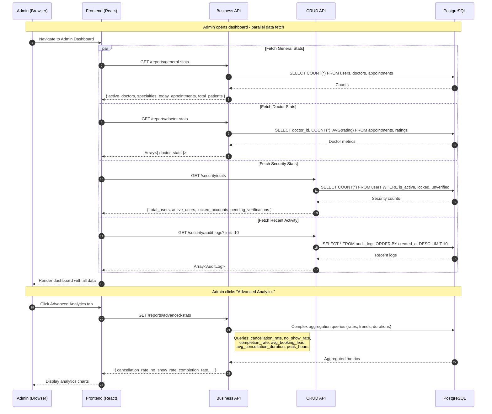
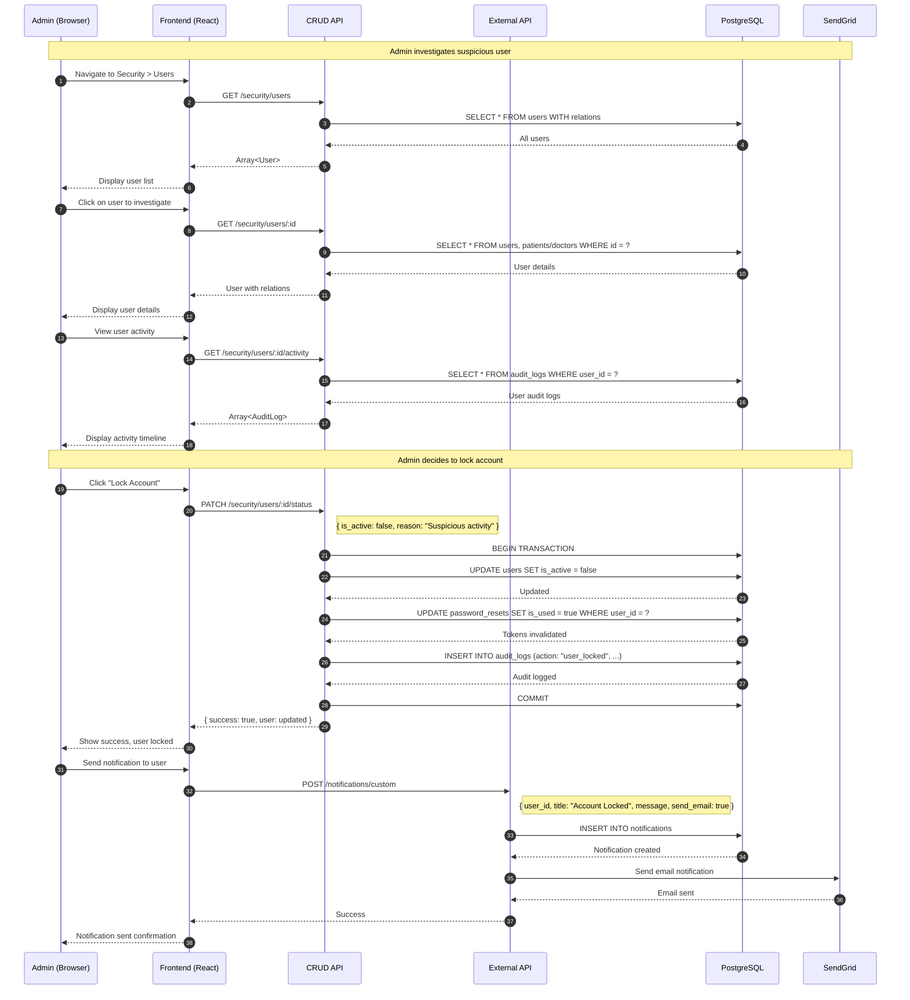
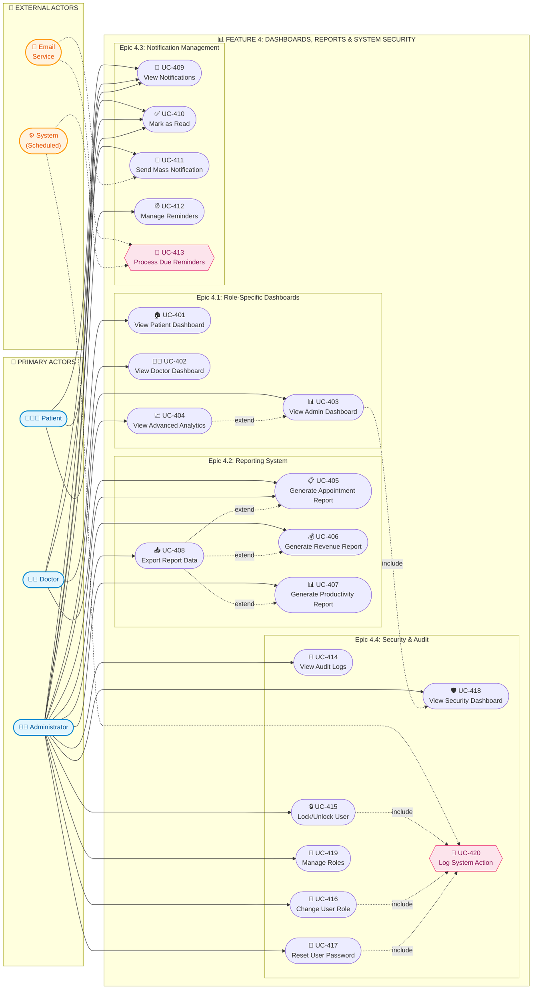

# 📊 Feature 4: Dashboards, Reports & System Security

## Architecture Design Document

**Feature ID:** 4  
**Feature Name:** Dashboards, Reports & System Security  
**Document Version:** 1.0  
**Last Updated:** February 2026  
**Author:** Senior Software Architect

---

## Table of Contents

1. [Feature Scoping](#1-feature-scoping)
2. [URI Design (Feature-Only)](#2-uri-design-feature-only)
3. [Feature Architecture (Data Flow)](#3-feature-architecture-data-flow)
4. [Feature Class Diagram](#4-feature-class-diagram)
5. [Feature Use Case Diagram](#5-feature-use-case-diagram)
6. [Assumptions & TODOs](#6-assumptions--todos)

---

## 1. Feature Scoping

### 1.1 Goal

Provide comprehensive visibility into system operations through role-specific dashboards with key metrics, enable data-driven decision making via robust reporting capabilities, manage system-wide notifications, and ensure security and compliance through comprehensive audit logging and user security management.

---

### 1.2 Epics & User Stories

#### Epic 4.1: Role-Specific Dashboards

| Story ID | User Story | Acceptance Summary |
|----------|------------|-------------------|
| **US 4.1.1** | As a patient, I want to see relevant information on my dashboard so that I can quickly understand my medical status | Welcome message, cards (upcoming appointments, completed visits, pending lab results, active prescriptions), next appointment details, recent consultations, quick book action, notifications summary |
| **US 4.1.2** | As a doctor, I want to see my daily overview on my dashboard so that I can start my day informed | Today's appointments count/list, weekly stats, next appointment highlighted, pending actions (unsigned notes, results to review, renewals), mini calendar, notification badge |
| **US 4.1.3** | As an administrator, I want to see clinic-wide statistics on my dashboard so that I can monitor overall operations | General stats (active doctors, specialties, appointments, patients), appointment charts (by status/month/day), today's summary, revenue summary, recent activity, alerts |
| **US 4.1.4** | As an administrator, I want to view advanced performance metrics so that I can make data-driven decisions | Average daily appointments, cancellation/no-show/completion rates, booking lead time, consultation duration, peak hours, performance by doctor/specialty |

#### Epic 4.2: Reporting System

| Story ID | User Story | Acceptance Summary |
|----------|------------|-------------------|
| **US 4.2.1** | As an administrator or doctor, I want to generate appointment reports so that I can analyze scheduling patterns | Filter by date/doctor/specialty/status, summary statistics, detailed list, export CSV/PDF, recurring reports via email, save filter presets |
| **US 4.2.2** | As an administrator, I want to generate financial reports so that I can track clinic revenue | Revenue by date range/service category/doctor, outstanding balances, insurance claims summary, payment method breakdown, export CSV/PDF, period comparison |

#### Epic 4.3: Notification Management

| Story ID | User Story | Acceptance Summary |
|----------|------------|-------------------|
| **US 4.3.1** | As a user (patient, doctor, or admin), I want to view and manage my notifications so that I stay informed | List notifications by date, filter by type, mark read/unread, mark all read, delete, badge count, real-time updates, click to navigate |
| **US 4.3.2** | As an administrator, I want to send notifications to multiple users so that I can communicate important information | Create with title/message/priority, select recipients (all/by role/specific), schedule delivery, track delivery/read stats, templates, preview |
| **US 4.3.3** | As a user, I want to configure my notification preferences so that I receive notifications how I prefer | Enable/disable email by type, enable/disable in-app by type, reminder frequency, quiet hours, save with confirmation |

#### Epic 4.4: Security & Audit

| Story ID | User Story | Acceptance Summary |
|----------|------------|-------------------|
| **US 4.4.1** | As the system, I want to log all important actions so that there is a complete audit trail | Log user/action/entity/timestamp/IP, log data changes (before/after), immutable logs, categories (auth, data access, modification, admin), automatic middleware logging |
| **US 4.4.2** | As an administrator, I want to view and search audit logs so that I can investigate security events | List with pagination, filter by user/action/date/entity, search by ID/description, view full details, export CSV, log statistics, highlight suspicious activity |
| **US 4.4.3** | As the system, I want to detect and alert on suspicious activity so that security threats are identified quickly | Alert on failed logins (brute force), new location/device, bulk data access, permission changes, security dashboard, email to admins, block suspicious IPs |
| **US 4.4.4** | As an administrator, I want to manage user security settings so that I can maintain system security | View last login, view active sessions, force logout, reset password with notification, lock/unlock accounts, view login history |

---

### 1.3 In-Scope

| Category | Items |
|----------|-------|
| **Dashboards** | Patient dashboard metrics, Doctor dashboard with daily overview, Admin dashboard with clinic-wide stats, Advanced analytics |
| **Reports** | Appointment reports with filters, Productivity reports, Patient flow reports, Revenue reports, Specialty demand reports |
| **Statistics** | General stats, Doctor stats, Advanced stats (rates, trends, averages) |
| **Notifications** | User notification list, Unread count, Mark as read, Delete notifications, Broadcast notifications, Custom notifications, Reminders |
| **Security** | Security stats dashboard, User management (status, role, email verification), Password reset management, Session/token management |
| **Audit** | Audit log storage, Audit log viewer with filters, Activity history per user |
| **Roles & Permissions** | Role management CRUD, Permissions matrix, Administrator management, Super admin toggle |

---

### 1.4 Out-of-Scope

| Category | Items | Belongs To |
|----------|-------|------------|
| **User Authentication** | Login, logout, JWT creation, OAuth flow | Feature 0 |
| **Patient/Doctor Registration** | User creation, profile setup | Feature 0 |
| **Appointment Booking** | Scheduling, availability, confirmation | Feature 1 |
| **Consultations** | SOAP notes, prescriptions, lab orders | Feature 2 |
| **Billing Operations** | Invoice creation, payment processing | Feature 3 |
| **Quality Surveys** | Satisfaction surveys, doctor ratings | Feature 3 |

---

### 1.5 Dependencies on Previous Features

| Dependency | Feature | Required Data | Usage |
|------------|---------|---------------|-------|
| **User Data** | Feature 0 | `users`, `patients`, `doctors` tables | Dashboard counts, security management |
| **Authentication** | Feature 0 | JWT middleware, session management | All authenticated dashboard/report endpoints |
| **Appointment Data** | Feature 1 | `appointments` table | Dashboard metrics, appointment reports |
| **Schedule Data** | Feature 1 | `schedules`, `schedule_exceptions` | Doctor dashboard calendar |
| **Consultation Data** | Feature 2 | `consultation_notes`, `prescriptions`, `lab_reports` | Patient dashboard pending items |
| **Billing Data** | Feature 3 | `billings`, `billing_items` | Revenue reports, admin dashboard |
| **Quality Data** | Feature 3 | `doctor_ratings`, `satisfaction_surveys` | Doctor dashboard ratings |

---

## 2. URI Design (Feature-Only)

### 2.1 CRUD API - Security Endpoints (Port 3001)

| Method | Path | Auth | Purpose | Key Request Fields | Key Response Fields | Notes/Edge Cases |
|--------|------|------|---------|-------------------|---------------------|------------------|
| **GET** | `/api/v1/security/stats` | Admin | Get security dashboard stats | — | `{ total_users, active_users, locked_accounts, pending_verifications, recent_logins }` | Admin overview |
| **GET** | `/api/v1/security/users` | Admin | Get all users with full details | — | `Array<User>` with relations | Security user list |
| **GET** | `/api/v1/security/users/:id` | Admin | Get user details with relations | URL: `id` | Full `User` object | — |
| **PATCH** | `/api/v1/security/users/:id/status` | Admin | Activate or deactivate user | URL: `id`, `is_active`, `reason?` | Updated user | Lock/unlock account |
| **PATCH** | `/api/v1/security/users/:id/role` | Admin | Change user role | URL: `id`, `role` enum | Updated user | Role: patient, doctor, admin |
| **PATCH** | `/api/v1/security/users/:id/verify-email` | Admin | Force verify email or resend | URL: `id` | Success status | Admin override |
| **GET** | `/api/v1/security/users/:id/activity` | Admin | Get user activity from audit logs | URL: `id` | `Array<AuditLog>` | User investigation |
| **GET** | `/api/v1/security/users/:id/password-resets` | Admin | Get password reset history | URL: `id` | `Array<PasswordReset>` | Security audit |
| **POST** | `/api/v1/security/users/:id/password-reset` | Admin | Generate password reset token | URL: `id` | `{ token, expires_at }` | Admin-initiated reset |
| **POST** | `/api/v1/security/users/:id/invalidate-tokens` | Admin | Invalidate all password reset tokens | URL: `id` | Success status | Force logout scenario |
| **POST** | `/api/v1/security/users/:id/set-password` | Admin | Admin sets new password for user | URL: `id`, `new_password` | Success status | Emergency access |

### 2.2 CRUD API - Role Management Endpoints

| Method | Path | Auth | Purpose | Key Request Fields | Key Response Fields | Notes/Edge Cases |
|--------|------|------|---------|-------------------|---------------------|------------------|
| **GET** | `/api/v1/security/roles` | Admin | Get all roles with user counts | — | `Array<{ role, user_count }>` | Role overview |
| **GET** | `/api/v1/security/roles/:id` | Admin | Get role by ID | URL: `id` | `Role` object | — |
| **POST** | `/api/v1/security/roles` | Admin | Create new role | `name`, `permissions[]` | Created role | Custom roles |
| **PUT** | `/api/v1/security/roles/:id` | Admin | Update role | URL: `id`, role fields | Updated role | — |
| **DELETE** | `/api/v1/security/roles/:id` | Admin | Delete role | URL: `id` | Success status | Check no users assigned |
| **PATCH** | `/api/v1/security/roles/:id/permissions` | Admin | Update role permissions | URL: `id`, `permissions[]` | Updated role | Permission matrix |

### 2.3 CRUD API - Administrator Management Endpoints

| Method | Path | Auth | Purpose | Key Request Fields | Key Response Fields | Notes/Edge Cases |
|--------|------|------|---------|-------------------|---------------------|------------------|
| **GET** | `/api/v1/security/administrators` | Admin | Get all administrators | — | `Array<Administrator>` | Admin list |
| **GET** | `/api/v1/security/administrators/:id` | Admin | Get administrator by ID | URL: `id` | `Administrator` object | — |
| **PATCH** | `/api/v1/security/administrators/:id/permissions` | Admin | Update admin permissions | URL: `id`, `permissions[]` | Updated admin | Granular permissions |
| **PATCH** | `/api/v1/security/administrators/:id/super-admin` | Super Admin | Toggle super admin status | URL: `id` | Updated admin | Super admin only |

### 2.4 CRUD API - Audit Log Endpoints

| Method | Path | Auth | Purpose | Key Request Fields | Key Response Fields | Notes/Edge Cases |
|--------|------|------|---------|-------------------|---------------------|------------------|
| **GET** | `/api/v1/security/audit-logs` | Admin | Get audit logs with filters | Query: `user_id`, `action`, `start_date`, `end_date` | `Array<AuditLog>` paginated | Large volume queries |
| **GET** | `/api/v1/security/audit-logs/filters` | Admin | Get available filter options | — | `{ actions[], entity_types[], users[] }` | Populate filter dropdowns |
| **GET** | `/api/v1/security/permissions-matrix` | Admin | Get permissions matrix definition | — | Permission structure | Documentation/UI |

---

### 2.5 Business API - Reports Endpoints (Port 3002)

| Method | Path | Auth | Purpose | Key Request Fields | Key Response Fields | Notes/Edge Cases |
|--------|------|------|---------|-------------------|---------------------|------------------|
| **GET** | `/api/v1/reports/my-stats` | Doctor | Get current doctor's statistics | — | `{ total_appointments, completed, cancelled, no_show, average_rating, total_patients }` | Doctor dashboard |
| **GET** | `/api/v1/reports/my-appointments` | Doctor | Get doctor's appointment history | — | `Array<Appointment>` | Doctor history |
| **GET** | `/api/v1/reports/my-ratings` | Doctor | Get doctor's ratings | — | `{ average, distribution, recent[] }` | Doctor performance |
| **GET** | `/api/v1/reports/appointments` | Admin, Doctor | Generate appointment report | Query: `start_date`, `end_date`, `doctor_id`, `status` | `{ summary, appointments[] }` | Filterable report |
| **GET** | `/api/v1/reports/productivity` | Admin | Generate doctor productivity report | — | `Array<{ doctor, metrics }>` | Doctor efficiency |
| **GET** | `/api/v1/reports/patient-flow` | Admin | Generate patient flow report | — | `{ by_hour[], by_day[], trends }` | Traffic analysis |
| **GET** | `/api/v1/reports/revenue` | Admin | Generate revenue report | Query: `start_date`, `end_date` | `{ total, by_category[], by_doctor[] }` | Financial report |
| **GET** | `/api/v1/reports/specialty-demand` | Admin | Generate specialty demand report | — | `Array<{ specialty, demand, avg_duration }>` | Demand analysis |
| **GET** | `/api/v1/reports/general-stats` | Admin | Get general statistics | — | `{ active_doctors, specialties, today_appointments, total_patients }` | Admin dashboard |
| **GET** | `/api/v1/reports/doctor-stats` | Admin | Get doctor statistics | — | `Array<{ doctor, stats }>` | Admin dashboard |
| **GET** | `/api/v1/reports/advanced-stats` | Admin | Get advanced statistics | — | `{ cancellation_rate, no_show_rate, completion_rate, avg_booking_lead, avg_consultation_duration, peak_hours }` | Analytics |

---

### 2.6 External API - Notifications Endpoints (Port 3003)

| Method | Path | Auth | Purpose | Key Request Fields | Key Response Fields | Notes/Edge Cases |
|--------|------|------|---------|-------------------|---------------------|------------------|
| **GET** | `/notifications/user` | Authenticated | Get user's notifications | — | `Array<Notification>` | User notification list |
| **GET** | `/notifications/user/unread-count` | Authenticated | Get unread notification count | — | `{ count }` | Badge count |
| **PUT** | `/notifications/:id/read` | Authenticated | Mark notification as read | URL: `id` | Updated notification | — |
| **DELETE** | `/notifications/:id` | Authenticated | Delete a notification | URL: `id` | Success status | — |
| **GET** | `/notifications/broadcasts` | Admin | Get all broadcast notifications | — | `Array<Notification>` | Admin oversight |
| **POST** | `/notifications/appointment-confirmation` | Admin, Doctor | Send appointment confirmation email | `appointment_id` | Success status | Trigger email |
| **POST** | `/notifications/appointment-cancellation` | Admin, Doctor | Send appointment cancellation email | `appointment_id` | Success status | Trigger email |
| **POST** | `/notifications/prescription` | Admin, Doctor | Send prescription notification email | `prescription_id` | Success status | Trigger email |
| **POST** | `/notifications/custom` | Admin | Send custom notification | `user_id`, `title`, `message`, `send_email` | Success status | Mass notification |

### 2.7 External API - Reminders Endpoints

| Method | Path | Auth | Purpose | Key Request Fields | Key Response Fields | Notes/Edge Cases |
|--------|------|------|---------|-------------------|---------------------|------------------|
| **POST** | `/reminders/process` | Admin | Process all due reminders | — | `{ processed_count }` | Batch job trigger |
| **POST** | `/reminders/create` | Admin | Create a new reminder | `appointment_id`, `reminder_time`, `type` | Created reminder | type: email, sms |
| **GET** | `/reminders/pending/count` | Admin | Get count of pending reminders | — | `{ count }` | Admin dashboard |
| **GET** | `/reminders/due/:hours` | Admin | Get appointments due for reminder | URL: `hours` | `Array<Appointment>` | Proactive reminders |
| **GET** | `/reminders/appointment/:appointmentId` | Admin, Doctor | Get reminder history for appointment | URL: `appointmentId` | `Array<Reminder>` | Audit trail |
| **DELETE** | `/reminders/appointment/:appointmentId` | Admin | Cancel pending reminders | URL: `appointmentId` | Success status | On appointment cancel |

---

### 2.8 Endpoint Overlap Analysis

| Endpoint | Primary Feature | Also Used By | Rationale |
|----------|-----------------|--------------|-----------|
| `GET /api/v1/appointments/*` | Feature 1 | Feature 4 (dashboard metrics) | Appointment counts and lists for dashboards |
| `GET /api/v1/billings/*` | Feature 3 | Feature 4 (revenue reports) | Billing data aggregated for revenue stats |
| `GET /api/v1/doctor-ratings/averages` | Feature 3 | Feature 4 (doctor dashboard) | Rating display in doctor dashboard |
| `GET /api/v1/prescriptions` | Feature 2 | Feature 4 (patient dashboard) | Active prescriptions count |
| `GET /api/v1/medical-records/lab-reports` | Feature 2 | Feature 4 (patient dashboard) | Pending lab results count |
| `POST /auth/login` | Feature 0 | Feature 4 (audit logging) | Login events logged in audit |

---

## 3. Feature Architecture (Data Flow)

### 3.1 End-to-End Architecture

```
┌──────────────────────────────────────────────────────────────────────────────────┐
│                                 PRESENTATION LAYER                                │
│                          React SPA (Vercel Edge Network)                          │
│  ┌─────────────────────┐  ┌──────────────────┐  ┌───────────────────────────┐    │
│  │ Patient Dashboard   │  │ Doctor Dashboard │  │ Admin Dashboard           │    │
│  │ • Upcoming appts    │  │ • Today's list   │  │ • Clinic stats            │    │
│  │ • Pending labs      │  │ • Weekly stats   │  │ • Revenue summary         │    │
│  │ • Active Rx         │  │ • Pending actions│  │ • User management         │    │
│  └──────────┬──────────┘  └────────┬─────────┘  └─────────────┬─────────────┘    │
│  ┌─────────────────────┐  ┌──────────────────┐  ┌───────────────────────────┐    │
│  │ Notification Center │  │ Reports Module   │  │ Security Management       │    │
│  │ • List/filter       │  │ • Generate/export│  │ • Audit logs              │    │
│  │ • Mark read         │  │ • Schedule       │  │ • User security           │    │
│  └──────────┬──────────┘  └────────┬─────────┘  └─────────────┬─────────────┘    │
└─────────────┼──────────────────────┼──────────────────────────┼──────────────────┘
              │                      │                          │
              │ HTTPS/JWT            │ HTTPS/JWT                │ HTTPS/JWT
              ▼                      ▼                          ▼
┌──────────────────────────────────────────────────────────────────────────────────┐
│                               BUSINESS LOGIC LAYER                                │
│                            Business API (Render :3002)                            │
│  ┌─────────────────────────────────────────────────────────────────────────────┐ │
│  │                            ReportService                                     │ │
│  │  • getMyStats(doctorId) → doctor's personal metrics                         │ │
│  │  • getAppointmentsReport(filters) → filtered appointment data               │ │
│  │  • getProductivityReport() → doctor efficiency metrics                      │ │
│  │  • getPatientFlowReport() → traffic patterns by hour/day                    │ │
│  │  • getRevenueReport(dateRange) → financial aggregations                     │ │
│  │  • getSpecialtyDemandReport() → specialty-wise analysis                     │ │
│  │  • getGeneralStats() → clinic overview metrics                              │ │
│  │  • getDoctorStats() → per-doctor statistics                                 │ │
│  │  • getAdvancedStats() → rates, trends, analytics                            │ │
│  └─────────────────────────────────────────────────────────────────────────────┘ │
└───────────────────────────────────┬──────────────────────────────────────────────┘
                                    │
            ┌───────────────────────┼───────────────────────┐
            ▼                       ▼                       ▼
┌───────────────────────────────────┐     ┌────────────────────────────────────────┐
│         DATA ACCESS LAYER         │     │       EXTERNAL INTEGRATION LAYER       │
│     CRUD API (Render :3001)       │     │      External API (Render :3003)       │
│  ┌─────────────────────────────┐  │     │  ┌──────────────────────────────────┐  │
│  │     SecurityRepository      │  │     │  │     NotificationService          │  │
│  │   • getSecurityStats()      │  │     │  │   • getUserNotifications(userId) │  │
│  │   • getAllUsers()           │  │     │  │   • getUnreadCount(userId)       │  │
│  │   • updateUserStatus()      │  │     │  │   • markAsRead(notificationId)   │  │
│  │   • changeUserRole()        │  │     │  │   • sendCustomNotification()     │  │
│  │   • getUserActivity()       │  │     │  │   • createBroadcast()            │  │
│  └─────────────────────────────┘  │     │  └──────────────────────────────────┘  │
│  ┌─────────────────────────────┐  │     │  ┌──────────────────────────────────┐  │
│  │       RoleRepository        │  │     │  │       ReminderService            │  │
│  │   • getAllRoles()           │  │     │  │   • processReminders()           │  │
│  │   • createRole()            │  │     │  │   • createReminder()             │  │
│  │   • updatePermissions()     │  │     │  │   • getPendingCount()            │  │
│  └─────────────────────────────┘  │     │  │   • getDueReminders(hours)       │  │
│  ┌─────────────────────────────┐  │     │  │   • cancelReminders()            │  │
│  │   AdministratorRepository   │  │     │  └──────────────────────────────────┘  │
│  │   • getAllAdministrators()  │  │     └────────────────────────────────────────┘
│  │   • updatePermissions()     │  │                       │
│  │   • toggleSuperAdmin()      │  │                       │ SendGrid API
│  └─────────────────────────────┘  │                       ▼
│  ┌─────────────────────────────┐  │     ┌────────────────────────────────────────┐
│  │     AuditLogRepository      │  │     │           EMAIL SERVICE                 │
│  │   • getAuditLogs(filters)   │  │     │   (Notifications & Reminders)          │
│  │   • getFilterOptions()      │  │     └────────────────────────────────────────┘
│  │   • createAuditEntry()      │  │
│  └─────────────────────────────┘  │
│  ┌─────────────────────────────┐  │
│  │   PasswordResetRepository   │  │
│  │   • getByUser(userId)       │  │
│  │   • createToken()           │  │
│  │   • invalidateAll(userId)   │  │
│  └─────────────────────────────┘  │
└───────────────────┬───────────────┘
                    │ Supabase Client
                    ▼
┌──────────────────────────────────────────────────────────────────────────────────┐
│                               PERSISTENCE LAYER                                   │
│                          Supabase PostgreSQL Database                             │
│  ┌─────────────────┐ ┌───────────────────┐ ┌─────────────────┐ ┌───────────────┐ │
│  │     users       │ │      roles        │ │  administrators │ │  audit_logs   │ │
│  │ • id            │ │ • id              │ │ • id            │ │ • id          │ │
│  │ • email         │ │ • name            │ │ • user_id       │ │ • user_id     │ │
│  │ • role          │ │ • permissions     │ │ • permissions   │ │ • action      │ │
│  │ • is_active     │ │ • user_count      │ │ • is_super_admin│ │ • entity_type │ │
│  │ • is_email_     │ └───────────────────┘ └─────────────────┘ │ • entity_id   │ │
│  │   verified      │                                           │ • old_values  │ │
│  │ • last_login    │ ┌───────────────────┐ ┌─────────────────┐ │ • new_values  │ │
│  └─────────────────┘ │ password_resets   │ │  notifications  │ │ • ip_address  │ │
│                      │ • id              │ │ • id            │ │ • created_at  │ │
│                      │ • user_id         │ │ • user_id       │ └───────────────┘ │
│                      │ • token_hash      │ │ • title         │                   │
│                      │ • expires_at      │ │ • message       │ ┌───────────────┐ │
│                      │ • is_used         │ │ • type          │ │   reminders   │ │
│                      └───────────────────┘ │ • is_read       │ │ • id          │ │
│                                            │ • created_at    │ │ • appointment_│ │
│                                            └─────────────────┘ │   id          │ │
│                                                                │ • reminder_   │ │
│                                                                │   time        │ │
│                                                                │ • type        │ │
│                                                                │ • status      │ │
│                                                                │ • sent_at     │ │
│                                                                └───────────────┘ │
└──────────────────────────────────────────────────────────────────────────────────┘
```

---

### 3.2 Validation Points

| Point | Layer | Validation | Action on Failure |
|-------|-------|------------|-------------------|
| **V1** | Frontend | Date range validation (start ≤ end) | Show inline error, block submission |
| **V2** | Business API | Report date range limits (max 1 year) | Return 400: "Date range exceeds maximum" |
| **V3** | CRUD API | Role existence before user role change | Return 404: "Role not found" |
| **V4** | CRUD API | Cannot delete role with assigned users | Return 409: "Role has assigned users" |
| **V5** | CRUD API | Super admin required for super admin toggle | Return 403: "Super admin privileges required" |
| **V6** | External API | Notification user exists | Return 404: "User not found" |
| **V7** | Auth Middleware | JWT validation, role checking (Admin for security) | Return 401/403 |
| **V8** | CRUD API | Audit log immutability (no update/delete) | Return 405: "Method not allowed" |

---

### 3.3 Transaction Boundaries

| Operation | Transaction Scope | Rollback Trigger |
|-----------|-------------------|------------------|
| **Change User Role** | `users` UPDATE + `audit_logs` INSERT | Audit log failure (non-blocking) |
| **Lock User Account** | `users` UPDATE (is_active) + `password_resets` UPDATE (invalidate all) + `audit_logs` INSERT | Any step failure → rollback |
| **Create Broadcast Notification** | Loop: `notifications` INSERT per recipient | Individual failures logged, continue |
| **Process Reminders** | Loop: `reminders` UPDATE (status) + email send | Email failure → mark `failed`, continue |
| **Admin Set Password** | `users` UPDATE (password_hash) + `password_resets` UPDATE (invalidate) + `audit_logs` INSERT | Any failure → rollback |

---

### 3.4 Concurrency Concerns

| Scenario | Risk | Mitigation |
|----------|------|------------|
| **Simultaneous User Status Updates** | Two admins lock/unlock same user | Last-write-wins with audit trail |
| **Report Generation Load** | Multiple large reports exhaust DB connections | Query timeouts, result caching (short TTL) |
| **Notification Broadcast** | Large recipient list overwhelms system | Queue-based processing with rate limiting |
| **Audit Log Volume** | High-traffic periods create log backlog | Async logging, batch inserts |
| **Dashboard Data Freshness** | Cached stats become stale | Cache TTL (1-5 minutes), manual refresh button |

---

### 3.5 Error Handling Strategy

| Error Type | HTTP Code | Response Format | Frontend Handling |
|------------|-----------|-----------------|-------------------|
| **Validation Error** | 400 | `{ success: false, errors: [{ field, message }] }` | Display field-specific errors |
| **Unauthorized** | 401 | `{ success: false, error: 'Token invalid/expired' }` | Redirect to login |
| **Forbidden** | 403 | `{ success: false, error: 'Admin access required' }` | Show access denied |
| **Not Found** | 404 | `{ success: false, error: 'User not found' }` | Show "not found" message |
| **Conflict** | 409 | `{ success: false, error: 'Cannot delete role with users' }` | Show conflict resolution |
| **Method Not Allowed** | 405 | `{ success: false, error: 'Audit logs are immutable' }` | Show restriction |
| **Server Error** | 500 | `{ success: false, error: 'Internal error', ref: uuid }` | Show generic error, log reference |

---

### 3.6 Admin Dashboard Data Flow Sequence



---

### 3.7 Security Management Flow



---

## 4. Feature Class Diagram

```mermaid
classDiagram
    direction TB

    %% ============================================
    %% SECURITY & AUDIT ENTITIES (CRUD API)
    %% ============================================

    class User {
        <<CRUD>>
        +int id
        +string email
        +string password_hash
        +string first_name
        +string last_name
        +UserRole role
        +boolean is_active
        +boolean is_email_verified
        +string phone
        +string avatar_url
        +datetime last_login
        +datetime created_at
        +datetime updated_at
        +activate()
        +deactivate()
        +changeRole()
        +verifyEmail()
    }

    class Role {
        <<CRUD>>
        +int id
        +string name
        +string[] permissions
        +int user_count
        +datetime created_at
        +updatePermissions()
    }

    class Administrator {
        <<CRUD>>
        +int id
        +int user_id
        +string[] permissions
        +boolean is_super_admin
        +datetime created_at
        +updatePermissions()
        +toggleSuperAdmin()
    }

    class AuditLog {
        <<CRUD>>
        +int id
        +int user_id
        +string action
        +string entity_type
        +int entity_id
        +json old_values
        +json new_values
        +string ip_address
        +datetime created_at
    }

    class PasswordReset {
        <<CRUD>>
        +int id
        +int user_id
        +string token_hash
        +datetime expires_at
        +boolean is_used
        +datetime created_at
        +validate()
        +invalidate()
    }

    %% ============================================
    %% NOTIFICATION ENTITIES (EXTERNAL API)
    %% ============================================

    class Notification {
        <<EXTERNAL>>
        +int id
        +int user_id
        +string title
        +string message
        +NotificationType type
        +boolean is_read
        +datetime created_at
        +markAsRead()
        +delete()
    }

    class Reminder {
        <<EXTERNAL>>
        +int id
        +int appointment_id
        +datetime reminder_time
        +ReminderType type
        +ReminderStatus status
        +datetime sent_at
        +send()
        +cancel()
    }

    %% ============================================
    %% REFERENCE ENTITIES (FROM OTHER FEATURES)
    %% ============================================

    class Patient {
        <<CRUD>>
        +int id
        +int user_id
    }

    class Doctor {
        <<CRUD>>
        +int id
        +int user_id
        +int specialty_id
        +decimal average_rating
    }

    class Appointment {
        <<CRUD>>
        +int id
        +int patient_id
        +int doctor_id
        +AppointmentStatus status
        +datetime appointment_date
    }

    %% ============================================
    %% BUSINESS SERVICES
    %% ============================================

    class ReportService {
        <<BUSINESS>>
        +getMyStats(doctorId) DoctorStats
        +getMyAppointments(doctorId) Appointment[]
        +getMyRatings(doctorId) RatingsSummary
        +getAppointmentsReport(filters) AppointmentReport
        +getProductivityReport() ProductivityReport
        +getPatientFlowReport() PatientFlowReport
        +getRevenueReport(dateRange) RevenueReport
        +getSpecialtyDemandReport() DemandReport
        +getGeneralStats() GeneralStats
        +getDoctorStats() DoctorStatsReport
        +getAdvancedStats() AdvancedAnalytics
        -aggregateAppointments(filters) AggregatedData
        -calculateRates(period) RateMetrics
        -analyzePeakHours() PeakHourData
    }

    %% ============================================
    %% EXTERNAL SERVICES
    %% ============================================

    class NotificationService {
        <<EXTERNAL>>
        +getUserNotifications(userId) Notification[]
        +getUnreadCount(userId) int
        +markAsRead(notificationId) void
        +deleteNotification(notificationId) void
        +sendAppointmentConfirmation(appointmentId) void
        +sendAppointmentCancellation(appointmentId) void
        +sendPrescriptionNotification(prescriptionId) void
        +sendCustomNotification(userId, title, message) void
        +createBroadcast(title, message, recipients) void
        +getBroadcasts() Notification[]
        -buildEmailTemplate(type, data) EmailContent
    }

    class ReminderService {
        <<EXTERNAL>>
        +processReminders() ProcessResult
        +createReminder(appointmentId, time, type) Reminder
        +getPendingCount() int
        +getDueReminders(hours) Appointment[]
        +getReminderHistory(appointmentId) Reminder[]
        +cancelReminders(appointmentId) void
        -sendEmail(reminder) boolean
        -markAsSent(reminderId) void
    }

    %% ============================================
    %% ENUMERATIONS
    %% ============================================

    class UserRole {
        <<enumeration>>
        patient
        doctor
        admin
    }

    class NotificationType {
        <<enumeration>>
        appointment
        prescription
        lab_result
        billing
        system
    }

    class ReminderType {
        <<enumeration>>
        email
        sms
    }

    class ReminderStatus {
        <<enumeration>>
        pending
        sent
        failed
        cancelled
    }

    class AppointmentStatus {
        <<enumeration>>
        pending
        confirmed
        in_progress
        completed
        cancelled
        no_show
    }

    %% ============================================
    %% RELATIONSHIPS
    %% ============================================

    %% User Relations
    User "1" -- "0..1" Patient : has profile
    User "1" -- "0..1" Doctor : has profile
    User "1" -- "0..1" Administrator : has profile
    User "*" -- "1" Role : belongs to
    User "1" -- "*" AuditLog : generates
    User "1" -- "*" PasswordReset : requests
    User "1" -- "*" Notification : receives

    %% Admin Relations
    Administrator "1" -- "1" User : extends

    %% Reminder Relations
    Reminder "*" -- "1" Appointment : for

    %% Service Dependencies
    ReportService ..> Appointment : aggregates
    ReportService ..> Doctor : aggregates ratings
    ReportService ..> Patient : counts

    NotificationService ..> Notification : manages
    NotificationService ..> User : notifies

    ReminderService ..> Reminder : manages
    ReminderService ..> Appointment : references
```



---

## 5. Feature Use Case Diagram



---

### 5.1 Use Case Traceability Matrix

| UC ID | Use Case Name | Epic | User Story | Primary Actor | API Endpoints |
|-------|---------------|------|------------|---------------|---------------|
| UC-401 | View Patient Dashboard | 4.1 | US 4.1.1 | Patient | `GET /api/v1/appointments/patient`, `GET /api/v1/prescriptions`, `GET /api/v1/medical-records/lab-reports` |
| UC-402 | View Doctor Dashboard | 4.1 | US 4.1.2 | Doctor | `GET /api/v1/reports/my-stats`, `GET /api/v1/reports/my-appointments` |
| UC-403 | View Admin Dashboard | 4.1 | US 4.1.3 | Admin | `GET /api/v1/reports/general-stats`, `GET /api/v1/reports/doctor-stats`, `GET /api/v1/security/stats` |
| UC-404 | View Advanced Analytics | 4.1 | US 4.1.4 | Admin | `GET /api/v1/reports/advanced-stats`, `GET /api/v1/reports/productivity` |
| UC-405 | Generate Appointment Report | 4.2 | US 4.2.1 | Admin, Doctor | `GET /api/v1/reports/appointments` |
| UC-406 | Generate Revenue Report | 4.2 | US 4.2.2 | Admin | `GET /api/v1/reports/revenue`, `GET /api/v1/billing-calculations/statistics` |
| UC-407 | Generate Productivity Report | 4.2 | US 4.2.2 | Admin | `GET /api/v1/reports/productivity`, `GET /api/v1/reports/patient-flow` |
| UC-408 | Export Report Data | 4.2 | US 4.2.1 | Admin, Doctor | Query params on report endpoints (format=csv/pdf) |
| UC-409 | View Notifications | 4.3 | US 4.3.1 | All Users | `GET /notifications/user` |
| UC-410 | Mark as Read | 4.3 | US 4.3.1 | All Users | `PUT /notifications/:id/read` |
| UC-411 | Send Mass Notification | 4.3 | US 4.3.2 | Admin | `POST /notifications/custom` |
| UC-412 | Manage Reminders | 4.3 | US 4.3.1 | Admin | `POST /reminders/create`, `DELETE /reminders/appointment/:id` |
| UC-413 | Process Due Reminders | 4.3 | US 4.3.1 | System | `POST /reminders/process` |
| UC-414 | View Audit Logs | 4.4 | US 4.4.2 | Admin | `GET /api/v1/security/audit-logs` |
| UC-415 | Lock/Unlock User | 4.4 | US 4.4.4 | Admin | `PATCH /api/v1/security/users/:id/status` |
| UC-416 | Change User Role | 4.4 | US 4.4.4 | Admin | `PATCH /api/v1/security/users/:id/role` |
| UC-417 | Reset User Password | 4.4 | US 4.4.4 | Admin | `POST /api/v1/security/users/:id/password-reset`, `POST /api/v1/security/users/:id/set-password` |
| UC-418 | View Security Dashboard | 4.4 | US 4.4.3 | Admin | `GET /api/v1/security/stats` |
| UC-419 | Manage Roles | 4.4 | US 4.4.4 | Admin | `GET/POST/PUT/DELETE /api/v1/security/roles/*` |
| UC-420 | Log System Action | 4.4 | US 4.4.1 | System | Middleware: auto-insert into `audit_logs` |

---

## 6. Assumptions & TODOs

### Assumptions

1. **A1**: Dashboard data is aggregated from multiple features' tables. Caching (1-5 minute TTL) is assumed to prevent excessive DB load on every page view.

2. **A2**: Audit logs are immutable - no UPDATE or DELETE operations are permitted. Historical accuracy is maintained for compliance.

3. **A3**: Report generation is synchronous for small date ranges. Background job support (for large exports) is assumed but not explicitly defined in API.

4. **A4**: Notification preferences endpoint is not explicitly in the API documentation. Assumption: preferences may be stored in user profile or pending implementation.

5. **A5**: The `processReminders` endpoint is designed to be called by a scheduled job (cron) rather than manually by admin.

6. **A6**: Role permissions are stored as string arrays. No granular permission entity exists - permissions are predefined constants.

7. **A7**: Super admin is a boolean flag on Administrator, not a separate role. Only super admins can toggle super admin status on others.

---

### TODOs

1. **TODO-1**: Implement WebSocket connection for real-time notification updates instead of polling.

2. **TODO-2**: Add notification preferences endpoint (`GET/PUT /api/v1/users/me/notification-preferences`).

3. **TODO-3**: Implement background job queue for large report generation with progress tracking.

4. **TODO-4**: Add export formats (CSV, PDF) as query parameters on report endpoints.

5. **TODO-5**: Implement IP geolocation for login location detection in security alerts.

6. **TODO-6**: Add configurable alert thresholds for brute force detection (failed login count, time window).

7. **TODO-7**: Implement dashboard widget customization (save layout per user).

8. **TODO-8**: Add two-factor authentication management endpoints for future MFA support.

9. **TODO-9**: Create scheduled job for automatic audit log archival (records > 1 year).

10. **TODO-10**: Add session management endpoints to view and invalidate active sessions per user.

---

**© 2026 Medical Appointment System - Feature 4 Architecture Document v1.0**
