```mermaid
flowchart LR
    %% ============================================
    %% ACTORS DEFINITION
    %% ============================================
    
    subgraph Actors["👥 ACTORS"]
        direction TB
        Visitor(["🌐 Visitor<br/>(Public)"])
        Patient(["🧑‍🤝‍🧑 Patient"])
        Doctor(["👨‍⚕️ Doctor"])
        Admin(["👨‍💼 Administrator"])
    end

    subgraph ExternalActors["🔌 EXTERNAL ACTORS"]
        direction TB
        GoogleOAuth(["🔐 Google OAuth<br/>Service"])
        EmailService(["📧 Email<br/>Service"])
        Pharmacy(["💊 Pharmacy<br/>(QR Verifier)"])
    end

    %% ============================================
    %% FEATURE 0: SYSTEM FOUNDATION
    %% ============================================
    
    subgraph F0["🏗️ FEATURE 0: SYSTEM FOUNDATION"]
        direction TB
        
        subgraph F0_Auth["Epic 0.1: Authentication"]
            UC_Register(["📝 Register as Patient"])
            UC_Login(["🔑 Login with Credentials"])
            UC_LoginOAuth(["🔗 Login with Google OAuth"])
            UC_RecoverPassword(["🔄 Recover Password"])
            UC_Logout(["🚪 Logout / End Session"])
            UC_Authenticate{{"🔒 Authenticate User"}}
        end
        
        subgraph F0_CRUD["Epic 0.2: Entity Management"]
            UC_ManageUsers(["👥 Manage Users"])
            UC_ManageSpecialties(["🏥 Manage Specialties"])
            UC_ManageRooms(["🚪 Manage Consultation Rooms"])
            UC_ManageDoctors(["👨‍⚕️ Manage Doctors"])
            UC_ManagePatients(["🧑‍🤝‍🧑 Manage Patients"])
        end
        
        subgraph F0_Nav["Epic 0.3: Navigation"]
            UC_ViewLanding(["🏠 View Landing Page"])
            UC_ViewDashboard(["📊 View Dashboard"])
        end
    end

    %% ============================================
    %% FEATURE 1: APPOINTMENT SCHEDULING
    %% ============================================
    
    subgraph F1["📅 FEATURE 1: APPOINTMENT SCHEDULING"]
        direction TB
        
        subgraph F1_Schedule["Epic 1.1: Schedule Config"]
            UC_ConfigSchedule(["⚙️ Configure Weekly Schedule"])
            UC_ManageExceptions(["📆 Manage Schedule Exceptions"])
            UC_ViewSchedule(["👁️ View My Schedule"])
        end
        
        subgraph F1_Availability["Epic 1.2: Availability"]
            UC_CheckAvailability(["🔍 Check Available Slots"])
        end
        
        subgraph F1_Booking["Epic 1.3: Patient Booking"]
            UC_BookAppointment(["📝 Book New Appointment"])
            UC_ViewAppointments(["📋 View My Appointments"])
            UC_CancelAppointment(["❌ Cancel Appointment"])
            UC_RescheduleAppointment(["🔄 Reschedule Appointment"])
            UC_ConfirmAttendance(["✅ Confirm Attendance"])
        end
        
        subgraph F1_AdminMgmt["Epic 1.4: Admin Management"]
            UC_ViewCalendar(["📆 View Clinic Calendar"])
            UC_AssignRoom(["🏠 Assign Consultation Room"])
            UC_AdminReschedule(["🔄 Reschedule (Admin)"])
            UC_ExportAppointments(["📤 Export Appointments"])
        end
        
        subgraph F1_DoctorAgenda["Epic 1.5: Doctor Agenda"]
            UC_ViewAgenda(["📋 View Daily Agenda"])
            UC_CheckInPatient(["✔️ Check-in Patient"])
            UC_MarkNoShow(["⚠️ Mark No-Show"])
            UC_StartConsultation(["▶️ Start Consultation"])
        end
        
        subgraph F1_Notifications["Epic 1.6: Notifications"]
            UC_SendConfirmation(["📧 Send Confirmation Email"])
            UC_SendReminder(["⏰ Send Reminder"])
        end
    end

    %% ============================================
    %% FEATURE 2: MEDICAL CONSULTATION
    %% ============================================
    
    subgraph F2["🩺 FEATURE 2: MEDICAL CONSULTATION"]
        direction TB
        
        subgraph F2_History["Epic 2.1: Medical History"]
            UC_UpdateMedicalProfile(["📝 Update Medical Profile"])
            UC_ViewMedicalTimeline(["📜 View Medical Timeline"])
        end
        
        subgraph F2_Consultation["Epic 2.2: Consultation Process"]
            UC_RecordVitals(["💓 Record Vital Signs"])
            UC_DocumentSOAP(["📋 Document SOAP Notes"])
            UC_RecordDiagnosis(["🔬 Record Diagnosis"])
        end
        
        subgraph F2_Prescriptions["Epic 2.3: Prescriptions"]
            UC_CreatePrescription(["💊 Create Prescription"])
            UC_DownloadPrescription(["📥 Download Prescription PDF"])
            UC_VerifyPrescription(["✅ Verify Prescription (QR)"])
            UC_RequestRenewal(["🔄 Request Prescription Renewal"])
            UC_ProcessRenewal(["✔️ Process Renewal Request"])
            UC_GenerateQR(["📱 Generate QR Code"])
        end
        
        subgraph F2_Lab["Epic 2.4: Laboratory"]
            UC_OrderLabTests(["🧪 Order Lab Tests"])
            UC_UploadLabResults(["📤 Upload Lab Results"])
            UC_ViewLabResults(["👁️ View Lab Results"])
        end
        
        subgraph F2_Complete["Epic 2.5: Completion"]
            UC_CompleteConsultation(["✅ Complete Consultation"])
            UC_ScheduleFollowUp(["📅 Schedule Follow-up"])
        end
    end

    %% ============================================
    %% FEATURE 3: BILLING & QUALITY
    %% ============================================
    
    subgraph F3["💰 FEATURE 3: BILLING & QUALITY"]
        direction TB
        
        subgraph F3_Billing["Epic 3.1: Billing"]
            UC_ManageServicesCatalog(["📋 Manage Services Catalog"])
            UC_CreateInvoice(["🧾 Create Invoice"])
            UC_ProcessPayment(["💳 Process Payment"])
            UC_ViewBillingHistory(["📜 View Billing History"])
            UC_DownloadInvoice(["📥 Download Invoice PDF"])
        end
        
        subgraph F3_Insurance["Epic 3.2: Insurance"]
            UC_ManageInsuranceProviders(["🏢 Manage Insurance Providers"])
            UC_AssignPatientInsurance(["📋 Assign Patient Insurance"])
            UC_CalculateCoverage(["🔢 Calculate Coverage"])
        end
        
        subgraph F3_Quality["Epic 3.3: Quality"]
            UC_SubmitSurvey(["📝 Submit Satisfaction Survey"])
            UC_RateDoctor(["⭐ Rate Doctor"])
            UC_ViewQualityDashboard(["📊 View Quality Dashboard"])
            UC_ViewOwnRatings(["👁️ View Own Ratings"])
        end
    end

    %% ============================================
    %% FEATURE 4: DASHBOARDS & SECURITY
    %% ============================================
    
    subgraph F4["🔐 FEATURE 4: DASHBOARDS & SECURITY"]
        direction TB
        
        subgraph F4_Dashboards["Epic 4.1: Dashboards"]
            UC_ViewPatientDashboard(["📊 View Patient Dashboard"])
            UC_ViewDoctorDashboard(["📊 View Doctor Dashboard"])
            UC_ViewAdminDashboard(["📊 View Admin Dashboard"])
            UC_ViewAdvancedAnalytics(["📈 View Advanced Analytics"])
        end
        
        subgraph F4_Reports["Epic 4.2: Reports"]
            UC_GenerateAppointmentReport(["📄 Generate Appointment Report"])
            UC_GenerateBillingReport(["📄 Generate Billing Report"])
            UC_ExportToCSV(["📤 Export to CSV"])
        end
        
        subgraph F4_Notifications["Epic 4.3: Notifications"]
            UC_ViewNotifications(["🔔 View Notifications"])
            UC_MarkNotificationRead(["✅ Mark as Read"])
            UC_SendMassNotification(["📢 Send Mass Notification"])
            UC_ConfigurePreferences(["⚙️ Configure Notification Preferences"])
        end
        
        subgraph F4_Security["Epic 4.4: Security"]
            UC_ViewAuditLogs(["📜 View Audit Logs"])
            UC_MonitorSecurityAlerts(["🚨 Monitor Security Alerts"])
            UC_ManageUserSecurity(["🔒 Manage User Security"])
            UC_LockUnlockAccount(["🔐 Lock/Unlock Account"])
            UC_ForceLogout(["🚪 Force Logout"])
        end
    end

    %% ============================================
    %% ACTOR RELATIONSHIPS - VISITOR
    %% ============================================
    
    Visitor --> UC_ViewLanding
    Visitor --> UC_Register
    Visitor --> UC_Login
    Visitor --> UC_LoginOAuth
    Visitor --> UC_RecoverPassword
    Visitor --> UC_VerifyPrescription
    Visitor --> UC_CheckAvailability

    %% ============================================
    %% ACTOR RELATIONSHIPS - PATIENT
    %% ============================================
    
    Patient --> UC_Login
    Patient --> UC_LoginOAuth
    Patient --> UC_Logout
    Patient --> UC_ViewDashboard
    Patient --> UC_ViewPatientDashboard
    Patient --> UC_UpdateMedicalProfile
    Patient --> UC_ViewMedicalTimeline
    Patient --> UC_BookAppointment
    Patient --> UC_ViewAppointments
    Patient --> UC_CancelAppointment
    Patient --> UC_RescheduleAppointment
    Patient --> UC_ConfirmAttendance
    Patient --> UC_DownloadPrescription
    Patient --> UC_RequestRenewal
    Patient --> UC_ViewLabResults
    Patient --> UC_ViewBillingHistory
    Patient --> UC_DownloadInvoice
    Patient --> UC_SubmitSurvey
    Patient --> UC_RateDoctor
    Patient --> UC_ViewNotifications
    Patient --> UC_MarkNotificationRead
    Patient --> UC_ConfigurePreferences

    %% ============================================
    %% ACTOR RELATIONSHIPS - DOCTOR
    %% ============================================
    
    Doctor --> UC_Login
    Doctor --> UC_LoginOAuth
    Doctor --> UC_Logout
    Doctor --> UC_ViewDashboard
    Doctor --> UC_ViewDoctorDashboard
    Doctor --> UC_ConfigSchedule
    Doctor --> UC_ManageExceptions
    Doctor --> UC_ViewSchedule
    Doctor --> UC_ViewAgenda
    Doctor --> UC_CheckInPatient
    Doctor --> UC_MarkNoShow
    Doctor --> UC_StartConsultation
    Doctor --> UC_RecordVitals
    Doctor --> UC_DocumentSOAP
    Doctor --> UC_RecordDiagnosis
    Doctor --> UC_CreatePrescription
    Doctor --> UC_ProcessRenewal
    Doctor --> UC_OrderLabTests
    Doctor --> UC_UploadLabResults
    Doctor --> UC_ViewLabResults
    Doctor --> UC_CompleteConsultation
    Doctor --> UC_ScheduleFollowUp
    Doctor --> UC_CreateInvoice
    Doctor --> UC_ViewOwnRatings
    Doctor --> UC_ViewNotifications
    Doctor --> UC_MarkNotificationRead
    Doctor --> UC_ConfigurePreferences
    Doctor --> UC_GenerateAppointmentReport

    %% ============================================
    %% ACTOR RELATIONSHIPS - ADMINISTRATOR
    %% ============================================
    
    Admin --> UC_Login
    Admin --> UC_Logout
    Admin --> UC_ViewDashboard
    Admin --> UC_ViewAdminDashboard
    Admin --> UC_ViewAdvancedAnalytics
    Admin --> UC_ManageUsers
    Admin --> UC_ManageSpecialties
    Admin --> UC_ManageRooms
    Admin --> UC_ManageDoctors
    Admin --> UC_ManagePatients
    Admin --> UC_ViewCalendar
    Admin --> UC_AssignRoom
    Admin --> UC_AdminReschedule
    Admin --> UC_ExportAppointments
    Admin --> UC_UploadLabResults
    Admin --> UC_ManageServicesCatalog
    Admin --> UC_CreateInvoice
    Admin --> UC_ProcessPayment
    Admin --> UC_ManageInsuranceProviders
    Admin --> UC_AssignPatientInsurance
    Admin --> UC_ViewQualityDashboard
    Admin --> UC_ViewAuditLogs
    Admin --> UC_MonitorSecurityAlerts
    Admin --> UC_ManageUserSecurity
    Admin --> UC_LockUnlockAccount
    Admin --> UC_ForceLogout
    Admin --> UC_SendMassNotification
    Admin --> UC_GenerateAppointmentReport
    Admin --> UC_GenerateBillingReport
    Admin --> UC_ExportToCSV

    %% ============================================
    %% EXTERNAL ACTOR RELATIONSHIPS
    %% ============================================
    
    GoogleOAuth -.-> UC_LoginOAuth
    EmailService -.-> UC_SendConfirmation
    EmailService -.-> UC_SendReminder
    EmailService -.-> UC_SendMassNotification
    Pharmacy --> UC_VerifyPrescription

    %% ============================================
    %% INCLUDE RELATIONSHIPS (Mandatory Sub-flows)
    %% ============================================
    
    UC_BookAppointment -.->|include| UC_Authenticate
    UC_ViewAppointments -.->|include| UC_Authenticate
    UC_CancelAppointment -.->|include| UC_Authenticate
    UC_RescheduleAppointment -.->|include| UC_Authenticate
    UC_CreatePrescription -.->|include| UC_Authenticate
    UC_CreateInvoice -.->|include| UC_Authenticate
    UC_ProcessPayment -.->|include| UC_Authenticate
    UC_ManageUsers -.->|include| UC_Authenticate
    UC_ViewAuditLogs -.->|include| UC_Authenticate
    
    UC_BookAppointment -.->|include| UC_CheckAvailability
    UC_RescheduleAppointment -.->|include| UC_CheckAvailability
    UC_AdminReschedule -.->|include| UC_CheckAvailability
    
    UC_CreatePrescription -.->|include| UC_GenerateQR
    UC_CompleteConsultation -.->|include| UC_DocumentSOAP
    UC_CreateInvoice -.->|include| UC_CalculateCoverage

    %% ============================================
    %% EXTEND RELATIONSHIPS (Optional/Conditional)
    %% ============================================
    
    UC_LoginOAuth -.->|extend| UC_Login
    UC_RecoverPassword -.->|extend| UC_Login
    
    UC_ScheduleFollowUp -.->|extend| UC_CompleteConsultation
    UC_CreatePrescription -.->|extend| UC_CompleteConsultation
    UC_OrderLabTests -.->|extend| UC_CompleteConsultation
    
    UC_SendConfirmation -.->|extend| UC_BookAppointment
    UC_SendReminder -.->|extend| UC_BookAppointment
    
    UC_RateDoctor -.->|extend| UC_CompleteConsultation
    UC_SubmitSurvey -.->|extend| UC_CompleteConsultation
    
    UC_DownloadInvoice -.->|extend| UC_ViewBillingHistory
    UC_DownloadPrescription -.->|extend| UC_ViewAppointments

    %% ============================================
    %% STYLING
    %% ============================================
    
    classDef actor fill:#E1F5FE,stroke:#0288D1,stroke-width:2px,color:#01579B
    classDef external fill:#FFF3E0,stroke:#FF9800,stroke-width:2px,color:#E65100
    classDef usecase fill:#E8F5E9,stroke:#4CAF50,stroke-width:1px,color:#1B5E20
    classDef included fill:#FCE4EC,stroke:#E91E63,stroke-width:1px,color:#880E4F
    classDef feature fill:#F3E5F5,stroke:#9C27B0,stroke-width:2px,color:#4A148C
    
    class Visitor,Patient,Doctor,Admin actor
    class GoogleOAuth,EmailService,Pharmacy external
    class UC_Authenticate included
```

# 📊 System-Wide UML Use Case Diagram

## Medical Appointment Management System - San Miguel Clinic

---

---

## 📋 Traceability Mapping Table

### Feature 0: System Foundation & Core Infrastructure

| Use Case | Epic | User Story | Key API Endpoints |
|----------|------|------------|-------------------|
| Register as Patient | 0.1 | US 0.1.1 | `POST /auth/register` |
| Login with Credentials | 0.1 | US 0.1.2 | `POST /auth/login` |
| Login with Google OAuth | 0.1 | US 0.1.3 | `GET /auth/google`, `GET /auth/google/callback` |
| Recover Password | 0.1 | US 0.1.4 | `POST /auth/password-reset/request`, `POST /auth/password-reset/confirm` |
| Logout / End Session | 0.1 | US 0.1.5 | `POST /auth/logout` |
| Authenticate User | 0.1 | US 0.1.6 | `GET /auth/me`, JWT validation middleware |
| Manage Users | 0.2 | US 0.2.1 | `GET/POST/PUT/DELETE /api/v1/users/*` |
| Manage Specialties | 0.2 | US 0.2.2 | `GET/POST/PUT/DELETE /api/v1/specialties/*` |
| Manage Consultation Rooms | 0.2 | US 0.2.3 | `GET/POST/PUT/DELETE /api/v1/consultation-rooms/*` |
| Manage Doctors | 0.2 | US 0.2.4 | `GET/POST/PUT/DELETE /api/v1/doctors/*` |
| Manage Patients | 0.2 | US 0.2.5 | `GET/POST/PUT/DELETE /api/v1/patients/*` |
| View Landing Page | 0.3 | US 0.3.4 | Frontend route (no API) |
| View Dashboard | 0.3 | US 0.3.1-0.3.3 | Role-specific dashboard endpoints |

---

### Feature 1: Appointment Scheduling & Availability Management

| Use Case | Epic | User Story | Key API Endpoints |
|----------|------|------------|-------------------|
| Configure Weekly Schedule | 1.1 | US 1.1.1 | `POST /api/v1/schedules`, `POST /api/v1/schedules/bulk` |
| Manage Schedule Exceptions | 1.1 | US 1.1.2 | `POST/DELETE /api/v1/schedules/exceptions/*` |
| View My Schedule | 1.1 | US 1.1.3 | `GET /api/v1/schedules/me`, `GET /api/v1/schedules/exceptions/me` |
| Check Available Slots | 1.2 | US 1.2.1 | `GET /api/v1/availability/doctor/:id/date/:date`, `POST /api/v1/availability/check` |
| Book New Appointment | 1.3 | US 1.3.1 | `POST /api/v1/scheduling/book` |
| View My Appointments | 1.3 | US 1.3.2 | `GET /api/v1/appointments/patient` |
| Cancel Appointment | 1.3 | US 1.3.2 | `POST /api/v1/scheduling/cancel/:id`, `DELETE /api/v1/appointments/:id` |
| Reschedule Appointment | 1.3 | US 1.3.2 | `PUT /api/v1/scheduling/reschedule/:id` |
| Confirm Attendance | 1.3 | US 1.3.3 | `POST /api/v1/scheduling/confirm/:id`, `POST /api/v1/scheduling/confirm-public/:id` |
| View Clinic Calendar | 1.4 | US 1.4.1 | `GET /api/v1/appointments` (with filters) |
| Assign Consultation Room | 1.4 | US 1.4.2 | `PATCH /api/v1/appointments/:id` |
| Reschedule (Admin) | 1.4 | US 1.4.2 | `PUT /api/v1/scheduling/reschedule/:id` |
| Export Appointments | 1.4 | US 1.4.3 | `GET /api/v1/reports/appointments` |
| View Daily Agenda | 1.5 | US 1.5.1 | `GET /api/v1/appointments/doctor` |
| Check-in Patient | 1.5 | US 1.5.2 | `PATCH /api/v1/appointments/:id/check-in` |
| Mark No-Show | 1.5 | US 1.5.3 | `POST /api/v1/scheduling/no-show/:id` |
| Start Consultation | 1.5 | US 1.5.1 | `POST /api/v1/scheduling/start/:id`, `POST /api/v1/consultations/start/:id` |
| Send Confirmation Email | 1.6 | US 1.6.1 | `POST /notifications/appointment-confirmation` |
| Send Reminder | 1.6 | US 1.6.1 | `POST /reminders/create`, `POST /reminders/process` |

---

### Feature 2: Medical Consultation & Clinical Records

| Use Case | Epic | User Story | Key API Endpoints |
|----------|------|------------|-------------------|
| Update Medical Profile | 2.1 | US 2.1.1 | `PUT /api/v1/patients/me`, `PUT /api/v1/medical-records` |
| View Medical Timeline | 2.1 | US 2.1.2 | `GET /api/v1/medical-records/:patientId`, `GET /api/v1/consultations/patient/:id/summary` |
| Record Vital Signs | 2.2 | US 2.2.1 | Part of `POST /api/v1/consultation-notes` |
| Document SOAP Notes | 2.2 | US 2.2.2 | `POST /api/v1/consultation-notes` |
| Record Diagnosis | 2.2 | US 2.2.3 | Part of `POST /api/v1/consultation-notes` (assessment field) |
| Create Prescription | 2.3 | US 2.3.1 | `POST /api/v1/prescriptions`, `POST /api/v1/consultations/:id/prescription` |
| Download Prescription PDF | 2.3 | US 2.3.2 | `GET /api/v1/prescriptions/:id` (includes QR) |
| Verify Prescription (QR) | 2.3 | US 2.3.3 | `GET /qr-codes/verify-prescription/:token` |
| Request Prescription Renewal | 2.3 | US 2.3.4 | `POST /api/v1/prescription-renewals` |
| Process Renewal Request | 2.3 | US 2.3.4 | `PUT /api/v1/prescription-renewals/:id/approve`, `PUT /api/v1/prescription-renewals/:id/reject` |
| Generate QR Code | 2.3 | US 2.3.1 | `POST /qr-codes/prescription/:id` |
| Order Lab Tests | 2.4 | US 2.4.1 | `POST /api/v1/medical-records/lab-reports` |
| Upload Lab Results | 2.4 | US 2.4.2 | `PUT /api/v1/medical-records/lab-reports/:id/results`, `PATCH /api/v1/medical-records/lab-reports/:id/status` |
| View Lab Results | 2.4 | US 2.4.3 | `GET /api/v1/medical-records/lab-reports`, `GET /api/v1/medical-records/lab-reports/doctor` |
| Complete Consultation | 2.5 | US 2.5.1 | `POST /api/v1/consultations/complete/:id`, `POST /api/v1/scheduling/complete/:id` |
| Schedule Follow-up | 2.5 | US 2.5.2 | `POST /api/v1/consultations/:id/create-follow-up` |

---

### Feature 3: Billing, Insurance & Quality Management

| Use Case | Epic | User Story | Key API Endpoints |
|----------|------|------------|-------------------|
| Manage Services Catalog | 3.1 | US 3.1.1 | `GET/POST/PUT/DELETE /api/v1/medical-services/*` |
| Create Invoice | 3.1 | US 3.1.2 | `POST /api/v1/billings`, `POST /api/v1/billing-calculations/generate/:id` |
| Process Payment | 3.1 | US 3.1.3 | `POST /api/v1/billing-calculations/payment/:id`, `PATCH /api/v1/billings/:id/status` |
| View Billing History | 3.1 | US 3.1.4 | `GET /api/v1/billings`, `GET /api/v1/billing-calculations/my-billings` |
| Download Invoice PDF | 3.1 | US 3.1.4 | `GET /api/v1/billings/:id` |
| Manage Insurance Providers | 3.2 | US 3.2.1 | `GET/POST/PUT/DELETE /api/v1/insurance-providers/*` |
| Assign Patient Insurance | 3.2 | US 3.2.2 | `PUT /api/v1/patients/:id` (insurance_provider_id, policy_number) |
| Calculate Coverage | 3.2 | US 3.2.3 | `GET /api/v1/billing-calculations/calculate/:id`, `POST /api/v1/billing-calculations/insurance-claim/:id` |
| Submit Satisfaction Survey | 3.3 | US 3.3.1 | `POST /api/v1/satisfaction-surveys` |
| Rate Doctor | 3.3 | US 3.3.2 | `POST /api/v1/doctor-ratings` |
| View Quality Dashboard | 3.3 | US 3.3.3 | `GET /api/v1/satisfaction-surveys/statistics`, `GET /api/v1/doctor-ratings/averages` |
| View Own Ratings | 3.3 | US 3.3.4 | `GET /api/v1/reports/my-ratings`, `GET /api/v1/doctor-ratings/doctor/:id` |

---

### Feature 4: Dashboards, Reports & System Security

| Use Case | Epic | User Story | Key API Endpoints |
|----------|------|------------|-------------------|
| View Patient Dashboard | 4.1 | US 4.1.1 | `GET /api/v1/appointments/patient`, `GET /api/v1/prescriptions`, `GET /api/v1/medical-records/lab-reports` |
| View Doctor Dashboard | 4.1 | US 4.1.2 | `GET /api/v1/reports/my-stats`, `GET /api/v1/reports/my-appointments` |
| View Admin Dashboard | 4.1 | US 4.1.3 | `GET /api/v1/reports/general-stats`, `GET /api/v1/reports/doctor-stats` |
| View Advanced Analytics | 4.1 | US 4.1.4 | `GET /api/v1/reports/advanced-stats`, `GET /api/v1/reports/productivity` |
| Generate Appointment Report | 4.2 | US 4.2.1 | `GET /api/v1/reports/appointments` |
| Generate Billing Report | 4.2 | US 4.2.2 | `GET /api/v1/reports/revenue`, `GET /api/v1/billing-calculations/statistics` |
| Export to CSV | 4.2 | US 4.2.1-4.2.2 | Query params on report endpoints |
| View Notifications | 4.3 | US 4.3.1 | `GET /notifications/user` |
| Mark as Read | 4.3 | US 4.3.1 | `PUT /notifications/:id/read` |
| Send Mass Notification | 4.3 | US 4.3.2 | `POST /notifications/custom` |
| Configure Notification Preferences | 4.3 | US 4.3.3 | *Assumption: User profile update or dedicated endpoint (not explicitly in API)* |
| View Audit Logs | 4.4 | US 4.4.2 | `GET /api/v1/security/audit-logs` |
| Monitor Security Alerts | 4.4 | US 4.4.3 | `GET /api/v1/security/stats`, `GET /api/v1/security/audit-logs` (filtered) |
| Manage User Security | 4.4 | US 4.4.4 | `GET /api/v1/security/users/:id`, `GET /api/v1/security/users/:id/activity` |
| Lock/Unlock Account | 4.4 | US 4.4.4 | `PATCH /api/v1/security/users/:id/status` |
| Force Logout | 4.4 | US 4.4.4 | `POST /api/v1/security/users/:id/invalidate-tokens` |

---

## 👥 Actors Summary

| Actor | Type | Description | Primary Use Cases |
|-------|------|-------------|-------------------|
| **Visitor (Public)** | Primary | Unauthenticated user | Register, Login, View Landing, Verify Prescription, Check Availability |
| **Patient** | Primary | Registered patient user | Book/Manage Appointments, View Medical History, Request Renewals, Rate Doctors, View Billing |
| **Doctor** | Primary | Medical professional | Configure Schedule, Conduct Consultations, Create Prescriptions, Order Labs, View Ratings |
| **Administrator** | Primary | System administrator | Manage All Entities, Process Payments, View Analytics, Security Management |
| **Google OAuth Service** | External | Authentication provider | OAuth 2.0 login flow |
| **Email Service** | External | Notification delivery | Send confirmations, reminders, notifications |
| **Pharmacy (QR Verifier)** | External | Prescription validator | Verify prescription authenticity via QR |

---

## 🔗 Relationship Legend

| Symbol | Meaning | Example |
|--------|---------|---------|
| `-->` | Actor initiates use case | `Patient --> Book Appointment` |
| `-.->` | External actor participates | `EmailService -.-> Send Confirmation` |
| `include` | Mandatory sub-flow (always executed) | `Book Appointment --include--> Authenticate` |
| `extend` | Optional/conditional flow | `Login OAuth --extend--> Login` |

---

## 📝 Modeling Assumptions

1. **Notification Preferences**: The API documentation does not explicitly show a dedicated endpoint for notification preferences. *Assumption: This may be part of user profile updates or a pending feature.*

2. **PDF Generation**: Download PDF endpoints return data that the frontend renders as PDF. *Assumption: Server-side PDF generation is handled internally.*

3. **Dashboard Data Aggregation**: Each dashboard view aggregates multiple API calls. The diagram shows the composite use case rather than individual data fetches.

4. **QR Code Flow**: Prescription QR verification is public (no authentication required) to allow pharmacy verification.

5. **Schedule Exception Approval**: The API shows approval/rejection workflow for exceptions, implying admin involvement in certain exception types.

---

*Document Version: 1.0*  
*Based on: PRODUCT_BACKLOG_EN.md and API_DOCUMENTATION.md v2.0*  
*Last Updated: February 2026*
